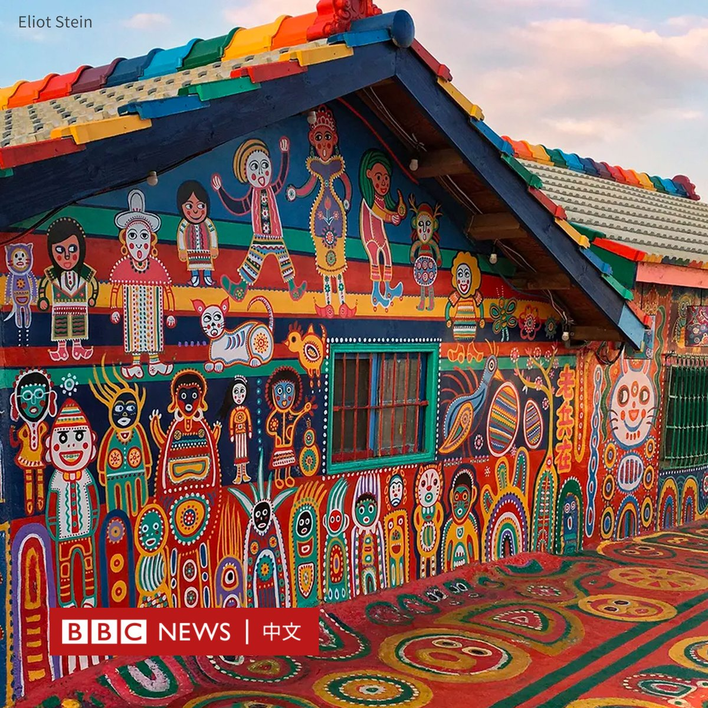
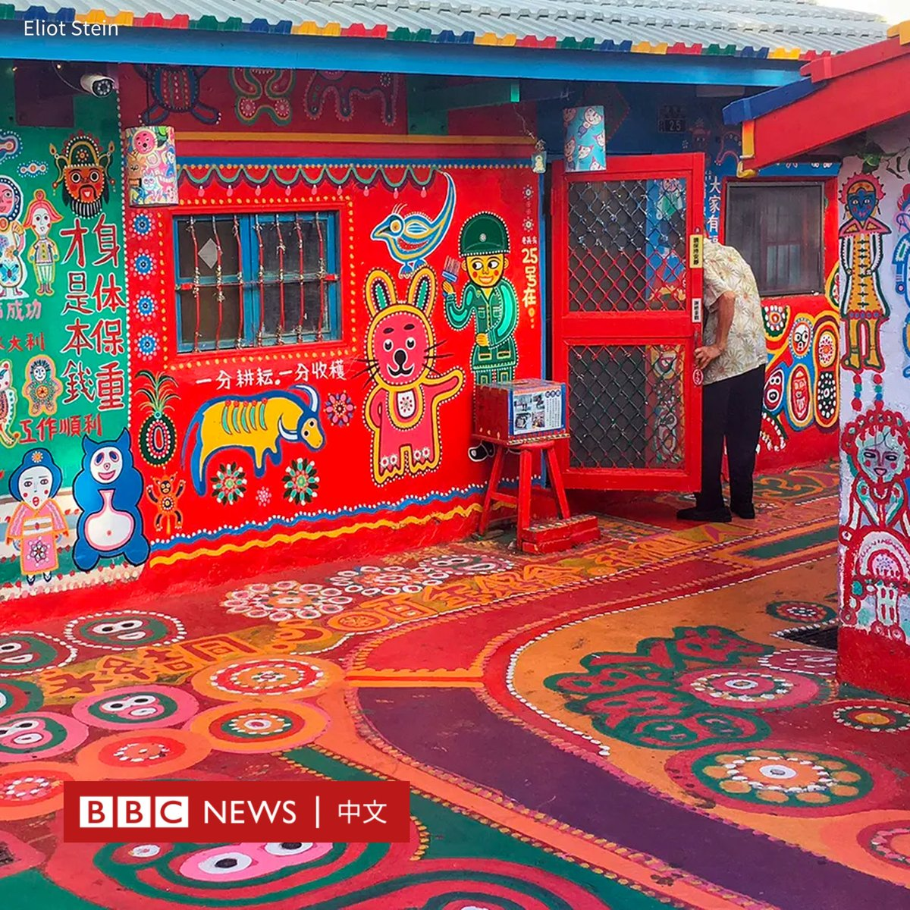
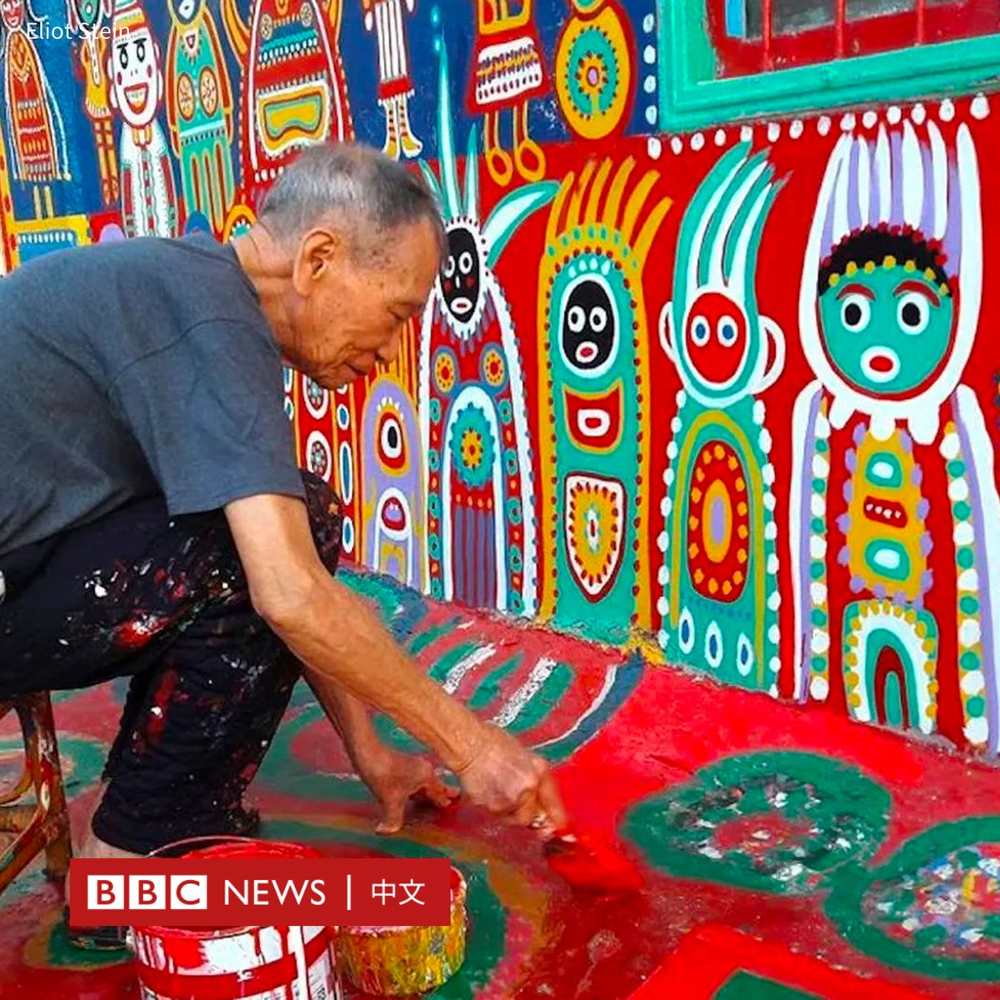
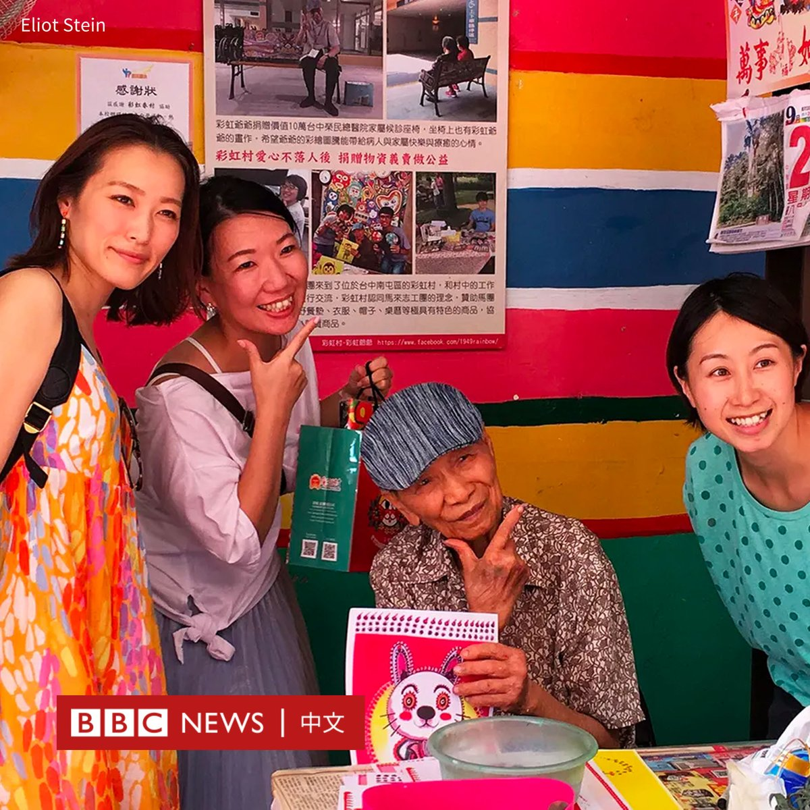

D英国广播公司BBC 北京时间 2024-01-25T14:51:30Z 1750411052561604970 现居日本的前中国中央电视台调查记者王志安，因在台湾一场网络脱口秀节目中发表涉及残障人士的言论，引发争议。

台湾内政部移民署周三（1月24日）以王志安“从事与许可目的不符的活动”为由，宣布废止其入境许可，并禁止其在未来五年内前往台湾。

55岁的王志安在本月前往台湾，为其在YouTube上开设的时政自媒体节目报道总统大选，并参加了台湾知名网络脱口秀《贺珑夜夜秀》的录影。

在节目中，王志安针对台湾大选发表看法，批评台湾造势晚会的舞台像演唱会现场，将残障人士作为煽情工具。“有歌星、还有前面铺垫的，还有把残疾人推上去煽情的。”他说道。

他随后颤抖着模仿残障人士说出“支持民进党，抢救王义川“口号，引发全场哄堂大笑。截至周四（1月25日），该集影片已超过百万次点击。

然而，这一行为让他身陷舆论漩涡。许多人指责他不尊重残疾人，还有人指他在影射患有罕见病脊髓性肌肉萎缩症的民进党不分区立委提名人陈俊翰律师。

据台湾媒体报道，民进党发言人张志豪对王志安表示“谴责”，并指其“以讪笑方式影射造势活动站台人士”是“恶意言论”。陈俊翰也对媒体表示，他不能接受王志安“对于身心障碍者的蔑视和讪笑的态度”。

王志安在X（推特）上捍卫自己的言论，表示真正消费残障人士的“是民进党的造势手法”。他还批评民进党“对一个综艺节目的言论断章取义施以压力”。

支持王志安的人也表示，他的言论并非在取笑残障人士个人，而是在抨击选举造势中“作秀”的一面，这属于言论自由的范畴。

随着该争议不断发酵，《贺珑夜夜秀》的一些赞助商宣布终止合作。该节目制作人霍金则在YouTube影片下方表示道歉，表示“因制作上的疏忽，造成部分内容对陈俊翰律师不敬”。目前，该节目剪去了争议的片段。

台湾内政部移民署则在一份公告中称，由于王志安是持观光签证赴台，应邀参加节目发表言论属于违规行为，因此废止其入境许可，并管制五年不予许可来台观光。

王志安曾长期在中国中央电视台供职，担任记者和主持人，并在2017年加入《新京报》任调查记者。他曾多次揭露中国的腐败，征地和医疗事故。

2019年，王志安被中国全网封杀，并于次年开始定居日本。2022年，他开始经营自己的YouTube频道，表示希望“重新寻找在境内无法实现的新闻理想”。他的节目以点评时政内容为主，目前已有近120万粉丝。   D英国广播公司BBC 北京时间 2024-01-25T16:18:51Z 1750433035223241095 随着台湾似乎在面临新一轮的断交风暴，台湾舆论自嘲的“凯子外交”是否已经告终？台北能承受邦交国“清零”的代价吗？https://t.co/MWrE2YqTVt   D英国广播公司BBC 北京时间 2024-01-25T11:19:37Z 1750357728306880862 金正恩宣布放弃与韩国和解并重新统一的目标，并将韩国人定义为完全不同的民族，这几乎颠覆了他的父亲与祖父长期以来所坚持的意识形态。

他是在考虑对韩国发动战争，还是另有其他目的？这在朝鲜观察圈引发了一场大规模辩论。
https://t.co/knwNKGV3A3   D英国广播公司BBC 北京时间 2024-01-25T09:20:57Z 1750327864376099131 台湾有着“彩虹爷爷”之称的黄永阜在周二（1月23日）去世，享年101岁。

黄永阜是台中市知名的彩虹村的缔造者。他用画笔将待拆除的老屋变成缤纷的彩绘世界，使该村庄成为当地知名的景点，吸引了数以百万计的游客。

黄永阜1924年出生于广东，在国共内战中来到台湾，居住在台中市南屯区。在退休后，他一时兴起就开始用水泥漆彩绘自己家和附近的几间小屋。

2007年因市地重划，邻近的眷村及周边房舍面临拆迁，当地民众发起了“抢救彩虹村”活动。当局最终同意保留这些色彩鲜艳的房屋，并辟划为“彩虹艺术公园”。

彩虹村随后声名大噪，入选国际知名旅游指南孤独星球（Lonely Planet）“世界的秘密奇迹”最值得探访景点，黄永阜亦获颁为台中市荣誉市民。

阅读此前报道：https://t.co/tU5GTvy6r0   