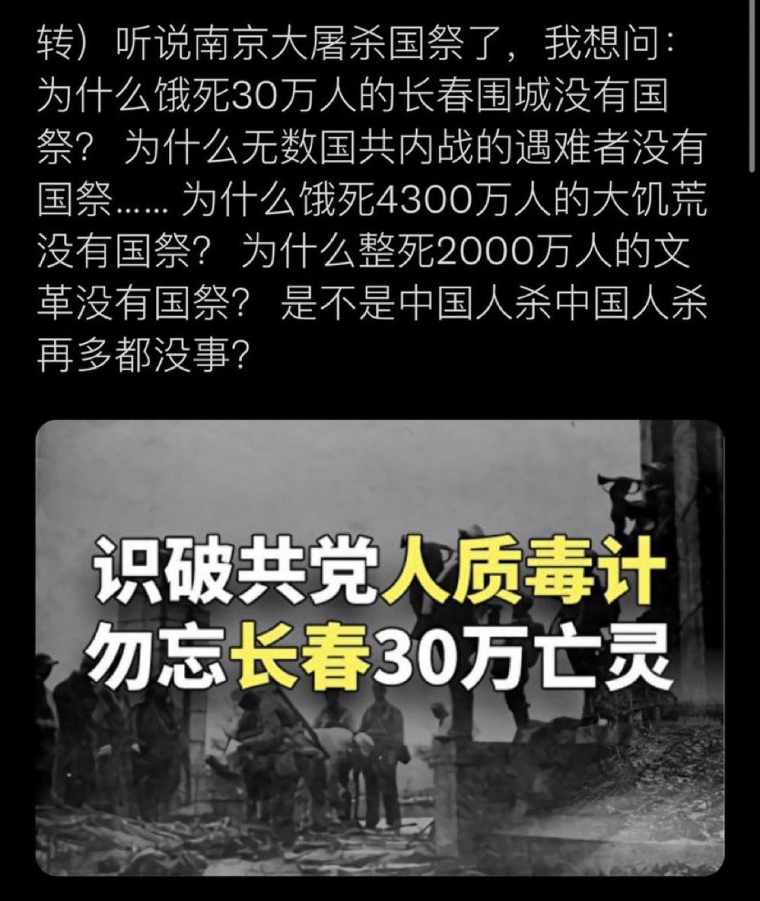
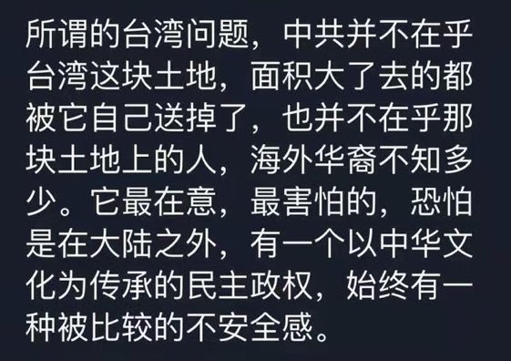

Ivy未央 北京时间 2024-01-25T12:31:08Z 1750375727734673842 部分中国人为什么仇恨日本？因为被中共愚民政策洗脑的。
对日本的民族仇恨是转移中共杀害中国人剥削中国人的认知策略 https://t.co/k00CVDuR85   Ivy未央 北京时间 2024-01-25T12:21:09Z 1750373214729978072 中共一直喊着统一台湾并不是为了领土和人民，因为中共从来不在乎领土和人民。中共为讨好苏俄发文承认外蒙独立，还把大半个长白山和半边鸭绿江以及丹东两个出海口岛屿送给了朝鲜，把夜莺岛以及周边大面积海域送给了越南等，并签字把海参崴正式归俄国…
至于中共在不在乎人民，哈哈韭菜们心里没点数吗？ https://t.co/3Xuw0j0vfK   