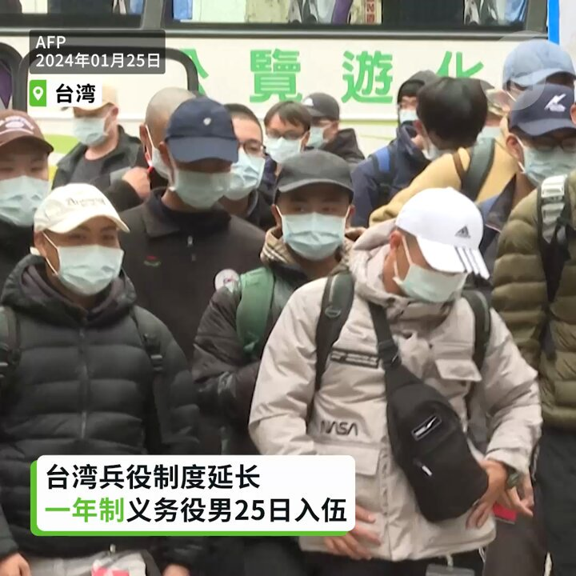
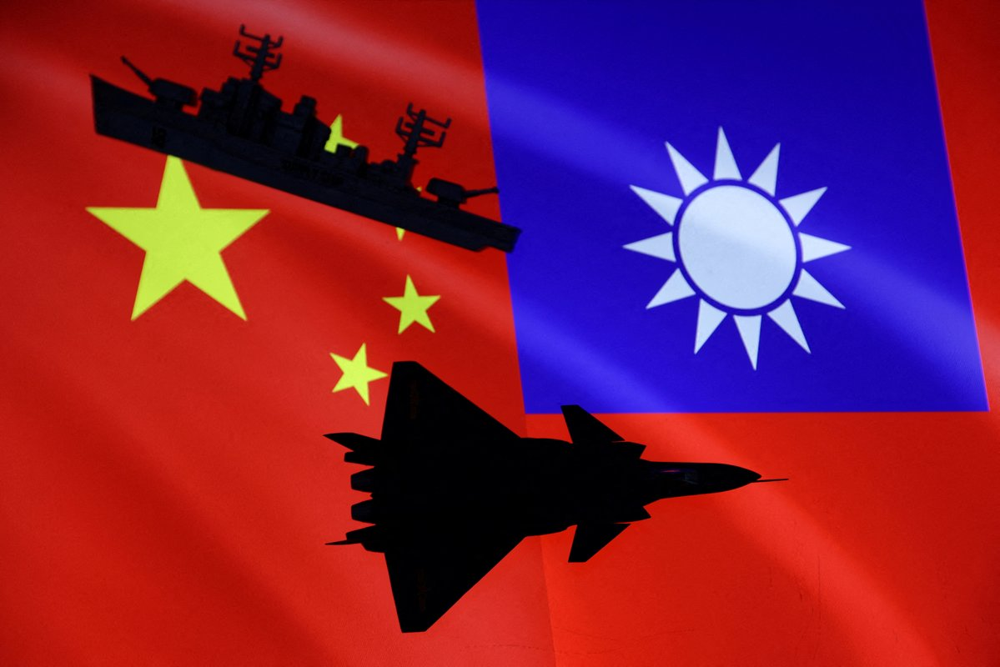
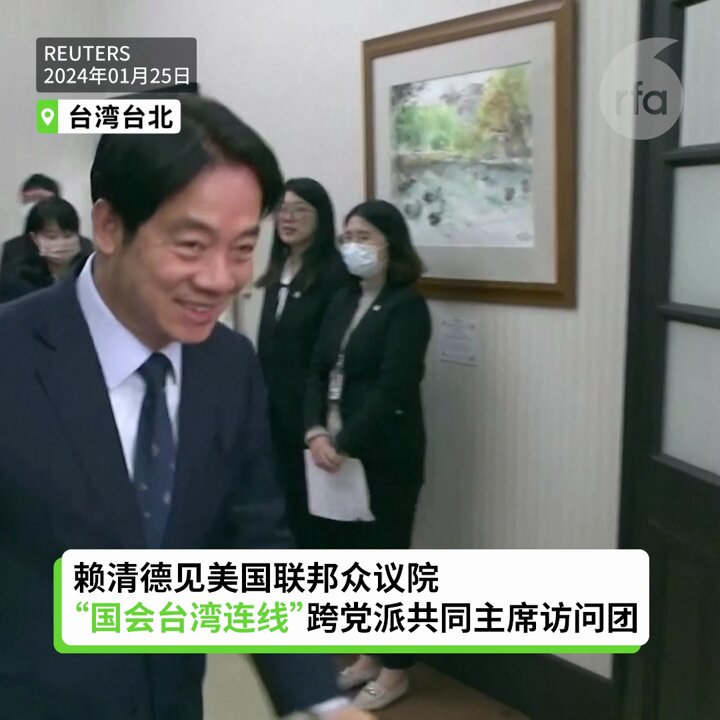
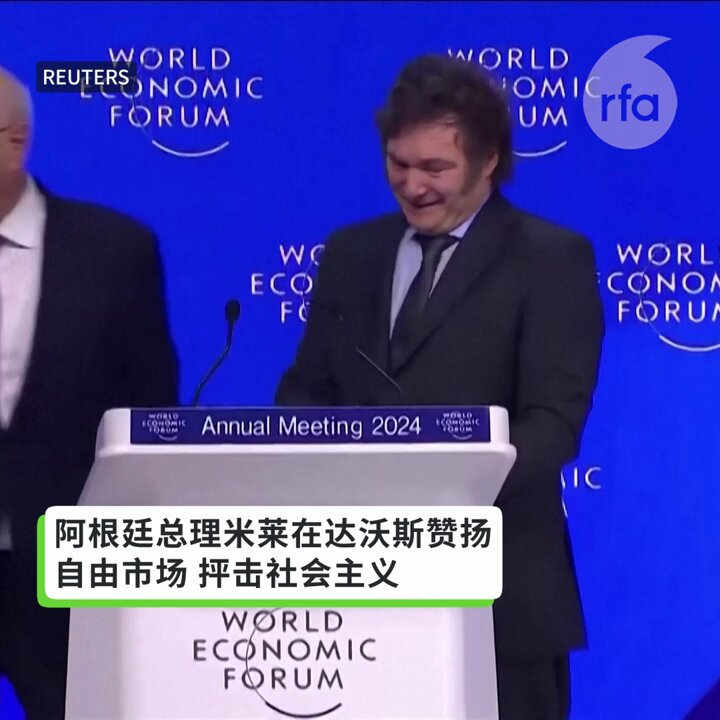

自由亚洲电台 北京时间 2024-01-25T18:27:03Z 1750465296379662748 【台湾兵役制度延长】
【一年制义务役男25日入伍】
台湾义务兵役由四个月恢复为一年，首批一年期的义务役男共670名官兵25日在北中南三处营区入伍。 https://t.co/Vhalb8kB2q   自由亚洲电台 北京时间 2024-01-25T18:59:30Z 1750473462681071878 【中国对台发动法律战】
【台国安人士：意图改变台海现状】
中国在台湾总统选举后，对台发动外交战，迳自将联合国2758号决议文、《开罗宣言》、《菠次坦宣言》，解读为“台湾是中国的一部分。”台湾的国安人士认为，这是中国有意重塑国际标准，意图改变台海国际秩序的现状。详细报道：https://t.co/1Et4lTtQ00   自由亚洲电台 北京时间 2024-01-25T17:56:36Z 1750457634065641660 【美国会众议院“国会台湾连线”访团会见蔡英文赖清德】
美国联邦众议院“国会台湾连线”（Congressional Taiwan Caucus）两位共同主席，共和党众议员马里奥·迪亚兹·巴拉特（Mario Diaz-Balart）及民主党众议员阿米·贝拉（Ami Bera）24日至26日率团访问台湾，这是美国众议院“国会台湾连线”近年首度有共同主席团访台。访团25日会见台湾的总统蔡英文，及新当选总统的赖清德和副总统当选人萧美琴。   自由亚洲电台 北京时间 2024-01-25T13:53:07Z 1750396358756860279 RT @RFA_Chinese: 【台湾移民署指王志安赴台观光违反规定：依法废证并管制入境】
台湾的内政部移民署24号指出，王志安是以“旅居海外中国大陆人士身分”，向移民署申请观光事由的一年多次入出境证，并持证赴台。… https://t.co/JouQO1kDsQ   自由亚洲电台 北京时间 2024-01-25T14:05:56Z 1750399586425045133 【中国央行“双降”救市】
【评论：难救经济低迷】
中国央行行长潘功胜突然宣布下调存款准备金率0.5个百分点，下调支农支小再贷款、再贴现利率0.25个百分点。该消息刺激陆港股市和海外中国资产拉升。不过评论认为，央行“双降”政策难以挽救疲弱的中国经济。详细报道：https://t.co/sMaPF9PQTE https://t.co/aEm14BOSVS   自由亚洲电台 北京时间 2024-01-25T11:21:35Z 1750358224388358416 欢迎收听和订阅播客【＃亚太报道】 https://t.co/MjLNSvVMqc
#武汉疫情封城四周年； 中国在 #联合国 自我表彰 #人权 状况；阿根廷总统 #米莱 演讲触动中国人心弦；#刘建超 有望接任外长；美国会跨党派访问团抵台 https://t.co/4pccBAfA2i   自由亚洲电台 北京时间 2024-01-25T11:30:38Z 1750360501299581148 RT @RFA_Chinese: 【中国突变转基因大国  #粮食安全 重于生物安全？】
中国农业农村部1月23日在国新办发布会上宣布，#转基因 玉米大豆产业化应用试点任务顺利完成。中国将在全国范围内扩大转基因大豆和玉米的种植。… https://t.co/FrPo4S6C0B   自由亚洲电台 北京时间 2024-01-25T05:10:13Z 1750264766831141067 【阿根廷总理米莱赞扬自由市场 抨击社会主义】
1 月 17 日，阿根廷自由意志主义总统哈维尔·米莱在达沃斯首次海外访问期间赞扬了自由市场，并猛烈抨击了社会主义，这位自称“无政府资本主义者”的总统正在努力解决国内的重大经济危机。
有何启发？ https://t.co/3RrC2MfawJ   自由亚洲电台 北京时间 2024-01-25T05:12:58Z 1750265458782097482 【中国突变转基因大国  #粮食安全 重于生物安全？】
中国农业农村部1月23日在国新办发布会上宣布，#转基因 玉米大豆产业化应用试点任务顺利完成。中国将在全国范围内扩大转基因大豆和玉米的种植。
北京大北农科技集团股份有限公司上周表示，在转基因完全商业化的背景下，转基因品种在3到5年后渗透率大概为85%。
多年来，中国在转基因作物的技术开发上一直小心翼翼，民间争论不断，为什么现在政府突然放开？
中国农业科技存在信息黑洞，在没有开放透明的社会监督的条件下，如何减少转基因带来的健康风险，保全家平安？   自由亚洲电台 北京时间 2024-01-25T05:47:30Z 1750274150579712036 【#米莱演讲 让中共躺枪？】
这篇演讲到底讲了什么，又对中国的经济形势有什么样的启示？
本台记者王允 @Jeff23Wang 报道
https://t.co/uJYSPMN8Tm   自由亚洲电台 北京时间 2024-01-25T05:54:37Z 1750275939106480593 专栏 | #网络博弈: 两岸互动几十年　#台湾2024大选 仍是微博禁搜话题
https://t.co/432ItzlPPu   自由亚洲电台 北京时间 2024-01-25T05:59:05Z 1750277065612615923 #印度股市 超越 #香港 跃居世界第四
https://t.co/vDpLMg4kU1   自由亚洲电台 北京时间 2024-01-25T03:23:30Z 1750237912665587965 上个月底，加拿大众议院加中关係委员会呼吁渥太华，研究起草一份禁止 #加拿大政府基金投资 违反人权的中国公司名单。加拿大香港监察组织(Hong Kong Watch Canada) 进一步呼吁渥太华参考美国作法进行明确立法，除了有制裁清单外，也要求金融监管机构严格督察。
https://t.co/YfJ4aZ2KNO   自由亚洲电台 北京时间 2024-01-25T03:34:37Z 1750240707229704690 中共中央对外联络部部长 #刘建超 日前在美国的访问之旅似乎大获成功。近日有美国媒体透露，刘建超有望接任中国外长 #王毅，出任新一届的外长。但刘建超的接任能否驱动中国外交政策转向、尤其是改善美中关系？
https://t.co/8zuNARNrcT   自由亚洲电台 北京时间 2024-01-25T03:59:02Z 1750246853327847540 1月24日下午3时，江西新余市渝水区沿街店铺发生地库起火事件，截至24日晚间8时止，这起事故造成39人死亡、9人受伤。在大火延烧期间，有多人透过跳窗的方式逃命，目前救灾行动已经结束。
https://t.co/efwe5NrZ3F   自由亚洲电台 北京时间 2024-01-25T00:59:15Z 1750201611019018300 中国国务院总理 #李强 近日在座谈会上指出，中国发展面临的有利条件强于不利因素，经济回升向好趋势不变。但学者质疑，外商外资撤离，股市跌跌不休，李强似乎被 #习近平 架空，只是服从政治的“唱好经济光明论”。李强的说法与客观情势不符，也无法取信于国内外。
https://t.co/otjjdXNbPl   自由亚洲电台 北京时间 2024-01-25T01:00:39Z 1750201963739013238 #台湾 在南太平洋的邦交国 #瑙鲁，在总统大选后两天宣布与台湾断交。中瑙两国外长24日在北京签署复交公报。台湾的外交部强烈谴责中国政府贬抑台湾主权，打压外交空间。与此同时，美国国会跨党派访问团抵台，对台湾表示支持。
https://t.co/qowwvGJPY4   自由亚洲电台 北京时间 2024-01-25T01:04:14Z 1750202862435459385 RT @RFA_Chinese: 【台湾移民署指王志安赴台观光违反规定：依法废证并管制入境】
台湾的内政部移民署24号指出，王志安是以“旅居海外中国大陆人士身分”，向移民署申请观光事由的一年多次入出境证，并持证赴台。… https://t.co/JouQO1kDsQ   自由亚洲电台 北京时间 2024-01-25T01:32:08Z 1750209886028489021 海外西藏媒体《西藏时报》报道，一名西藏大学二年级学生、藏族女孩 #才仲（Tsedon），12月下旬被警方带走，3周后中国警方通知家人，她“#摔倒死亡”，并拒绝归还遗体。海外藏人表达悲愤，接力发视频谴责，并誓言继续为境内藏人悲惨遭遇发声。
https://t.co/2LgF90rdqP   自由亚洲电台 北京时间 2024-01-25T02:12:11Z 1750219964240551946 专栏 | #纵横大历史：#文革 系列 第七十七讲　#红八月 的暴力幕后推手到底是谁（一）
https://t.co/G3TAZGq6T1   