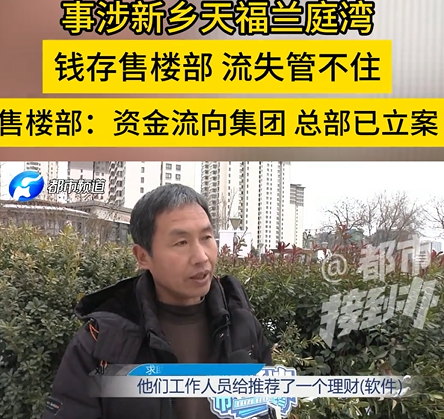
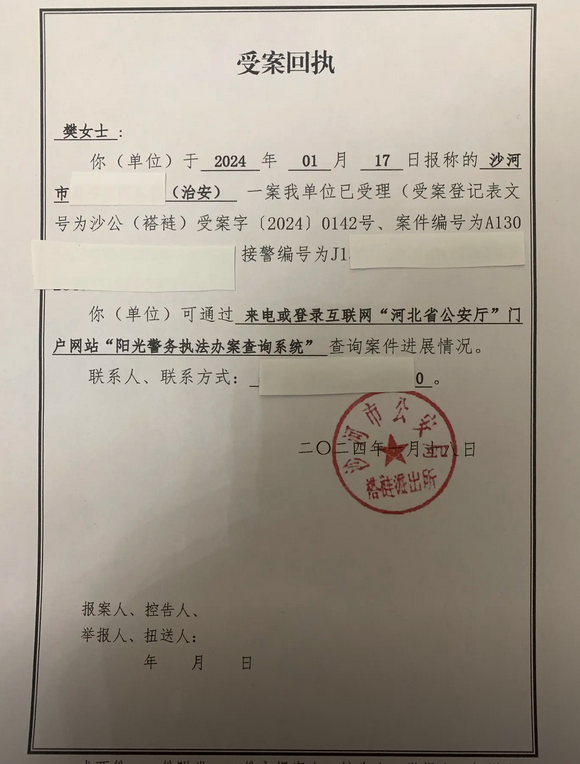

谁将十万横扫三江 北京时间 2024-01-25T12:31:46Z 1750375885310714311 2024奥斯卡最佳短片提名，又一部豆瓣无条目的电影。https://t.co/BtEZnXzBFn https://t.co/2bnPLX4Sx0   谁将十万横扫三江 北京时间 2024-01-25T12:32:26Z 1750376054441836547 RT @Evans_2333: 关于最近很火的伦敦钢琴事件，我想揭露一下其中一位女主Mengying求职计，TOA英美留学的创始人在英国坑害中国留学生的可耻行径，以及她是如何在英国利用中国法律对付想要维权的中国留学生的   谁将十万横扫三江 北京时间 2024-01-25T12:56:10Z 1750382026992320985 网友投稿：河南信阳固始县天福集团利用房地产业务推销旗下天福钱包非法集资上亿人民币现爆雷，波及一千多户，因政府欠企业钱，故而不管不顾，与企业注册地福建省政府相互踢皮球，当地群众认为天福集团直接影响了固始县的经济和人民生活的安定（当地房地产公司旗下物业多次出现全体业主生活用水无法供给的情况）

从茶叶这种金融资金池转型房地产公司搞资金池，总有人追着送钱......   谁将十万横扫三江 北京时间 2024-01-25T13:03:29Z 1750383870518985157 RT @torontobigface: 王局做的这件事情首先百分之百是违法的，这没有什么好争论的
就算你说夜夜秀节目不是电视节目
但是之前的其他访谈明显就是电视节目
而且王局确实收取了报酬，明确违反了第7条(虽然捐了)
什么签证干什么事情，这是基本的法律常识。
但是王局知道这个…   谁将十万横扫三江 北京时间 2024-01-25T14:17:05Z 1750402389415547127 RT @laborpowercn: 工劳小报 第35期：一口价，谁说了算

截至2023年7月31日，全国共有322家网约车平台公司取得经营许可，共发放网约车驾驶员证597.6万本(来源)。网约车市场高速增长的同时，这个行业的疯狂内卷也在各个层面上演，“一口价”作为价格战的主战…   