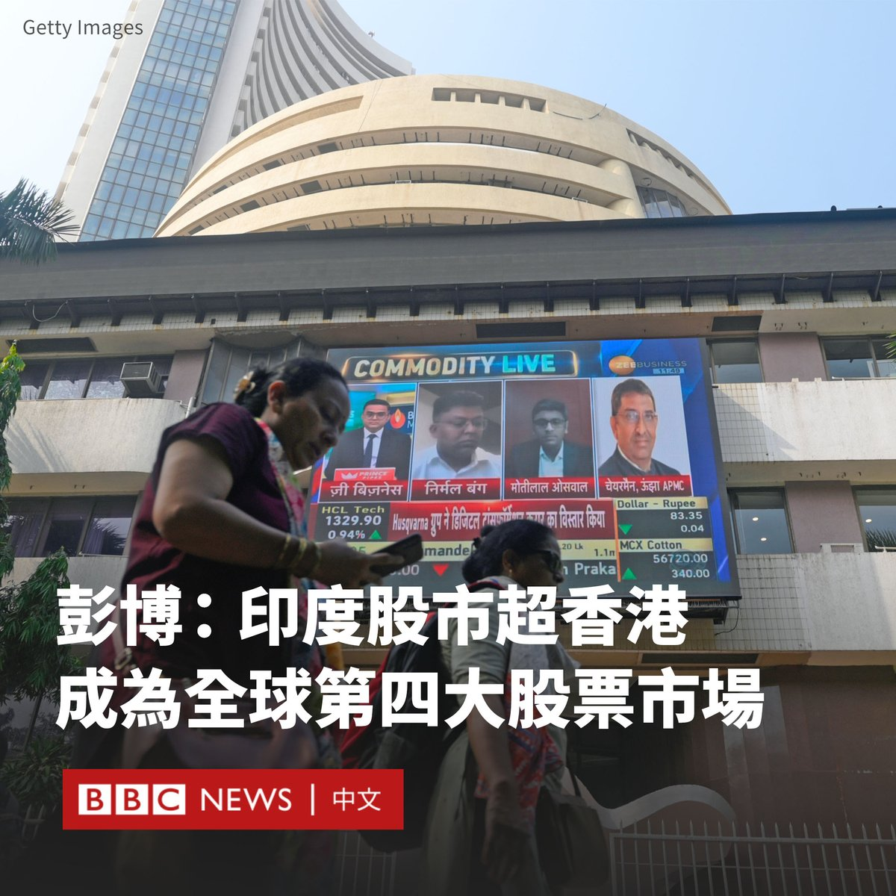
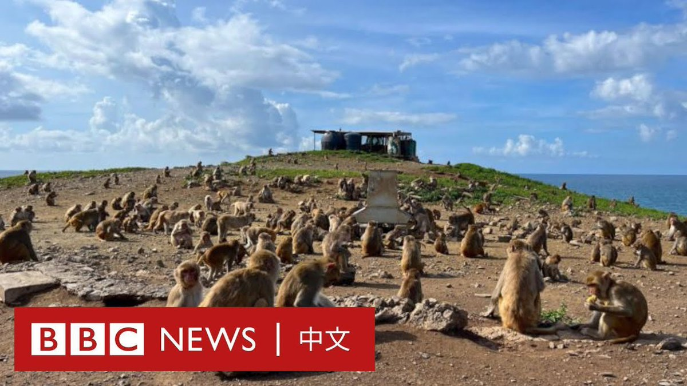

D英国广播公司BBC 北京时间 2024-01-24T13:57:31Z 1750035078217114001 随着全球资本从中国流出，彭博数据分析显示，印度股市首次超过香港股市，成为全球第四大股票市场。

据报导，截至周一（1月22日）收盘，印度交易所上市股票总值达到4.33万亿美元，而香港交易所上市股票总值为4.29万亿美元。

去年12月5日，印度股票市值首次突破4万亿美元，其中约一半资金是在过去四年中吸纳的。

这使得印度在全球股票市场仅次于美国、中国和日本。

印度股市在2023年经历了持续的热潮。该国蓬勃发展的经济推动大批国际资金流入，散户投资者规模也迅速壮大。

与此同时，香港股市正经历暴跌。恒生指数自今年年初以来已下跌近10%，较2021年高点更跌去一半。

周一，香港股市跌至15个月以来的最低点，在周二收复部分失地。中国众多最具影响力和创新性的公司都在香港上市。

中国大陆股市也跌势难止。中国国务院周一表示，“要采取更加有力有效措施，着力稳市场、稳信心”。   D英国广播公司BBC 北京时间 2024-01-24T10:48:38Z 1749987546308948210 波多黎各的圣地亚哥岛又称“猴子岛”，这里是1800只猕猴的家园，也是世界上最古老的灵长类动物自然实验室之一。

这些猴子的祖先最初来自印度。几十年来，一代又一代的猴子在科学家的注视下生活着，以了解它们的行为。研究中心的一些做法受到动物保护组织的质疑，但该中心表示其按照规定展开科学研究。 https://t.co/HSlne1d0Hq   