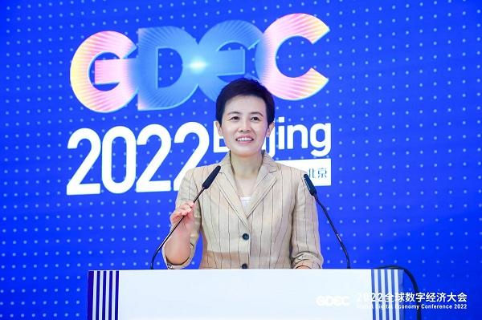
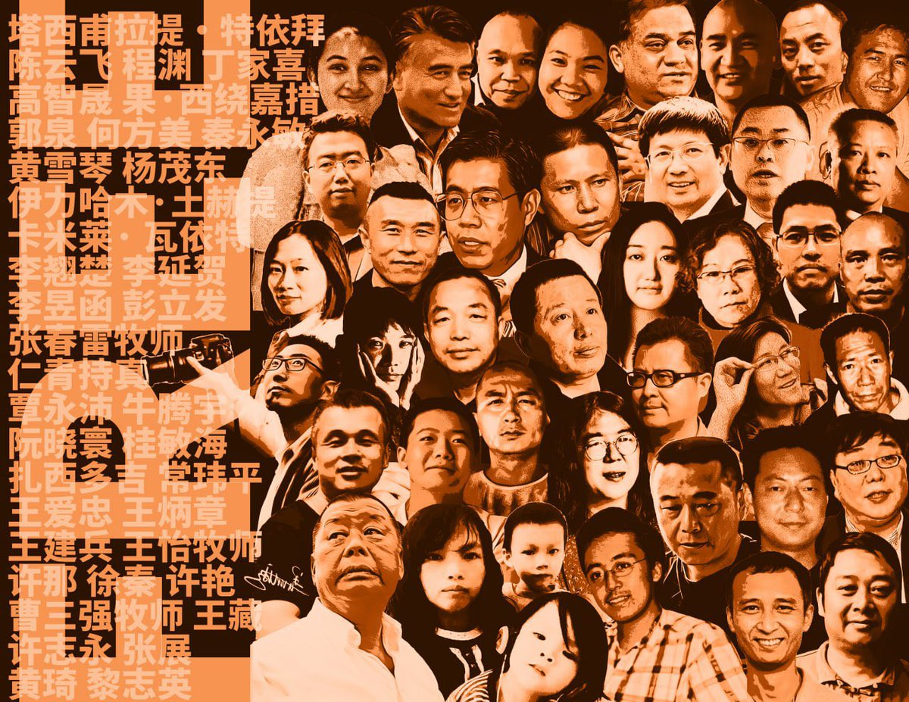

拆墙运动公号 北京时间 2024-01-24T21:51:03Z 1750154247151173850 【 #2259专案组 互联网防火墙第113号嫌犯 #侯健美】 性别：女
国 籍：中国
民 族：汉族
出生日期：1978年12月
证件:
北京市市辖区宣武区 
手機/支付宝: 
政治面貌：中共党员
地址: 西花市南里东区(新景家园)9号楼2单元1001房间
地址: (单位地址)北京市建国门内大街新闻大厦8层
邮箱: houjianmei@sina.com
职务：北京市通州区委常委、宣传部部长

官网：https://t.co/LZ1NK8udKm
详细资料见: #BanGFW拆墙运动（建墙罪犯录）：https://t.co/7hdRKHDxHI

侯健美，女，汉族，1978年12月生，中共党员，研究生。
现任北京市通州区委常委、宣传部部长

侯健美，女，汉族，中共党员。1978年12月出生，2003年7月参加工作，研究生学历，哲学硕士、工商管理硕士，主任记者。现任中共北京市通州区委常委、宣传部部长。

人物履历

曾任中共北京市委宣传部版权管理处处长、一级调研员；北京市委网络安全和信息化委员会办公室（北京市互联网信息办公室）副主任。
2023.05—中共北京市通州区委员会委员、常委。
现任北京市通州区委常委、宣传部部长。

职务任免
2023年5月，北京市委决定：侯健美同志任中共北京市通州区委员会委员、常委。
战略合作伙伴：1、中共恶人榜：#ccpevils       
   2、#zhinawiki   拆墙运动公号 北京时间 2024-01-24T22:47:33Z 1750168464692568350 这个帖子必须转   拆墙运动公号 北京时间 2024-01-24T23:14:55Z 1750175355036381219 RT @changingChina: 推倒中共的网络防火墙！(The Great FireWall )让大陆民众知道世界真相，认清：中共是他们所有不幸痛苦的根源！ 加大世界知道大陆的真相!!!   拆墙运动公号 北京时间 2024-01-24T23:16:33Z 1750175764933210555 RT @luoshch: @ISHR_chinese 有没有哪一个国家建议：1）拆除中国的网络防火墙？2）停止以颠覆罪名剥夺人权捍卫者的基本权利和自由；3）释放所有在香港和中国大陆被强加罪名，被长期监禁的良心犯？ https://t.co/186yFWraYY   拆墙运动公号 北京时间 2024-01-24T23:18:26Z 1750176239703203998 RT @zhikongdukong1: 通信自由，防火墙就是违宪！   