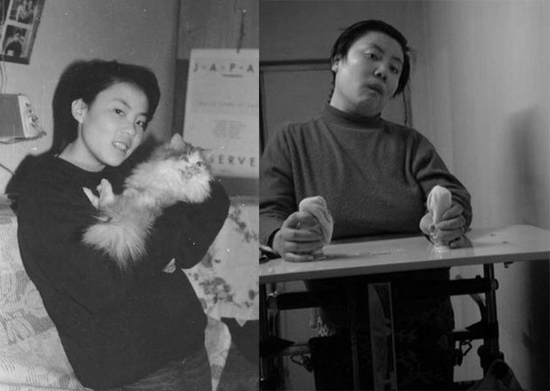

自由亚洲电台 北京时间 2024-01-24T02:45:24Z 1749865935966752945 爱尔兰裔钢琴家， YouTube博主Brendan Kavanagh1月19日在伦敦圣番克拉斯火车站作街头钢琴表演，与一群手持五星红旗的中国男女，因为拍摄引起争议。
这一直播视频在油管点阅已超460万次，海内外众多自媒体和中外媒体引用转发，事态继续发酵，详阅：
https://t.co/cj4VS2V7qM https://t.co/ks50cx4hgV   自由亚洲电台 北京时间 2024-01-24T03:29:26Z 1749877015078162849 1994年震惊中国社会的 #朱令 陀中毒案关系人 #孙维 在移居澳大利亚后，该国民众正在呼吁澳洲政府将其驱逐，目前在请愿网站https://t.co/ARD5iSkwf2上，驱逐孙维的连署书已有超过4万人签署。
#孙释颜
https://t.co/EOjJOiItq3 https://t.co/SGRpa0l3hO   自由亚洲电台 北京时间 2024-01-24T04:08:41Z 1749886895600042246 中国 ＃股市 近日大幅下挫。有消息指出，中国政府计划推出一揽子计划注资 ＃救市。有经济学者质疑，国家出手救市最后导致“国家队”高位离场，而散户被套牢。
https://t.co/sIsmv04Wf2 https://t.co/ijs0Yrl3iO   自由亚洲电台 北京时间 2024-01-24T00:47:21Z 1749836225035555172 近日，广东深圳港资企业 #达琦华声 电子（深圳）有限公司向全体员工发出停工、停产通知，原因是该厂受新冠疫情及经济大环境恶劣影响，长期处于亏损状态。另外，清远一家民企也因经营困难宣告破产。
https://t.co/BkM90r0oTD https://t.co/Gqfxi2UKSq   