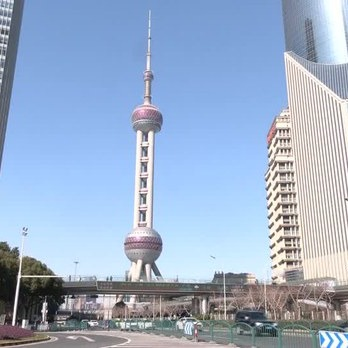

自由亚洲电台 北京时间 2024-01-24T04:08:41Z 1749886895600042246 中国 ＃股市 近日大幅下挫。有消息指出，中国政府计划推出一揽子计划注资 ＃救市。有经济学者质疑，国家出手救市最后导致“国家队”高位离场，而散户被套牢。
https://t.co/sIsmv04Wf2 https://t.co/ijs0Yrl3iO   自由亚洲电台 北京时间 2024-01-24T00:47:21Z 1749836225035555172 近日，广东深圳港资企业 #达琦华声 电子（深圳）有限公司向全体员工发出停工、停产通知，原因是该厂受新冠疫情及经济大环境恶劣影响，长期处于亏损状态。另外，清远一家民企也因经营困难宣告破产。
https://t.co/BkM90r0oTD https://t.co/Gqfxi2UKSq   