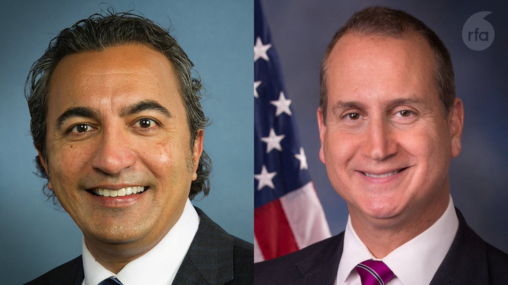
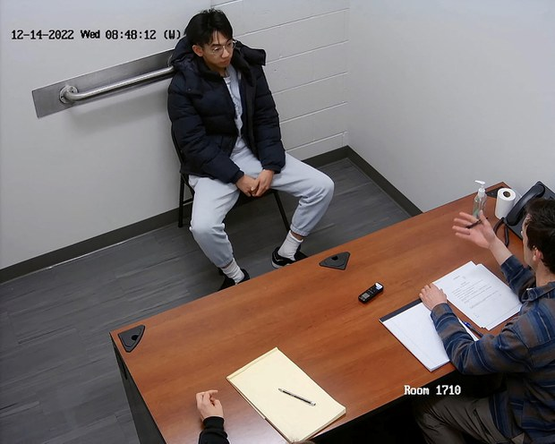
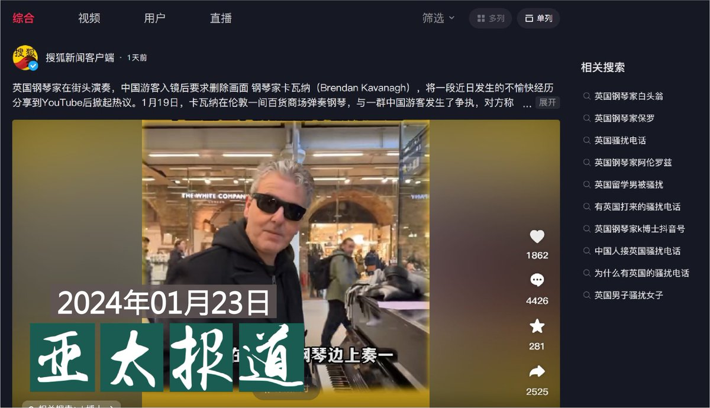
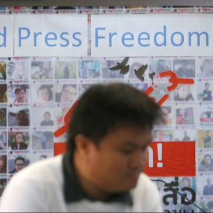
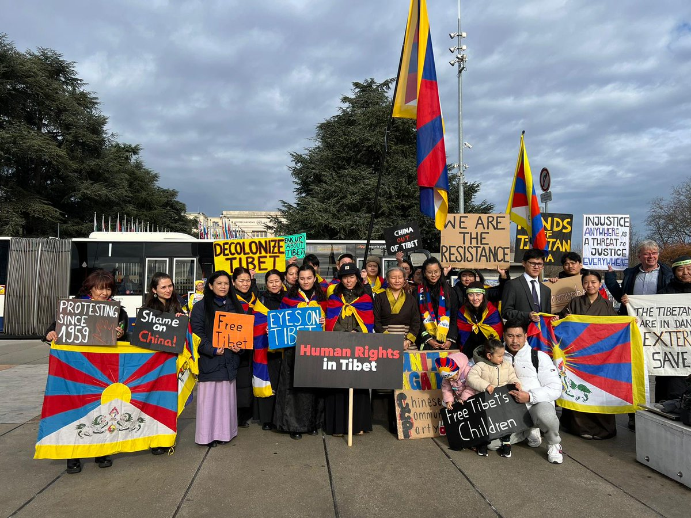
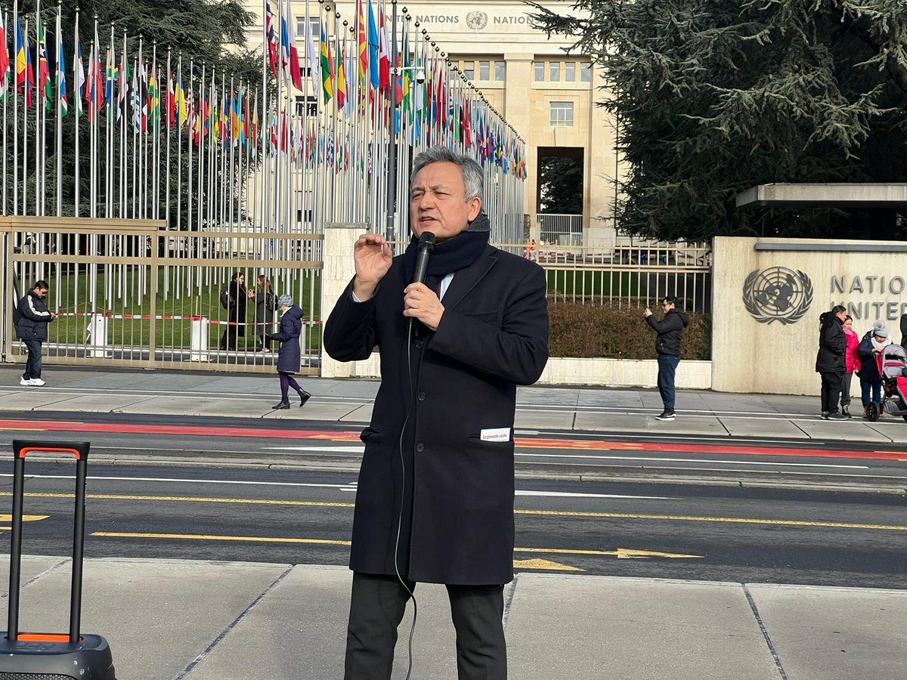
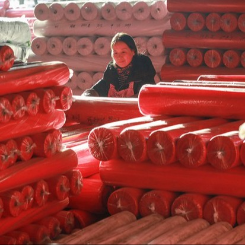
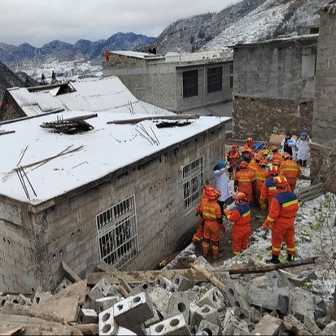

自由亚洲电台 北京时间 2024-01-24T12:03:15Z 1750006324111515688 【美国跨党派众议员访问台湾】
美国众议院外交事务委员会印太小组委员会首席民主党议员 #贝拉 (Ami Bera）办公室24日表示，贝拉与“#国会台湾连线”主席、共和党籍众议员 #巴拉特（Mario Díaz-Balart)所率领的国会代表团已抵达 #台湾。 声明中指出，此行的目的是重申美国在台湾成功举行 #民主选举 后对台湾的支持。
https://t.co/kuR845bd2S   自由亚洲电台 北京时间 2024-01-24T06:36:37Z 1749924123818561714 就读于美国波士顿的伯克利音乐学院的中国留学生 #吴啸雷 本周二在美国受审，他被起诉的罪名是涉嫌骚扰在伯克利音乐学院张贴支持中国民主传单的活动人士“佐伊” （Zooey） ，并威胁要向中国执法部门举报她。
法庭上，助理检察官波特（Alathea Porter）告诉陪审团，25岁的吴啸雷在网络上恐吓佐伊要砍断她的双手，并向中国有关部门举报佐伊的“反动传单”，使得佐伊对自己和家人的安危感到恐惧。
吴啸雷则否认相关指控，他的律师坦波斯基（Michael Tumposky）表示，他的客户“不是中国政府的特工”，而是一个“笨拙的书呆子”，吴啸雷只是来波士顿学习爵士乐，但是，不小心以错误的方式谈论佐伊的海报，尽管他只是想提醒她激进主义的后果。
最近一段时间，西方政府对于北京当局企图在境外胁迫和压制海外批评中国政府的人士以及他们的声音不断提出警告。   自由亚洲电台 北京时间 2024-01-24T06:44:43Z 1749926159721365996 #事实查核 @asiafactcheckcn｜美国菲律宾在 #南海 的 #联合演习，美国航母没去？
https://t.co/10vY26a31u https://t.co/IEnDrZvgPf   自由亚洲电台 北京时间 2024-01-24T08:00:09Z 1749945144579903785 欢迎收听和订阅播客【＃亚太报道】 https://t.co/MjLNSvVMqc
#小粉红出征 英国引发热议；中国拟用 #两万亿救市。有用吗？#统计造假 被纳入中共党纪处分条例；中国公布 #间谍 案情如低俗小说；深圳、清远更多工厂关门破产 https://t.co/Gckbl5963x   自由亚洲电台 北京时间 2024-01-24T04:41:34Z 1749895169217016092 微博热搜话题“＃华中农大 被举报教授克扣研究生劳务费”有超7200万次点阅。
有微博大V表示，“真实情况是，很多研究生的劳务费、补助费都被导师侵吞了，而且导师还觉得理所应当”。“事实上师生关系已经变了，变成老板与员工的关系，而且很多导师是一毛不拔的铁公鸡”。
#黄飞若，
https://t.co/erjg0YmM81 https://t.co/x8ufW8jDer   自由亚洲电台 北京时间 2024-01-24T04:44:33Z 1749895918000971801 中国资深媒体人 ＃彭远文 在本周一于微信上撰文《新闻‘通报时代’”》，文章指出，中国媒体业如今的报道空间越来越窄，在重大案件中媒体也不能及时进入现场了解情势，导致新闻进入“＃通报时代”，报道只能仰赖不透明的官方通报。不过，彭远文的文章在刊出不到一天便被下架。
https://t.co/7F4F26rhu0 https://t.co/yOUQrwffIW   自由亚洲电台 北京时间 2024-01-24T05:59:45Z 1749914844684542172 【#联合国 开启 #中国人权审查】 　
多个人权团体场外抗议，包括 法轮功学员、西藏活动人士、维吾尔族活动人士、香港人权捍卫者、以及反对中国将“脱北”妇女强制遣返回朝鲜的人权团体。
https://t.co/6i2eHbzJtY https://t.co/AxII8MH9HL   自由亚洲电台 北京时间 2024-01-24T06:05:57Z 1749916403862552974 【中国 #GDP 以美元计算首度出现负成长】
https://t.co/vOmpytkKyA https://t.co/EbmIjBnF2H   自由亚洲电台 北京时间 2024-01-24T02:26:54Z 1749861279957909730 据中国官媒新华社报道，本周一发生于云南省 #昭通市镇雄县 的“1·22”#山体滑坡 事件，截至周二下午5时40分，已搜救出31名失联人员，均无生命体征，目前搜救仍在继续，灾难处置指挥部也紧急安置了233个家庭共918人。但当地大雪、严寒天气及结冰的路面将会为灾难处置增加难度。
https://t.co/hq4MOGHtum https://t.co/b9ZrjqmyfB   自由亚洲电台 北京时间 2024-01-24T02:45:24Z 1749865935966752945 爱尔兰裔钢琴家， YouTube博主Brendan Kavanagh1月19日在伦敦圣番克拉斯火车站作街头钢琴表演，与一群手持五星红旗的中国男女，因为拍摄引起争议。
这一直播视频在油管点阅已超460万次，海内外众多自媒体和中外媒体引用转发，事态继续发酵，详阅：
https://t.co/cj4VS2V7qM https://t.co/ks50cx4hgV   自由亚洲电台 北京时间 2024-01-24T03:29:26Z 1749877015078162849 1994年震惊中国社会的 #朱令 陀中毒案关系人 #孙维 在移居澳大利亚后，该国民众正在呼吁澳洲政府将其驱逐，目前在请愿网站https://t.co/ARD5iSkwf2上，驱逐孙维的连署书已有超过4万人签署。
#孙释颜
https://t.co/EOjJOiItq3 https://t.co/SGRpa0l3hO   自由亚洲电台 北京时间 2024-01-24T04:08:41Z 1749886895600042246 中国 ＃股市 近日大幅下挫。有消息指出，中国政府计划推出一揽子计划注资 ＃救市。有经济学者质疑，国家出手救市最后导致“国家队”高位离场，而散户被套牢。
https://t.co/sIsmv04Wf2 https://t.co/ijs0Yrl3iO   自由亚洲电台 北京时间 2024-01-24T00:47:21Z 1749836225035555172 近日，广东深圳港资企业 #达琦华声 电子（深圳）有限公司向全体员工发出停工、停产通知，原因是该厂受新冠疫情及经济大环境恶劣影响，长期处于亏损状态。另外，清远一家民企也因经营困难宣告破产。
https://t.co/BkM90r0oTD https://t.co/Gqfxi2UKSq   