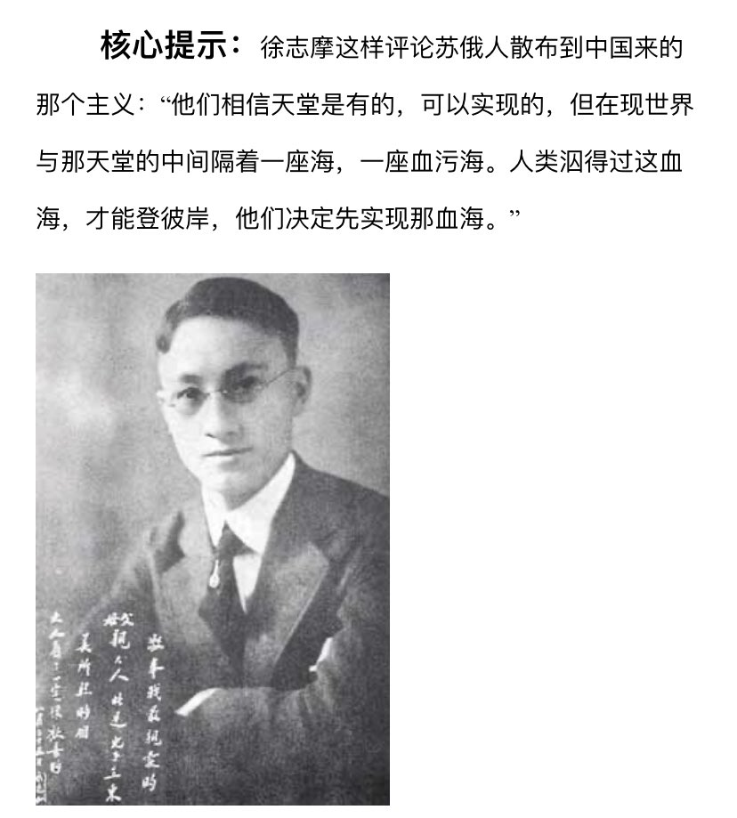

Ivy未央 北京时间 2024-01-23T10:41:59Z 1749623481438707833 徐志摩谈马克思主义：“他们相信天堂是有的，可以实现的，但在现世界与那天堂的中间却隔着一座海，一座血污海，人类泅得过这血海，才能登彼岸，他们决定先实现那血海。”
事实证明，信马列主义的人从没到过天堂，却被扔进了血海，共产主义执政的政府把国家都变成了地狱 https://t.co/RY1OpSny50   