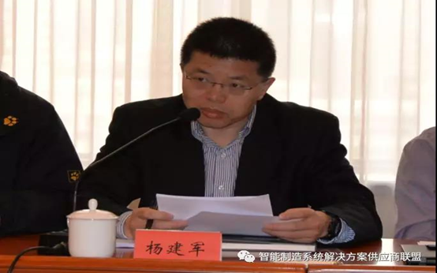
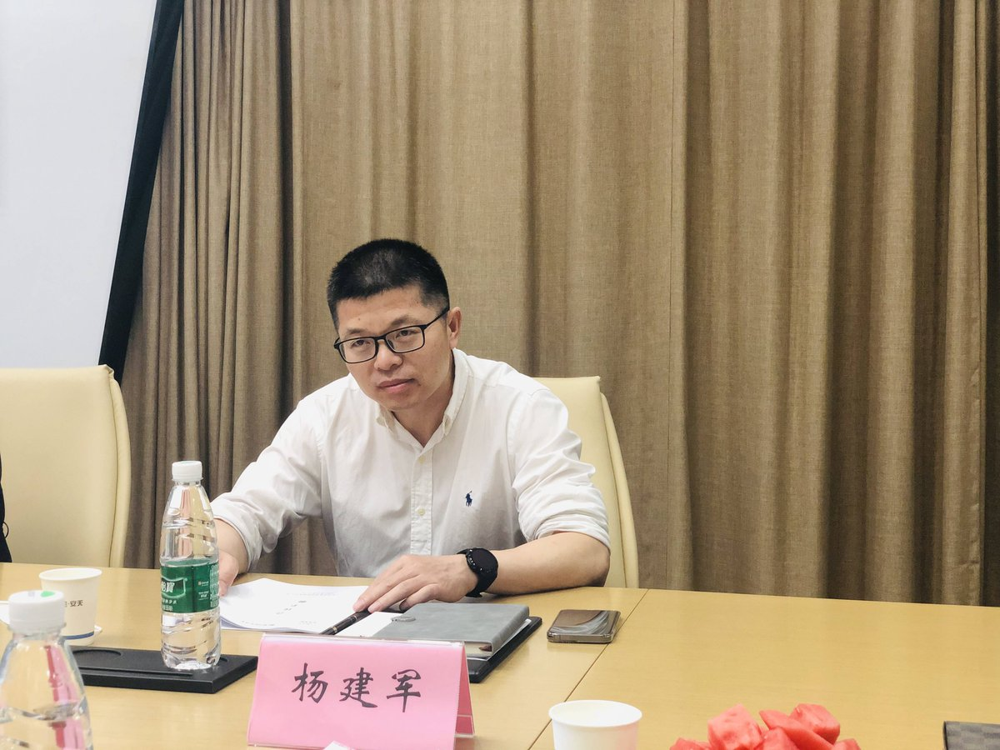

拆墙运动公号 北京时间 2024-01-23T14:02:29Z 1749673939540840499 【 #2259专案组 互联网防火墙第112号嫌犯 #杨建军】 性别：男  
浙江人中共党员工学博士，清华大学博士后出站，
高级工程师。

职务：工业和信息化部电子工业标准化研究院党委书记、副院长

杨建军，现任工业和信息化部电子工业标准化研究院（工业和信息化部电子第四研究院）党委书记、副院长。

中国电子技术标准化研究院副院长，中国网络安全产业联盟秘书长

负责专业范围为信息技术, 信息技术、信息安全标准化, 信息技术标准化。

官网：https://t.co/LZ1NK8udKm
详细资料见: #BanGFW拆墙运动（建墙罪犯录）：https://t.co/zTosGamYua

擅长专业为1.控制理论与控制工程 2.优化理论与优化算法 https://t.co/vmHLC10nbh技术标准化 https://t.co/lPSZjavPqN安全标准化 5.电子政务与企业信息化, 信息技术, 控制理论与控制工程、优化理论与优化算法、信息技术标准化、信息安全标准化、电子政务与企业信息化, 标准化。

职务任免

2022年3月10日，中共工业和信息化部党组研究决定：杨建军试用期满，考核合格，正式任工业和信息化部电子工业标准化研究院（工业和信息化部电子第四研究院）党委书记，任职时间自2020年12月18日起计算。
战略合作伙伴：1、中共恶人榜：#ccpevils         
2、#zhinawiki   拆墙运动公号 北京时间 2024-01-23T14:30:09Z 1749680903540945055 RT @VOAChinese: 1月22日，备受华人圈瞩目的波士顿中国留学生吴啸雷一案正式开庭审理。25 岁的伯克利音乐学院学生吴啸雷因涉嫌跟踪缠扰并威胁一名在伯克利校园附近张贴支持中国民主传单的人士被美国司法部起诉。这起案件采取陪审制，审理预计持续一周。文字报道：https:…   