自由亚洲电台 北京时间 2024-01-23T12:41:35Z 1749653581719126081 评论 | #余杰：习近平时代的“#十不青年”
https://t.co/TyR9Yg5b3S https://t.co/3RH3RK1k5z 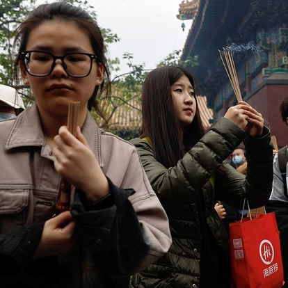  自由亚洲电台 北京时间 2024-01-23T13:00:19Z 1749658297379311918 联合国网站周一（1月22日）发文称，多位人权专家呼吁香港撤销对前《苹果日报》创办人 #黎智英 的所有指控，并立即释放他。目前黎智英正在香港接受包括串谋勾结外国在内的三项罪名指控的审判。
https://t.co/MpZt5p8aeb https://t.co/rUqgQm3FnB 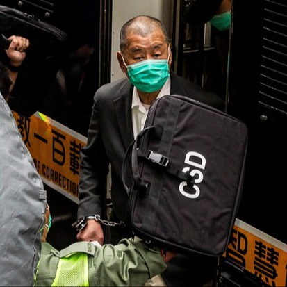  自由亚洲电台 北京时间 2024-01-23T06:34:01Z 1749561081729892417 【#您怎么看】据《华尔街日报》1月22日报道，中国股市继续大幅下跌，中国沪深300指数下跌1.6%，收于近5年来最低点。香港恒生指数下跌2.3%，现在接近2009年以来的最低收盘点位。您分析，这是为什么？您看好中国股市的未来吗？ https://t.co/TJnLYIpXAl 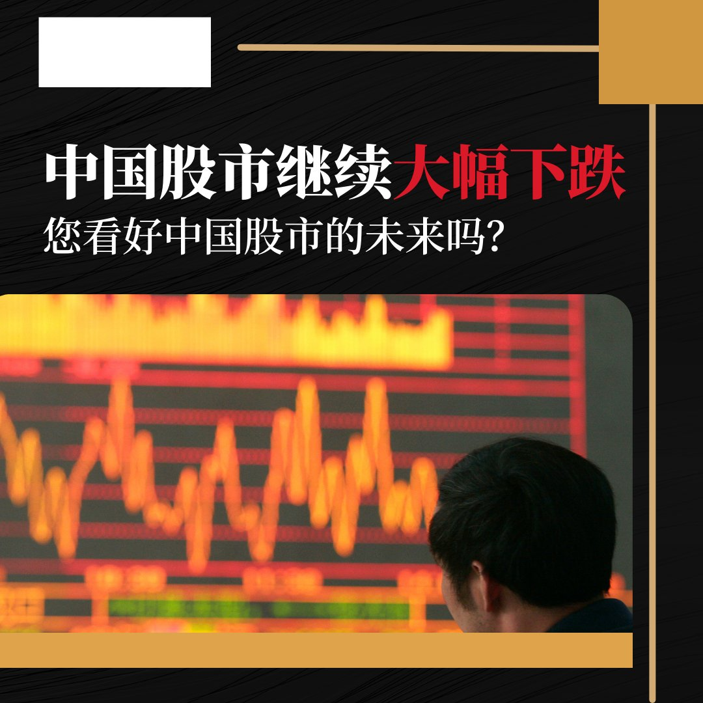  自由亚洲电台 北京时间 2024-01-23T06:34:41Z 1749561246339510451 据路透社报道，周五的一份声明显示，去年海外企业在中国的投资为1.13万亿元人民币（1571亿美元），同比下降8%，这是自2012年以来的首次下降。
您分析，背后原因是什么？ https://t.co/5PoMee6QLI 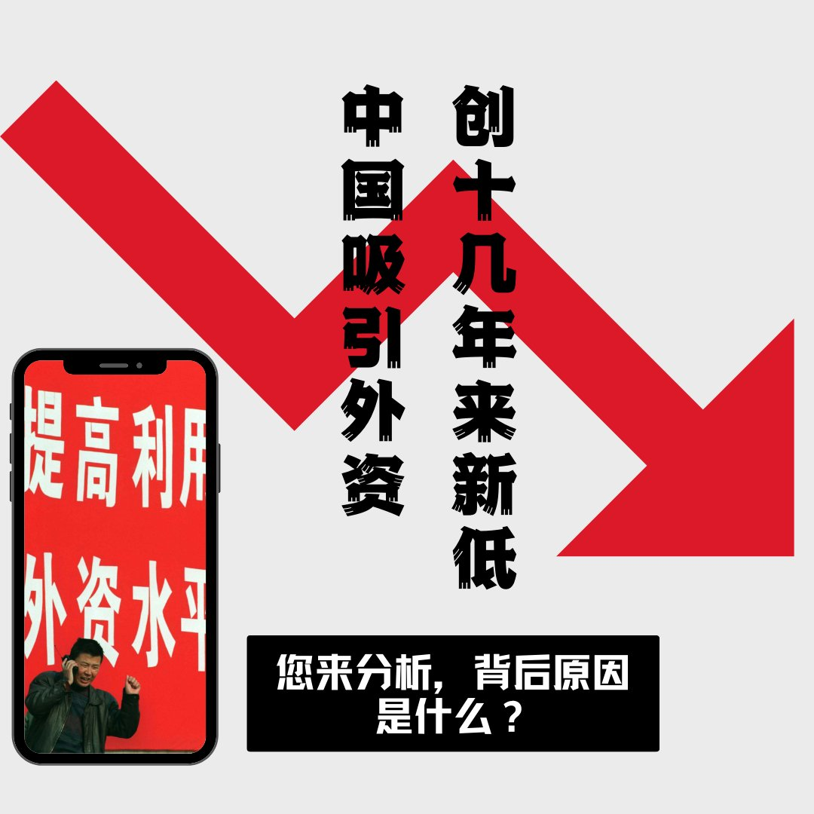  自由亚洲电台 北京时间 2024-01-23T07:00:47Z 1749567816741834920 美国国土安全部1月18日突击搜查了中国 #青岛三祥 科技股份有限公司（Sunsong Holdings Inc.）在俄亥俄州的子公司（Harco Manufacturing Group）。文件显示，这家中国制造商涉嫌通过第三国转运商品，以规避美国对中国商品课征的 #301条款关税。
https://t.co/zbTm6V5OMn https://t.co/ylusKrnG48 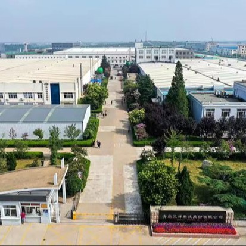  自由亚洲电台 北京时间 2024-01-23T07:07:32Z 1749569516194140511 【隔离、封锁还是进攻？】
美国华盛顿智库战略与国际研究中心 @CSIS 本周一发布的报告邀请了台美80多位学者针对2024年的 #两岸关系 做分析。学者们认为，在未来5年内，中国更可能会对台湾进行隔离、封锁，而非军事进攻，不过，隔离或封锁将不足以让台湾接受中国的 #统一 方案。https://t.co/L1j5OQqgXh https://t.co/cR30b9s85h   自由亚洲电台 北京时间 2024-01-23T07:19:24Z 1749572501158465869 【新疆阿克苏发生7.1级 #地震】
据中国官媒中新网报道，据国家地震台网官方微博消息，北京时间01月23日02时09分在 #新疆阿克苏 地区乌什县(北纬41.26度，东经78.63度)发生7.1级地震，震源深度22千米。
震中距乌鲁木齐市790公里，地震造成周边震感非常强烈，阿克苏、阿图什、喀什、伊犁，库尔勒，克拉玛依等地震感强烈，乌鲁木齐亦有震感报告。 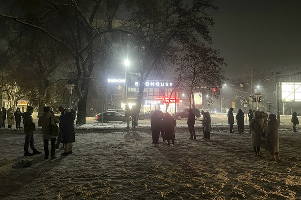  自由亚洲电台 北京时间 2024-01-23T07:32:22Z 1749575765438660975 专栏 | #夜话中南海：反右已经没有对手，#胡锡进 只好反“极左”
https://t.co/YQuGBYD68Y https://t.co/mGvqhevb9D 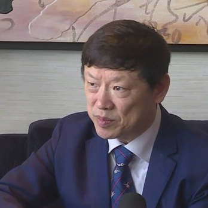  自由亚洲电台 北京时间 2024-01-23T07:46:04Z 1749579211873071191 欢迎收听和订阅播客【＃亚太报道】 https://t.co/MjLNSvVMqc

六四伤残者 #齐志勇 被传病逝；上海一重点工程被紧急叫停；《#洗脑》聚焦如何增强对“中共病毒”免疫力；80多位学者预测今年 #台海局势 https://t.co/7G19jTcD3M 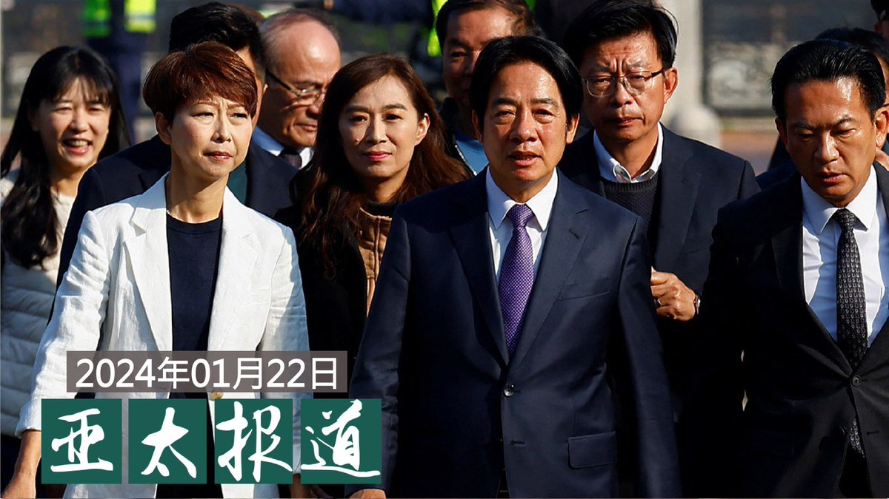  自由亚洲电台 北京时间 2024-01-23T08:55:46Z 1749596751877878018 评论 | 胡平 @HuPing1：#金正恩 会效仿金日成攻打韩国吗？
https://t.co/rbL7j1GyRc https://t.co/NhZ44IBFaD 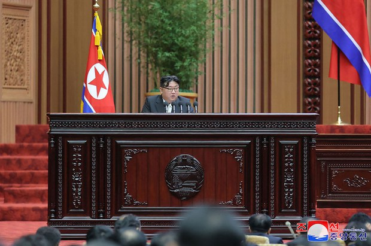  自由亚洲电台 北京时间 2024-01-23T04:44:47Z 1749533588935385226 评论 | 陈光诚 @iguangcheng: #齐志勇 去世让我伤痛愤怒
https://t.co/xXhEa9lmXH https://t.co/DOkNMuKQb5   自由亚洲电台 北京时间 2024-01-23T05:34:26Z 1749546086770102359 #联合国 将于本周二对中国的人权记录进行例行的审议。各国政府及民间团体将提出意见及观察，而中国当局也有机会做出回应或辩解。但在审议工作还没开展之前，就有媒体报道中国政府试图游说非西方政府表扬 #中国人权纪录。
https://t.co/vX99MbsFbN https://t.co/UKtK5Xeveq 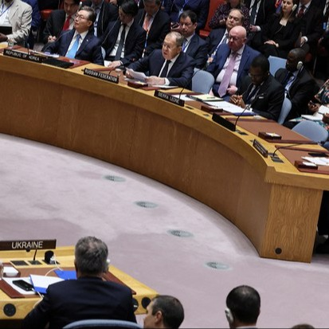  自由亚洲电台 北京时间 2024-01-23T02:30:08Z 1749499705674096867 随着引发中共发动大规模 #认知战 的台湾选举刚刚落幕,一本研究“#洗脑”的新书在台湾上市。
在新书发表座谈会上，主编 #夏明 表示，希望这本书成为对抗中共病毒的疫苗。
另一位主编 #宋永毅 告诉自由亚洲电台，洗脑不只是中国、也是世界性的问题。
https://t.co/qjIaW5i1ts https://t.co/nuNfnyVTuS   自由亚洲电台 北京时间 2024-01-23T02:44:46Z 1749503388201677251 曾提出“#中俄关系上不封顶” 的中国外交部原副部长 #乐玉成， 近期发表有关国际形势的讲话。他说，“今年的好消息不多”，要“系好安全带，前方有气流”。
战狼退休就变公知了？
https://t.co/vUyeGaluwP https://t.co/rccE8juGyB 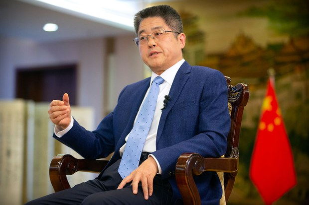  自由亚洲电台 北京时间 2024-01-23T03:43:15Z 1749518104156336357 据中国官媒新华社、央视等报道，#云南 省昭通市镇雄县周一（1月22日）早上6点左右发生 #山体滑坡，目前为止已致八人死亡，18户房屋被掩埋，至少47人失联。
https://t.co/rVIH28FZaW https://t.co/2ls4vteJTj 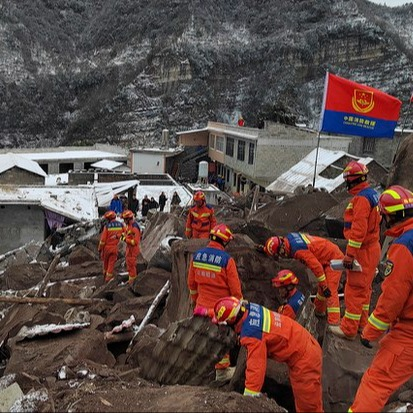  自由亚洲电台 北京时间 2024-01-23T01:03:46Z 1749477970413252848 近日，#网易裁员 的消息引发舆论关注。
有中国媒体披露，该公司从12月开始业务裁员，重灾区是网易传媒、游戏部门等。但本周一下午，相关消息在中国社媒平台被全网下架
https://t.co/ffd2UY8o8i https://t.co/MarvJAzs0J   自由亚洲电台 北京时间 2024-01-23T01:06:55Z 1749478763019268150 【“六四”幸存者 #齐志勇 传病逝】
#胡佳：“齐哥他是 #六四 伤残者，是活的历史证据，是当局当年那场屠杀的见证。他付出的代价仅次于死在北京的学生和市民。国内的伤残者也有一些，但是只有他这30多年来一直坚持发声。”
https://t.co/3r4Xvetqd8 https://t.co/vuL5cinNXL   自由亚洲电台 北京时间 2024-01-23T01:35:44Z 1749486015822356964 台湾总统大选刚落幕不久，抖音海外版TikTok平台流传多个指控台湾大选“作弊”的视频。台湾的中央选举委员会(中选会)在选举前后，总计向TikTok举报105则错假讯息视频，该平台已下架54则。
https://t.co/o9YjU9uSqT https://t.co/NvQtJvfdXl   