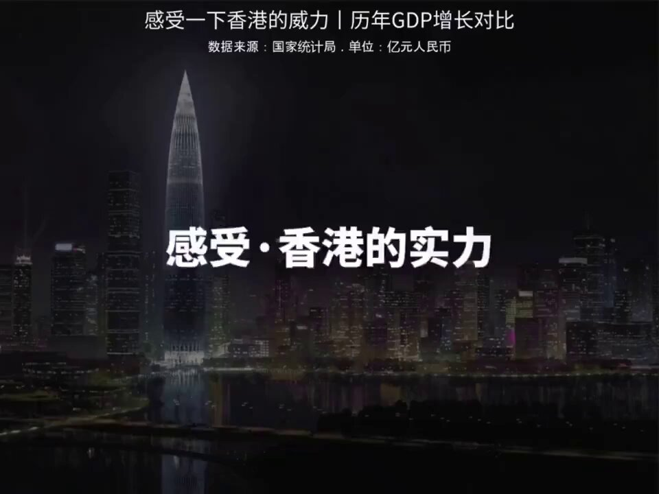

谁将十万横扫三江 北京时间 2024-01-23T10:57:51Z 1749627477151174691 RT @CDTChinese: 所谓“通报时代”，就是一个公权大幅扩张，媒体同步萎缩的过程。说回山东台吕台长那句话。他当然该骂，但不能只骂他，那也是捏软柿子。以及南阳火灾，河南媒体连消防通报都不发，看来中国新闻不仅进入“通报时代”，现在还要进入“不通报时代”了。用张丰兄的话说，…   谁将十万横扫三江 北京时间 2024-01-23T11:53:15Z 1749641418174312647 以前香港的对手：上海，深圳，广州
以后香港的对手：义乌，昆山，常熟 https://t.co/oR8YZvwoAA   