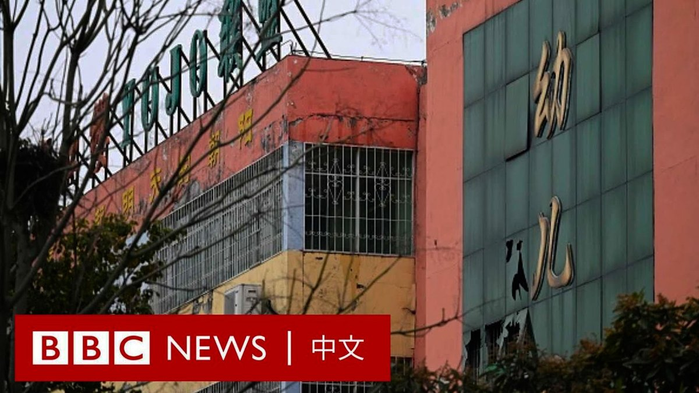
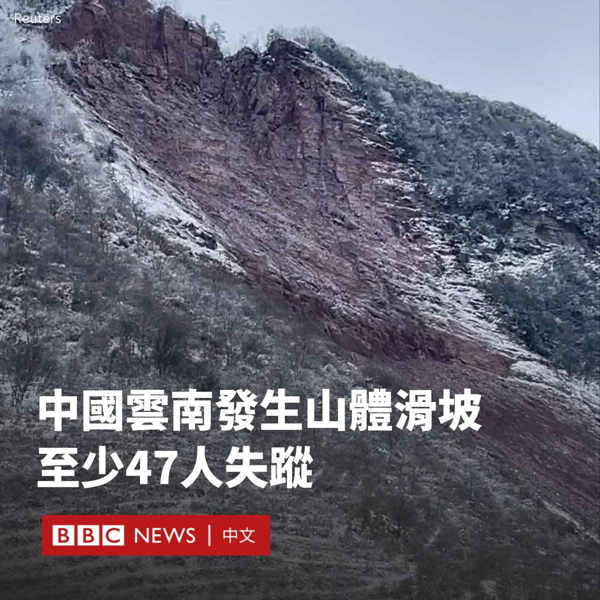

D英国广播公司BBC 北京时间 2024-01-22T19:59:19Z 1749401353452204164 中国中部河南省一学校宿舍发生致命火灾，造成13名学生死亡。火灾发生在1月19日夜晚事发时，学生们正在宿舍内睡觉。

有中国媒体报导称火灾或与电加热装置有关，但官方尚未公布遇难者身份及起火原因。

目前事故调查正在进行中，涉事学校负责人已被拘留。 https://t.co/7lvB7aiIlC   D英国广播公司BBC 北京时间 2024-01-22T17:08:30Z 1749358363610423428 美国遭到猛烈的冬季风暴侵袭。航拍画面显示，密歇根州格兰德港仿佛进入冰河时代。在密歇根湖东岸，有房屋几乎完全被冰雪所包裹。

最近一周，随着寒潮来袭，美国部分地区气温骤降，全美已有近90人因天气原因死亡。 https://t.co/uPd0gEeYLv   D英国广播公司BBC 北京时间 2024-01-22T14:08:24Z 1749313043882971202 据中国官方媒体报道，中国西南部的云南省发生山体滑坡事件，导致47人被埋，失去联系。

据《人民日报》报道，事故发生于清晨5点51分左右。在山体滑坡发生后，昭通市镇雄县凉水村有18户人家遭到掩埋。

据报道，当地政府启动了应急响应，已派出33辆消防车、200多名救援人员前往搜救。

现场画面显示，搜救人员在一片瓦砾中寻找幸存者。废墟上有衣服等物品。

凉水村一名付姓村民对BBC说，村民们此前就发现山体存在裂缝。他补充说：“过去曾发生过山体滑坡，但伤亡人数从来没有这么多。”

据报道，目前已有超过500人被疏散。山体滑坡的原因仍在调查。

据中央气象台的数据，云南省正在经历寒潮，事发地最低气温低于0℃，并预计有小到中雪。   D英国广播公司BBC 北京时间 2024-01-22T11:54:48Z 1749279420739686419 中国新经济数字显示，该国经济增长超过了官方目标。其中，消费的复苏在拉动增长方面起到主力引擎的作用，服务的消费额增长尤为明显。

与此同时，制造业、基建投资大幅超过GDP整体增速，而房地产投资继续大幅萎缩，拖累整个经济。
https://t.co/yvSdfZOlht   D英国广播公司BBC 北京时间 2024-01-22T10:05:31Z 1749251918524989542 菲律宾总统小费迪南德·马科斯（Ferdinand Marcos Jr）因乘坐总统直升机参加在首都马尼拉举行的一场演唱会，而在社交媒体上受到批评。

周五（1月19日），马科斯与夫人被发现乘直升机前往菲律宾体育馆（Philippine Arena），观看英国摇滚乐队“酷玩乐队”（Coldplay）的演出。

批评者称，使用政府资源出席非官方活动是滥用权力。马科斯办公室为其行为进行了辩护，理由是“无法预见的交通问题”。

总统府安全小组解释，由于演唱会是在该国最大的室内体育馆举行，当晚约有四万名观众涌入，造成沿途可能出现“无法预料的交通问题”，这会对总统的人身安全构成潜在威胁，呼吁公众理解。

然而，这一解释并未得到很多社交媒体用户的认可。他们批评马科斯浪费纳税人的钱。

网上流传的影片和照片显示，马科斯和夫人乘坐的总统专用直升机在体育馆附近降落，现场有多名身穿白色制服的男子。   