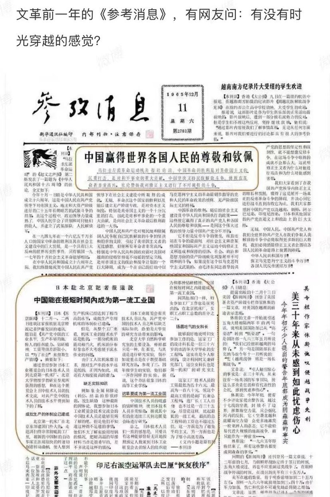

Petrichor 北京时间 2024-01-22T22:59:26Z 1749446678975840753 把这些小粉红全面送回中共国，哪里来哪里去，不要再传播中共的意识形态，毒害欧美国家。这些不是贪官子女就是奸商子女（普通劳苦大众无钱送孩子留学）。从中国转移资金海外，享受生活，却干着大外宣之事，令人恶心。他们不代表海外华人。排华就是要去小粉红。

 https://t.co/QESdXPcZkr   Petrichor 北京时间 2024-01-22T07:57:41Z 1749219747432902793 工作、房子、孩子、银行存款或贷款….都是统治者可以控制你的软肋。出于这一考虑，青年一代被动性的选择躺平，符合自然界最小能原理。 https://t.co/WXzmiIUJrs   Petrichor 北京时间 2024-01-22T08:10:17Z 1749222919383712035 我一朋友评论道：【爱吹大牛逼，原先以为是做知青和工农兵学员留下来的后遗症。现在看来错了，他爱吹大牛逼的毛病是从他毛爷爷那里遗传过来的。】 https://t.co/uJFnIj8dmz   Petrichor 北京时间 2024-01-22T08:29:28Z 1749227748231414055 沈阳这是干嘛？这么多警车同时出行？我猜，反正不是去解放钓鱼岛和海参崴。出来为了保护百姓，还是为了镇压百姓？声势浩大，在百姓面前显摆官员的阔气？说明中国社会稳定、治安甚好？

我朋友视角特殊，她怀疑会不会是皇帝驾崩了，紧忙赶回京安排接班人后再发丧？我说她大陆宫廷电视剧看多了。 https://t.co/ppccThc4kM   Petrichor 北京时间 2024-01-22T03:15:02Z 1749148617036746912 政治正确，或美其名政权为大，总是联想丰富，一红圈、一张膏药、一个用过的卫生巾…都能让他们联想到日本的国旗，就是哈日，日本永远是中国的敌人，哪怕拿过日本的对华援助拿到手软。

这和大清皇帝的文字狱有何区别。清朝徐骏的一句诗“清风不识字，何故乱翻书”，惹来杀身之祸，原因是皇帝认为他是在讽刺满清人没文化还装作有文化的样子。但其实这句话不过是徐骏应景而作的诗罢。

雍正朝礼部侍郎查嗣庭在一文中引用《诗经·商颂·玄鸟》﹕“邦畿千里，维民所止。”，却被举发“维止”二字，意在取“雍正”二字去其首。雍正大怒，下令将查嗣庭被捕入狱，又在家中被抄出《维止录》，所载“狂妄悖逆”之语，雍正五年（1727年）五月戊午迫害死于狱中，仍被戮尸枭示。

图像语言文字的理解的主观性比较强，这个时候其实应该运用现代法律中的疑罪从无的理念，即不足以证明被告人有罪，应推定其无罪。但很可惜的是，当今中国政治空气越来越浓，不少人依然保留着疑罪从有的观念，这样的社会是人人自危的社会，因为这样陷害一个人会变得非常容易，正如当年秦桧的一句莫须有就可以把岳飞陷害致死，要想陷害一个人只需要根据其过往的图像语言文字不断联想即可，这无疑跟现代社会的法治精神是背道而驰的。   