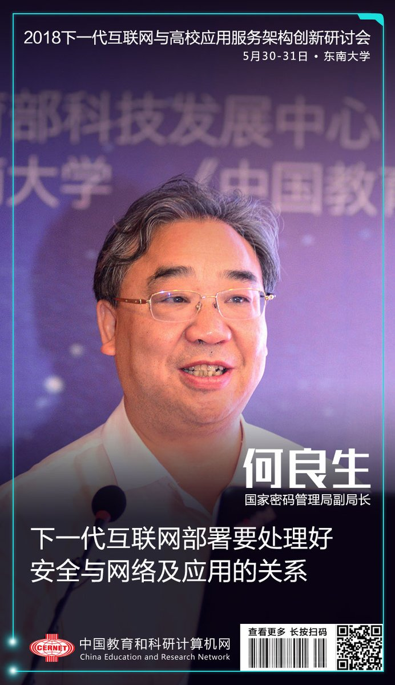
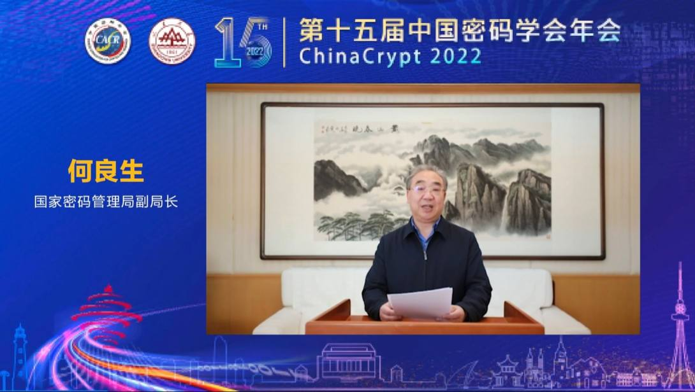
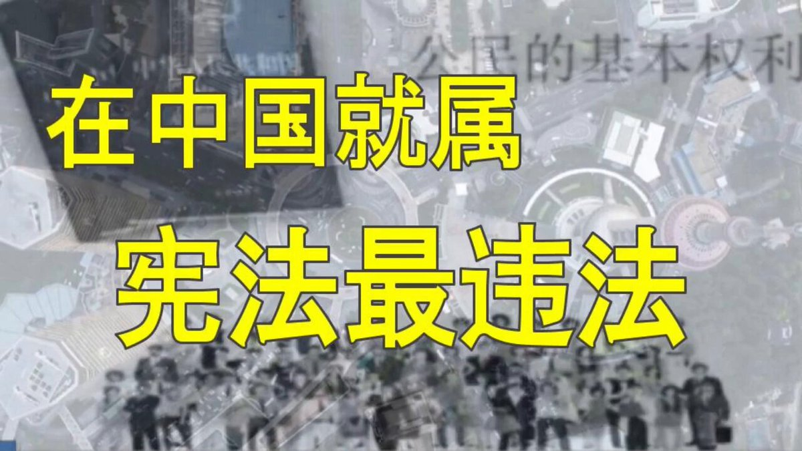

拆墙运动公号 北京时间 2024-01-22T22:27:27Z 1749438633222848871 【 #2259专案组 互联网防火墙第111号嫌犯 #何良生】 性别：男 
职务：国家密码管理局副局长
现任国家密码管理局副局长。

官网：https://t.co/LZ1NK8udKm
详细资料见: #BanGFW拆墙运动（建墙罪犯录）：https://t.co/mXkE54QKtc

何良生

负责专业范围为密码科研及管理。
擅长专业为密码科研及管理。

标委会信息
委员会名称:TC260 全国网络安全标准化技术委员会
工作单位:国家密码管理局
委员会职务:主任委员
加入时间:2021-08-24

单位地址：北京市丰台区靛厂路7号
邮政编码：100036

中文名:国家密码管理局
地 点：北京市丰台区靛厂路7号　
邮政编码：100036
机构职责：承担重要科研任务

国家密码管理局
国家密码管理局，与中央密码工作领导小组办公室，实际上是一个机构两块牌子，列入中共中央直属机关的下属机构。国家密码管理局位于北京市丰台区。

战略合作伙伴：1、中共恶人榜：#ccpevils        
2、#zhinawiki   拆墙运动公号 北京时间 2024-01-22T22:21:22Z 1749437100275953703 RT @changchengwai: @gaoyu200812 “大家好! 谢谢你们听我讲述当年八九六四的受伤经过。我叫齐志勇，整齐的齐，同志的志，勇敢的勇。我是北京人，我从小出生在北京。当年，我受伤的时候是三十三岁，回想起八九六四这场中共在天安门大屠杀的情景，至今我的心情，是…   拆墙运动公号 北京时间 2024-01-22T01:19:17Z 1749119485867614221 RT @HeroWeliam: 这真是历史性的大笑话！
在中国，就属宪法最违法 https://t.co/ggMnGECfyM   