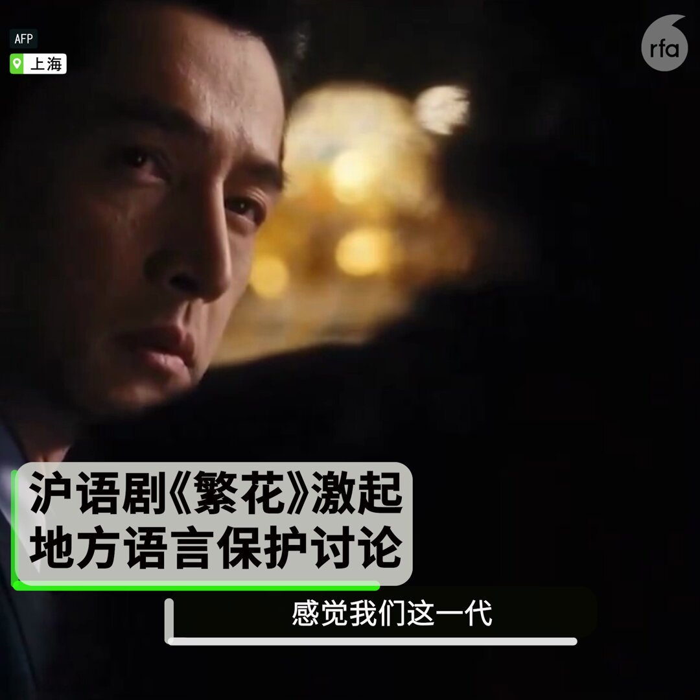
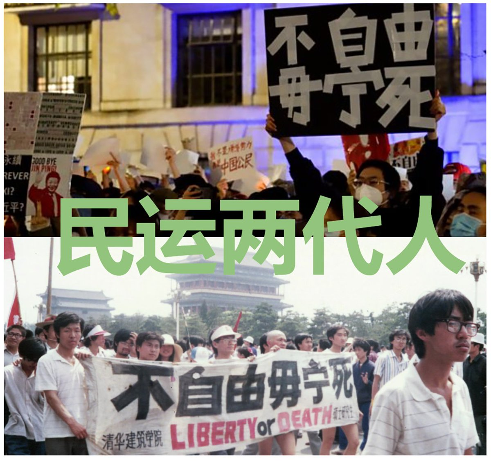

自由亚洲电台 北京时间 2024-01-22T06:26:05Z 1749196694812598702 新疆 #阿勒泰地区 哈巴河县公路管理分局3名除雪保通队员在布尔津县境内新疆省道S232线K17至K18公里处进行道路清雪作业时，遭遇雪崩失联。
详阅：
https://t.co/FcGNFtd9Q7   自由亚洲电台 北京时间 2024-01-22T07:19:51Z 1749210226325066201 朝鲜中央广播电台报道，俄罗斯总统 #普京 近日接见朝鲜外务相 #崔善姬 时表明，他愿早日访问朝鲜。#朝鲜 就此已做好接待准备。
详阅：
https://t.co/nIut4esUbV   自由亚洲电台 北京时间 2024-01-22T08:01:01Z 1749220588806164562 菲国渔民1月12日在南海 #黄岩岛 附近捕捞海贝时，遭5名中国海警搭橡皮艇骚扰，海警要求他们将海贝扔回海里，渔民才得以离开。
详阅：
https://t.co/YPjtr1jWoa   自由亚洲电台 北京时间 2024-01-22T08:29:40Z 1749227795216032114 英国反恐事务负责人 #马特·朱克斯（MattJukes）警告有中国、俄罗斯和伊朗的间谍威胁，英国国防大臣 #格兰特·沙普斯（Grant Shapps）表示，英国“非常严肃地”对待今年选举面临的外国干预。
详情：
https://t.co/78hv0PfQvs   自由亚洲电台 北京时间 2024-01-22T08:51:26Z 1749233273580999166 【沪语剧集风靡南北，激起地方语言保护讨论】
王家卫首部电视剧《#繁花》全剧以上海话拍摄完成，以富有活力的语言生动展示九十年代上海风情。尽管剧集配有普通话选项，多数民众表示选择沪语追剧更富韵味。
长年以来，包括内蒙、新疆、西藏、广东的多地民众因中国语言政策而被触发不满情绪。在 #上海，不少新一代年青人不识沪语，引发担忧。有市民希望可以借助电视剧，重燃新上海人学习和保育 #沪语 的兴趣。
下一套大剧，您想看什么语言的？（素材源：法新社）   自由亚洲电台 北京时间 2024-01-22T03:41:15Z 1749155213557035352 RT @RFA_Chinese: 近日，流亡藏人社区“西藏小姐” 选美赛冠军丹增白珍参加在柬埔寨举行的“2023年全球小姐”选美赛，然而，据她在社交媒体IG账号发布的视频指出，主办方要求她必须以中国国籍的身份参赛，在被拒绝后主办方剥夺了她的参赛权利。对此，您怎么看？ https…   自由亚洲电台 北京时间 2024-01-22T04:08:13Z 1749162002449158451 “非暴力”不仅是抗争手段，也应是政权和平转型的基本原则：这有赖于国人“#自我消毒，不断吐出从小被灌输洗脑的狼奶，譬如极端思维、唯我正确、追求思想统一、难以包容不同意见、成王败寇、非黑即白、不择手段，并要扩大视野及心胸，学会妥协、接受及 #包容”。—#蔡霞 
详阅：https://t.co/Ujd342bMrm https://t.co/MKKDVOLq8a   自由亚洲电台 北京时间 2024-01-22T00:30:56Z 1749107320708014305 民调显示日本86.7%民众对中国“没有亲近感”；近三成人认为中日关系发展“不重要”或“不太重要”。
详阅：
https://t.co/j4n5czswgk   自由亚洲电台 北京时间 2024-01-22T00:48:11Z 1749111658922779061 【网民发表“#和平转型”言论被刑拘】上海公民张敏杰因在推特向当局提出“和平转型”，被徐汇区政保人员约谈。现时 #张敏杰 被公安局以涉嫌“寻衅滋事罪”刑事拘留，住家被警方查抄。
详阅：
https://t.co/UIHi7jAWcw   自由亚洲电台 北京时间 2024-01-22T01:02:46Z 1749115331983843490 【齐志勇逝世，多年不懈收集六四伤残者名单】
民运人士 #齐志勇 1989年6月4日凌晨，在撤离 #天安门 广场路上遭戒严部队枪击，双腿中弹，左腿高位截肢接受输血时，不幸感染丙型肝炎。2022年荣获“全美学自联自由精神奖”。
详阅：
https://t.co/l25TQJVYwV   自由亚洲电台 北京时间 2024-01-22T01:27:58Z 1749121671909314784 【台湾: 中国或以四种手段对台施压】
大选落幕，台海局势备受瞩目。#台湾 驻加代表曾厚仁表示，为打压台湾，中国或将继续挖角邦交国、实弹军演、中止两岸 #ECFA 合作协议、以及阻挠台湾民间组织参加国际NGO活动。
详阅：
https://t.co/HZTwklXyqa   自由亚洲电台 北京时间 2024-01-22T01:49:29Z 1749127087988871175 【公开拒加“三自”教会，基督徒祷告被拘】安徽改革宗家庭教会“麦种归正教会”的 #代传礼、#王丹丹 和 #马佳慧 等在带领孩子们唱诗时，被阜阳公安带走，处以15天行政拘留。
详阅：
https://t.co/XI0VDC9Ryg   