Petrichor 北京时间 2024-01-21T23:02:25Z 1749085044507922805 装，继续装…. https://t.co/KadE9KjRIV   Petrichor 北京时间 2024-01-21T22:01:12Z 1749069638879601100 腿掰大了，拉破裤裆，扯痛蛋。悠着点！ https://t.co/bqNPE6DfWi   Petrichor 北京时间 2024-01-21T13:06:44Z 1748935133015441673 国际技术领先的肉食品注水机器，中国研发出来了，并广泛应用于实践，经济效益特别显著。 https://t.co/ghKWiu7pbw   Petrichor 北京时间 2024-01-21T14:06:47Z 1748950247617794520 没有比较，就没有伤害。 https://t.co/HLjTQzE8pu 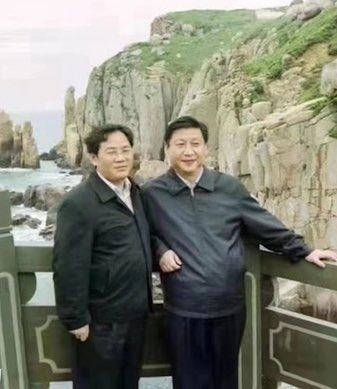  Petrichor 北京时间 2024-01-21T14:13:41Z 1748951982599962879 残酷！中国大陆华人出国后的离婚率竟高达60%！至少加拿大的统计数据是这样。中国人家庭观念重，但离婚率为何这么高？出国后，新环境破坏了原先的男女平衡。 https://t.co/B8gTmxHLGj 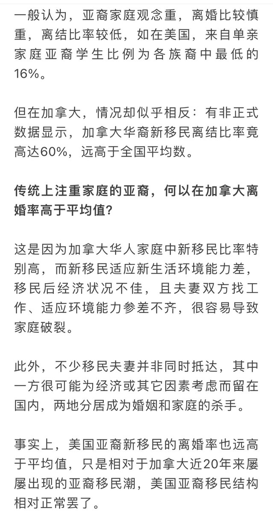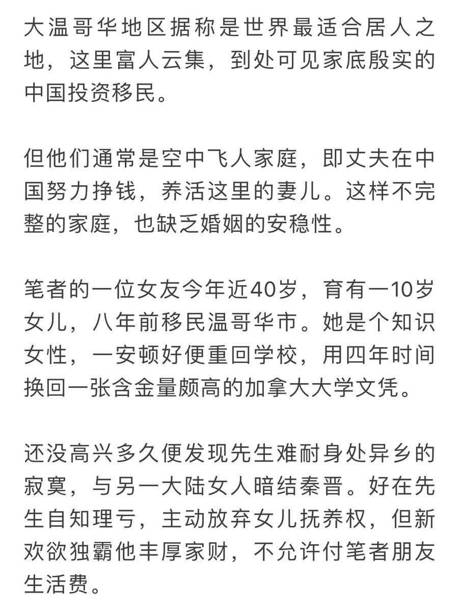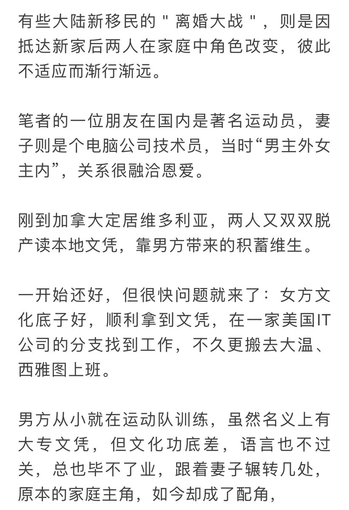  Petrichor 北京时间 2024-01-21T07:52:33Z 1748856069953044588 中国外交部原副部长乐玉成在中国人民大学演讲时说，”与全球乱局变局相对照, 霸权主义强权政治今年也不会消停。个别大国本性难改，唯恐天下不乱，会继续从所谓的实力地位出发，四处煽风点火，插手干预，仗势欺人，把他们的国内危机向外部转嫁”。

如果外联部长刘建超最近在美国的讲话代表习近平外交政策发生转变的话，乐玉成就是来拆台的。不过也有外国消息灵通人士说，乐玉成所言的“个别大国”就是指中国。他已经被迫离开了外交部。 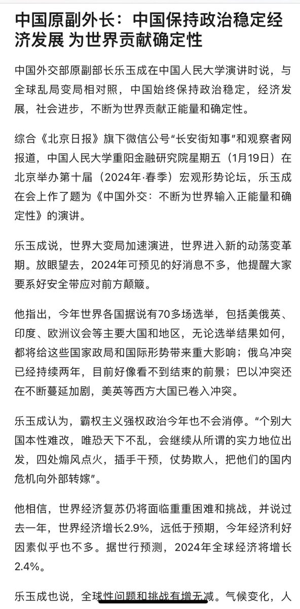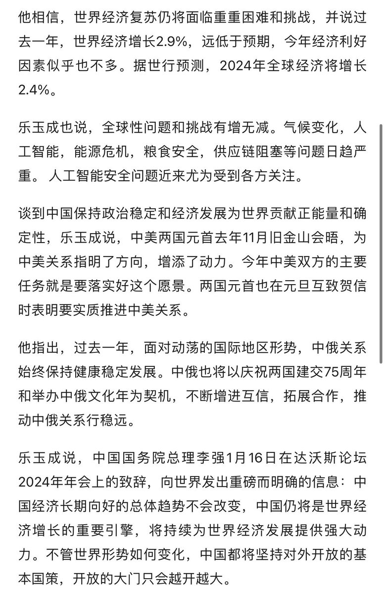  Petrichor 北京时间 2024-01-21T09:04:46Z 1748874240206557222 美国去年GDP增加3%，股市一片欣欣向荣，失业率历史最低。中国去年GDP增长5.2%，股市一片凄风惨雨，破产和失业率不忍目睹、房市暴雷不断？究竟说慌？ https://t.co/lhBOTkZLsg 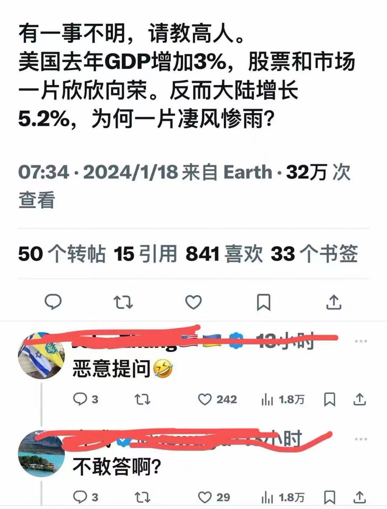  Petrichor 北京时间 2024-01-21T01:19:33Z 1748757167350456665 刘建超最近在美国说“中国无意改变世界秩序”。
事实真是如此吗？互联网是有记忆的，请看附图。
习近平上台后一直致力于全球治理改革，建立中国主导打世界新秩序。
刘建超狠打习近平的脸，看不下去了。 https://t.co/PasEYGCF4f 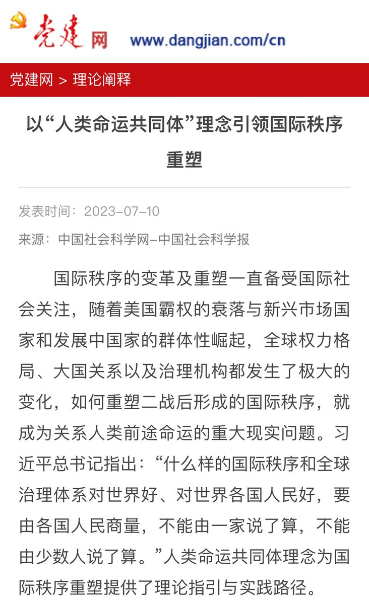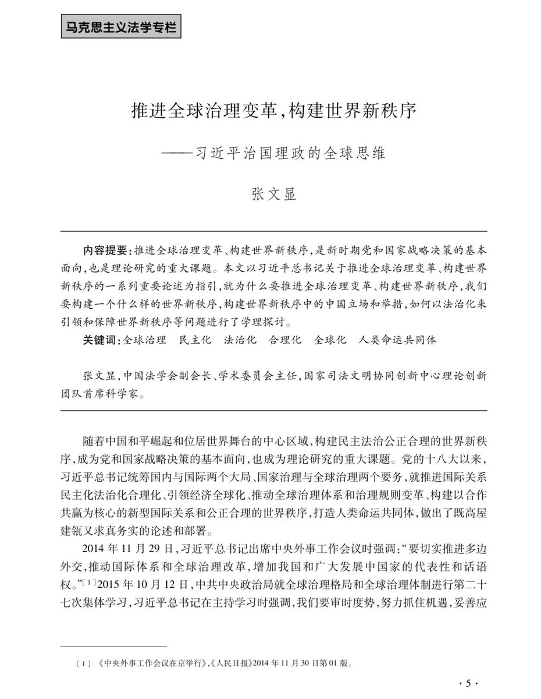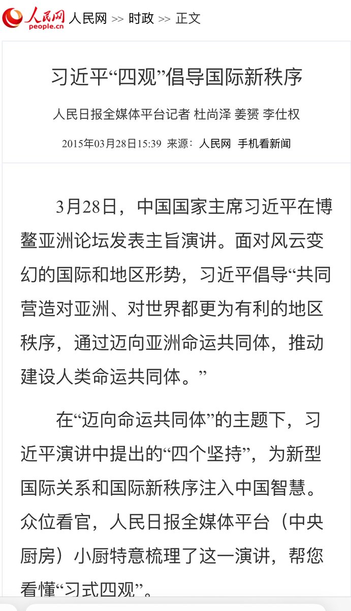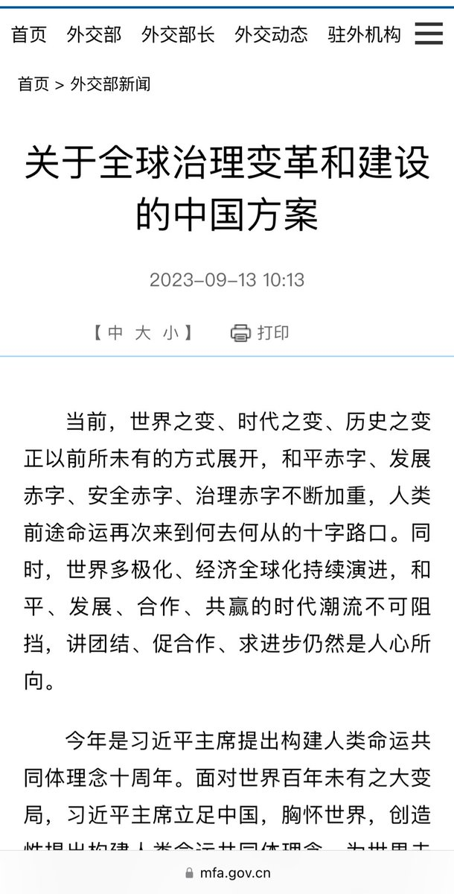  Petrichor 北京时间 2024-01-21T00:13:16Z 1748740486297448954 9个月前“中国引领世界新秩序”，9个月后“中国无意改变世界秩序”。翻手为云覆手为雨，主动认怂？牛逼吹不动了？

失信于民，失信于世，再难以欺世！ https://t.co/gjTznN4W6m 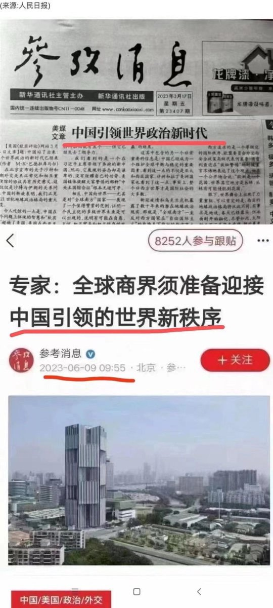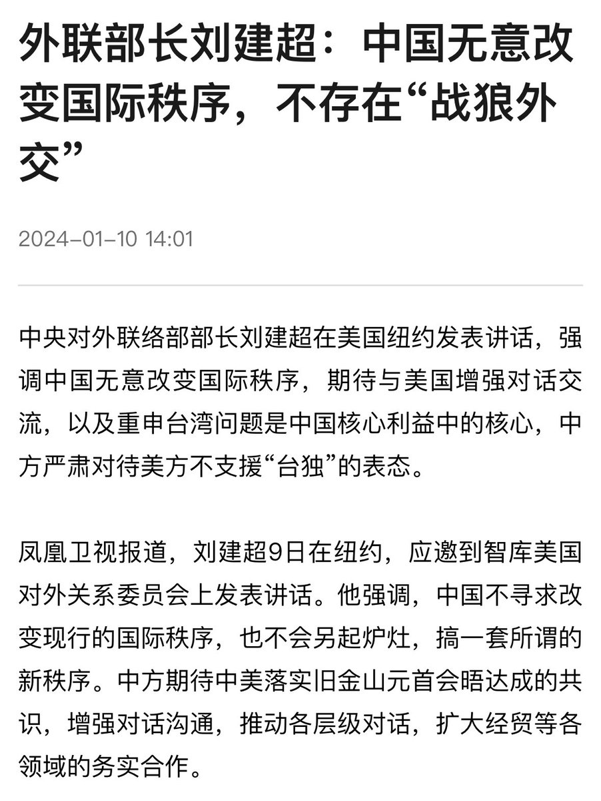  