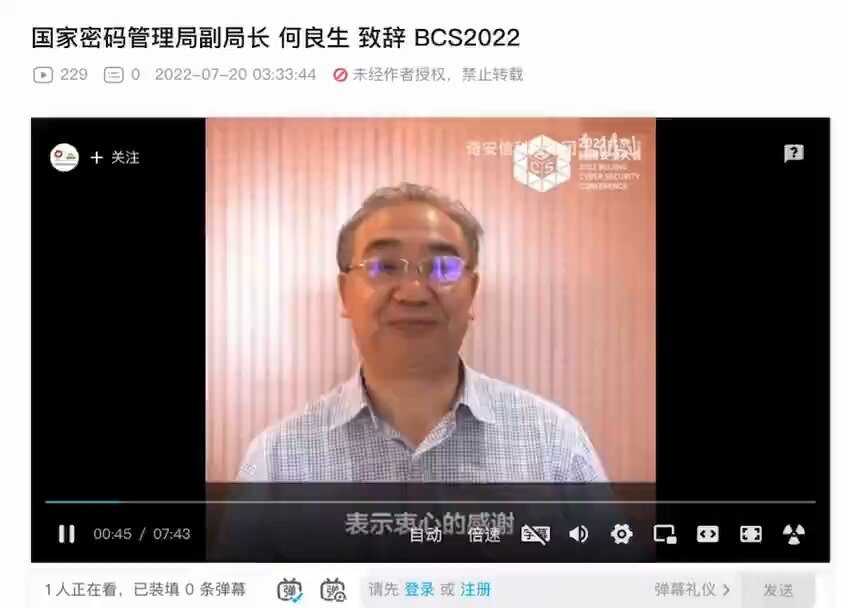
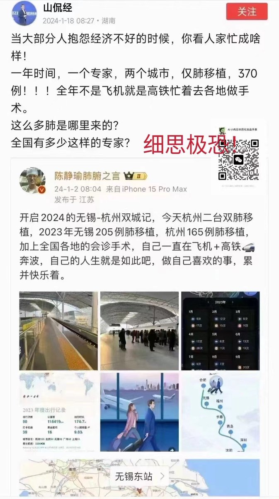

拆墙运动公号 北京时间 2024-01-21T21:36:19Z 1749063376209088598 姓名：#何良生
性别：男
职务：国家密码管理局副局长
现任国家密码管理局副局长。

何良生

负责专业范围为密码科研及管理。
擅长专业为密码科研及管理。

标委会信息
委员会名称:TC260 全国网络安全标准化技术委员会
工作单位:国家密码管理局
委员会职务:主任委员
加入时间:2021-08-24

单位地址：北京市丰台区靛厂路7号
邮政编码：100036

国家密码管理局
国家密码管理局，与中央密码工作领导小组办公室，实际上是一个机构两块牌子，列入中共中央直属机关的下属机构。国家密码管理局位于北京市丰台区。   拆墙运动公号 北京时间 2024-01-21T22:33:31Z 1749077770661945490 RT @LinShengliang: #陳靜瑜 器官移植專家一年的手術攻略。 https://t.co/KyRwVT6ASt   拆墙运动公号 北京时间 2024-01-21T01:10:45Z 1748754950128124010 RT @changchengwai: #悼齐志勇

吕上：“齐哥走了，带着他的故事走了，他的故事不仅仅属于他的，他的疼痛也是很多人的疼痛”

再听一次六四伤残者、六四屠杀见证人 #齐志勇 的口述历史吧：
https://t.co/EbpBPj3pB5 https://t.co/…   拆墙运动公号 北京时间 2024-01-21T01:17:20Z 1748756608438378617 RT @gaoyu200812: 得到齊志勇先生病逝的惡耗，非常悲痛。他是六四的受難者，被被解放軍的子彈擊中一條腿，不得不截肢。近年更受盡病痛折磨，每週都要做透析。自從去年8月，我的微信被封，就失去和他的聯繫。此前他經常發給我的語音問候還時時在耳邊響起。… https://t.…   