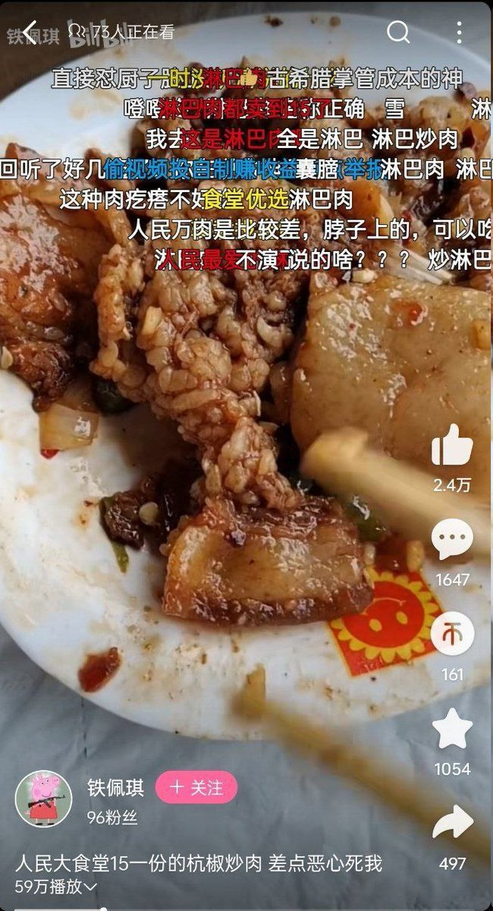
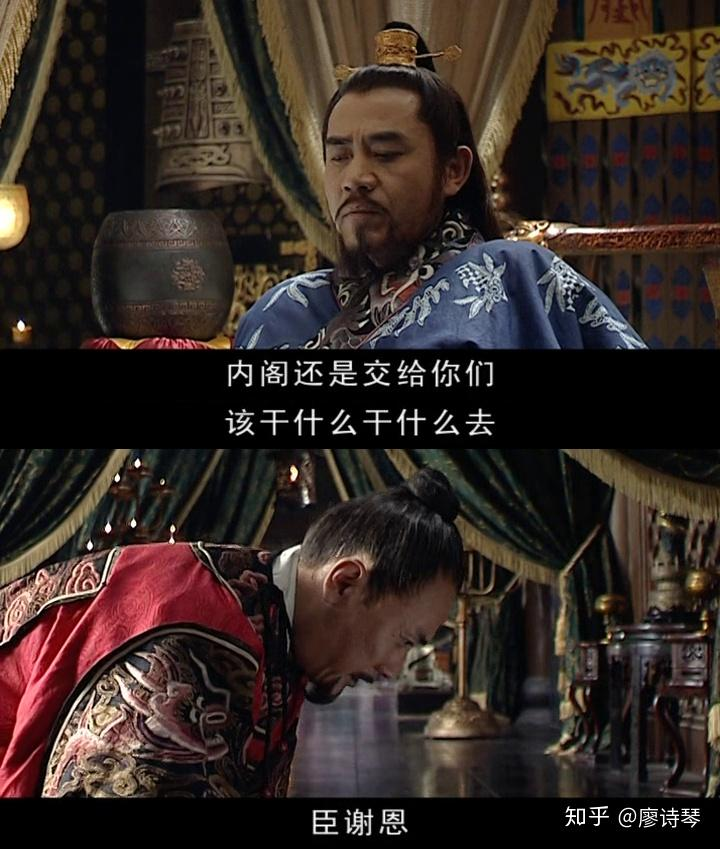
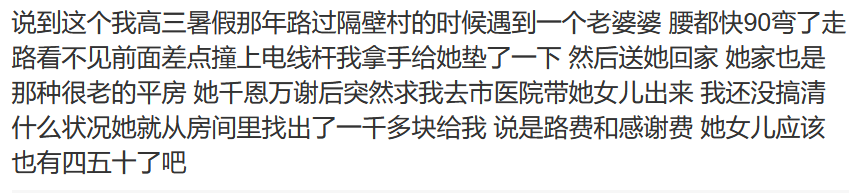
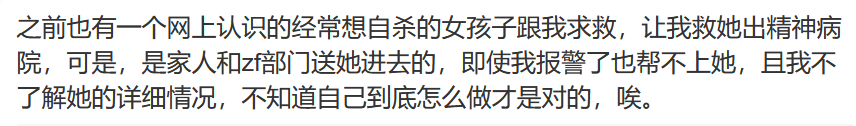
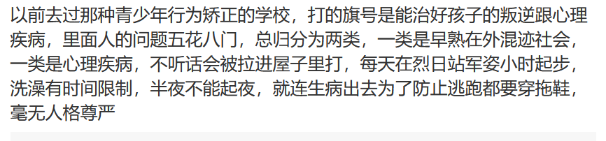
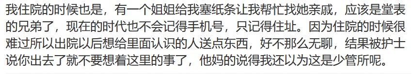
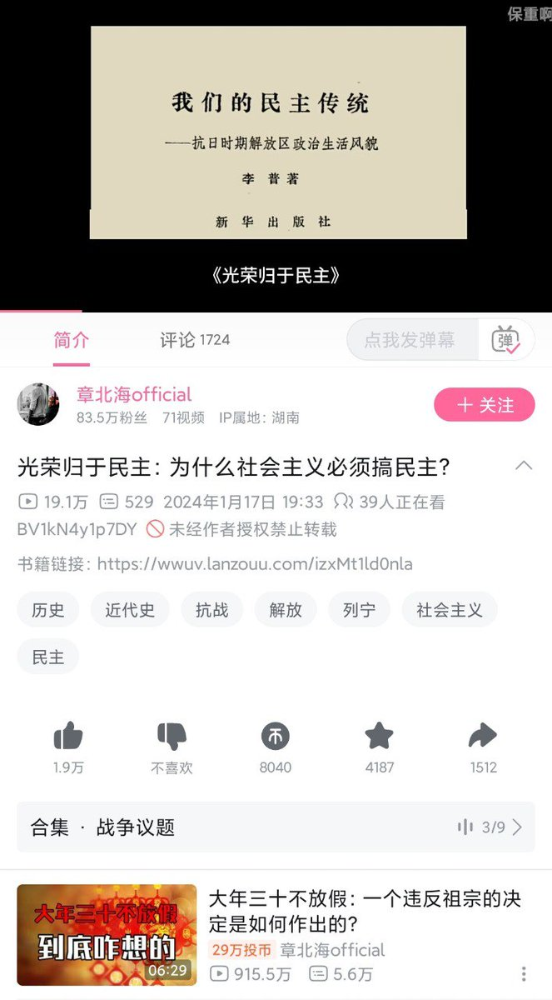
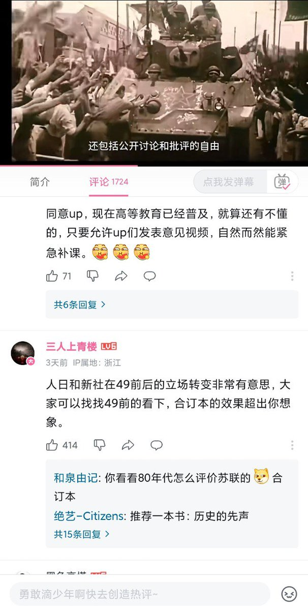
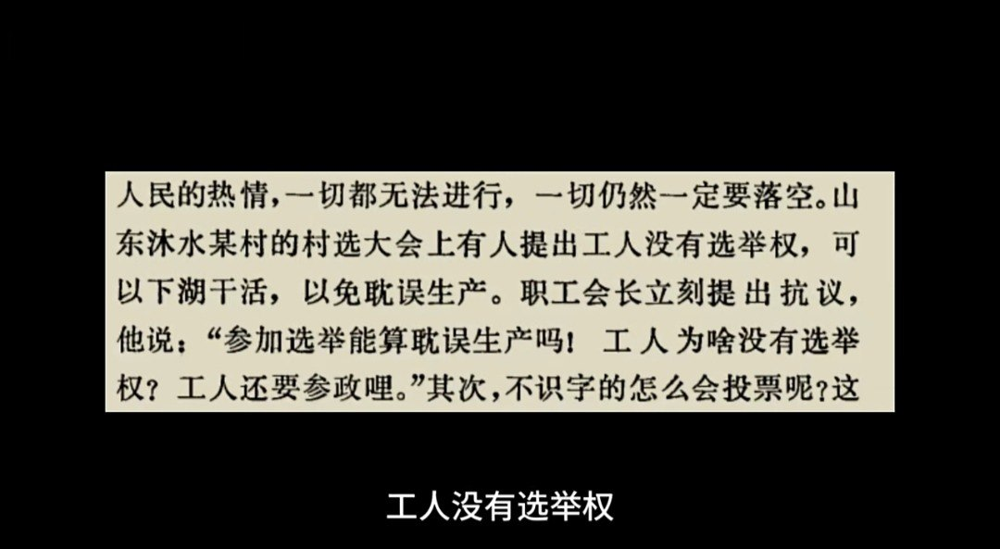

谁将十万横扫三江 北京时间 2024-01-21T17:27:58Z 1749000876155625723 大锅饭的淋巴肉，干净又卫生 https://t.co/KJvU5PzvFA   谁将十万横扫三江 北京时间 2024-01-21T17:41:06Z 1749004181548204224 RT @torontobigface: 粉红认知里一直有一股莫名的自信
认为入侵台湾，战场的炮灰不会是自己，而是台湾人和其他中国人
认为发动文革，被批判被打倒的，一定也不是自己，自己只会是那个批判别人的人。
这么多年的生活，难道还没有让各位意识到，自己韭菜的命运吗？
入侵台湾的…   谁将十万横扫三江 北京时间 2024-01-21T18:17:52Z 1749013435181097341 中国也有自己的三权，和西方基于治理的三权分立不同，中国的三权是服务于暴力政变的，军权政权财权，军权归军委主席/国防委员会主席，财权归计划经济主席/，政权归党主席，但是在毛泽东以后的治理模式，党政军归于一人，管经济的成了下属部门，自然是一出问题就回归封建王朝的，“朕把内阁交给了你们” https://t.co/oiiTzgzsjj   谁将十万横扫三江 北京时间 2024-01-21T10:37:12Z 1748897502638809581 在中国，批评私盐怎么都行，官盐是不能说的   谁将十万横扫三江 北京时间 2024-01-21T10:52:45Z 1748901416159371522 RT @AapkaPapu: 微信小视频里的一个女的吸猫的视频，内容就是她在亲自己的猫，其它啥也没有，评论区却破了防，充满了对这名女孩的恶意。

如果有人不懂为什么，那是因为在中国incel的眼里，养猫的女的可能是搞女权丁克那一套的。 https://t.co/KPNkunkt…   谁将十万横扫三江 北京时间 2024-01-21T10:13:32Z 1748891548878815249 精神病院，中国的另类监狱

一位两次被送进精神病院的人：我记得我第二次从精神病院出院的时候，有个女孩偷偷塞了一张纸条给我，上面写了她妈妈的电话号码，她说告诉她妈妈她在里面过的很痛苦，她想出去，我出去以后打了那个电话，电话对面的女人说啊啊我也知道她在里面的情况，但她这个情况很复杂嘛我们也没有办法，挂了电话我觉得心都碎了，她以为她还在里面是因为外面的人不知道里面是什么样的，但其实外面的人都知道，正事因此才把她送进去的。忘了是哪一年了，但是是个夏天，我上吊到一半被父母揪下来，他们打了110又打了120，两个警察把又尖叫又踢打的我抓到救护车上开走了，救护车上的人说里面的设备很如果我不乖不能呆在里面，但进去的时候我已经放弃了，没有力气了。宛平南路总部那个时候人满了，我在本区的分部住的，没有特需男女也是分开住的，里面中老年女性的比例吓到我了，因为宛平南路还是有很多年轻人的，分部就像老人院一样，甚至有一个特殊的病房是临终的人呆的，她们二十四小时都躺着，到死都不能自由。其实里面大多数的女人根本就没有病，或者就是轻度抑郁和焦虑，她们的家人把她们送起来只是因为懒得管她们或者嫌她们情绪不好的时候麻烦。把亲人关起来就是这么简单，基本上添油加醋一番精神病院就会收容，因为患者本人说什么都是没人信的，而且医生不会主动放你出去，只有你亲人愿意让你出去你才能出去。我震惊为什么让人失去人权是这么简单，轻松的一句话就能把人送进或者揪出地狱，进去是不能带任何东西的，只能穿病号服和拖鞋，口袋里头发里的东西都给你翻出来，脸盆，牙刷，厕纸，水杯都没有，只能你家人给你带，家人不给你带就是没有了。精神病人是不被当成人看待的，厕所没有门，上厕所就面对着所有其他人，所有人都能看到，每天到点起来，然后集体走到一个像教室一样全是桌子的房间里，然后就坐在桌子旁边，什么都不能做，没有理由也不能起来，到点吃一些煮熟的烂白菜和肉丸，然后到点吃药，到点睡觉。有时候外面的人会运一叠一叠的纸盒子进来，里面的人可以叠纸盒，据说叠一个有几分钱，但是又哪里可以用钱呢，大家叠纸盒只是为了有点事情做而已。我出院的时候看到一个卡车拉着一个个叠好的月饼纸盒出去，心情是那些人过节吃着桌上的月饼的时候，应该想不到是一群精神病人叠的吧。我记得我进去的那天，因为很年轻又有一些乱七八糟的穿孔，很多人都来看热闹，有一个还挺漂亮的女人兴奋地跟我讲她外婆是民国的大小姐，诸如此类，我不知道她外婆知道自己子孙这样会不会开心。我第一次住院的时候遇到一个女孩，她在里面已经呆了十年了，当初是大学生，因为跳楼被送进来，她给我看她的本子，里面写了各种各样的歌词，应该是她能记起来的青春和一切美好的事情了，有多久都没有听过真的歌了呢，耳机因为有线是肯定不能带进去的，鞋带都不能。我后来跟别的住过宛平南路的人聊起，他们都对那个女孩有印象，因为她半只眼球是露在外面的，当初因为想出去，用手指把自己的眼球挖出来，想着趁送医院的时候逃走，但是也没逃走，送回来了，代价是每天睡觉的时候都用束腹带绑在床上，吃饭的时候也要绑在椅子上。她应该还在那里吧，我记得我走的时候她说叫我给她带个菠萝，她好久没有见到菠萝了。我最后也没有给她带那个菠萝，因为我实在不愿意想起来那里的任何事情了，不愿意去想象用手指把自己的眼球硬生生抠出来有多痛，我曾经想过末日来临也许是件好事，也许没有人管她们能逃出来，但那些临终病房躺在床上的人呢，就真的死在那里了吗，曾经好想把整座城市的人一把火烧掉，然后不去想到底谁有资格断定一个人到底是不是人类了   谁将十万横扫三江 北京时间 2024-01-21T10:23:25Z 1748894036931555705 RT @Hitsuji_Kawawa: 帮转
由于日语的特殊性，我甚至悲观地认为，即使未来这件事真的引起热议，也会有铺天盖地的诸如“谁让你学鬼子话的，活该”“就不该让这些二鬼子们上学”“改的好”等言论充斥墙内局域网，随后粉蛆大V下场帮腔，接着一场民粹的狂欢正式形成，最终，这本该…   谁将十万横扫三江 北京时间 2024-01-21T10:34:41Z 1748896871513456793 RT @chonglangzhiy1n: 墙内80万粉丝马列小鬼up主章北海official（IP属地湖南）在批评美国和台湾民主政治后公开冲塔，要求必须搞民主。疑似他的器官太痒了想另谋出路。
#中国好声音 https://t.co/brLpN21CEU   