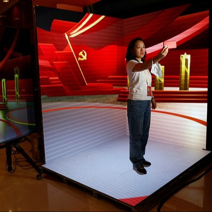
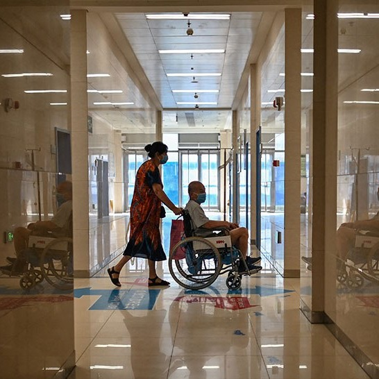
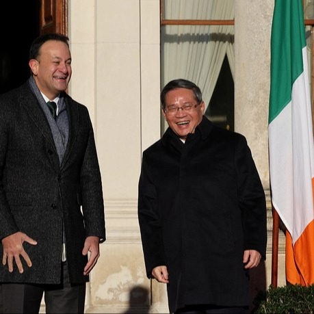
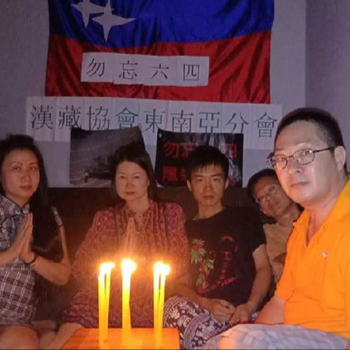
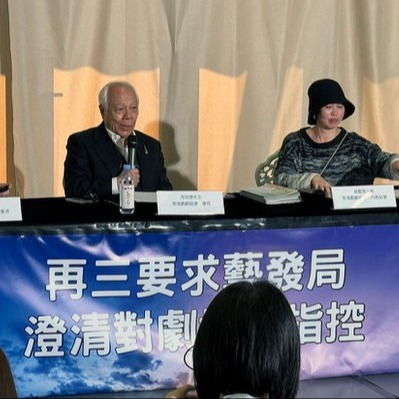

自由亚洲电台 北京时间 2024-01-20T05:30:01Z 1748457812286705934 1月18日，国际人权组织 #保护记者委员会 发布报告，揭示了2023年全球记者被监禁的状况。其中，中国有四十四位记者被监禁，再次位列全球榜首。记者持续遭受当局迫害，这对当下的中国新闻环境意味着什么？
https://t.co/l2SXyRYMkS https://t.co/jh5aS28uL8   自由亚洲电台 北京时间 2024-01-20T03:11:46Z 1748423019947819035 近期，中国有关“#居民医疗保险参保人数年减2500万”的消息引发舆论关注，多地政府已宣布延长今年的参保期限。同时，习近平当局主导的 #反腐 行动也扩展到 #医保 领域，多名省级医保官员相继被查。
中国民众与医务专家们怎么看？反腐，能够解决中国医保领域的严峻问题吗？
https://t.co/H0nmCHn0ar https://t.co/MBYFkGrjG7   自由亚洲电台 北京时间 2024-01-20T04:20:09Z 1748440227214147817 17日，中国国务院总理 #李强 在都柏林和爱尔兰总理瓦拉德卡举行会谈，会后李强宣布中国将 #对爱尔兰开放单方面免签。
此前两天，李强在伯尔尼与瑞士联邦主席阿姆赫德会面时，宣布了将 #对瑞士开放单方面免签。
中国过去半年内允许了11个亚洲及欧洲国家的人民可免签证入境。
https://t.co/erZseZvk10 https://t.co/AkYKjUWKlz   自由亚洲电台 北京时间 2024-01-20T00:32:51Z 1748383024327385566 一名滞留 #泰国 的 #中国难民 日前在曼谷被警察逮捕，目前关押在移民拘留中心，有可能被遣返中国。由于该难民曾起底中国商人 #佘智江 开发的“一带一路”项目，使人怀疑泰国当局突然对他采取行动，另有内情。
https://t.co/6u7S9eZY7i https://t.co/VA2g4Rf3tl   自由亚洲电台 北京时间 2024-01-20T00:50:35Z 1748387488052519238 港府设立的法定机构 #香港艺术发展局，突然叫停已资助逾20年的 #香港舞台剧奖 资助，并表示决定是因为收到港府代表等意见，不满该奖去年颁奖礼的嘉宾安排，以及主持人提“红桥”和“红线”意有所指，更表示事件涉及国安风险。
https://t.co/H3ax0xyWQC https://t.co/J5sut6o6Qe   自由亚洲电台 北京时间 2024-01-20T01:07:59Z 1748391868671656372 “#九二共识”创造者 #苏起 悲观看待未来四年两岸关系
他警告说，中国犯台的决策不会考量经济和成本，习近平更在意的是历史定位。
https://t.co/o8mnFAaJda https://t.co/sR1Rm4OolP   自由亚洲电台 北京时间 2024-01-20T01:32:46Z 1748398103827513590 都在传外资出逃， 中国商务部不承认
https://t.co/1aoebcTbUp https://t.co/ryo322LnK4   自由亚洲电台 北京时间 2024-01-20T01:54:42Z 1748403623791624684 曾经担任澳大利亚驻华大使、目前在中国经商的 #芮捷锐 被指替中共打压人权辩护。中国艺术家肖鲁拒绝出席他在悉尼的收藏展"在我们的时代：中国艺术四十年"。
https://t.co/uwEKKs9etm https://t.co/djERiuaCv4   自由亚洲电台 北京时间 2024-01-20T00:01:59Z 1748375260481606033 RT @asiafactcheckcn: #谣言抓漏：台选做票阴谋论观察（上）⁣

🔗全文：https://t.co/9WqYSunw18 https://t.co/YEUrBkKmSS   自由亚洲电台 北京时间 2024-01-20T00:08:22Z 1748376865092624483 【台湾选后“作票”传闻 攻击台湾民主】
 #瑙鲁 断交  #作票 传闻，让台湾内部自我攻击，怀疑民主可信度。 #公子沈 和 #悉尼奶爸 在 #亚洲很想聊 解析 中国如何持续分化台湾社会? #习近平“#亲自指导”金融,中国经济持续看坏，未来对台湾还能有多大的施压空间？
https://t.co/iEumYNq0ZU https://t.co/a4nQIiK65Z   