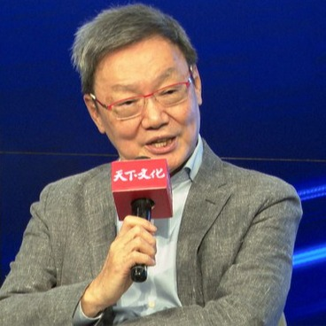
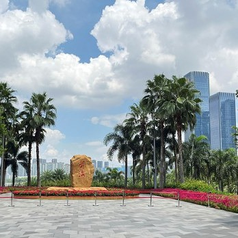
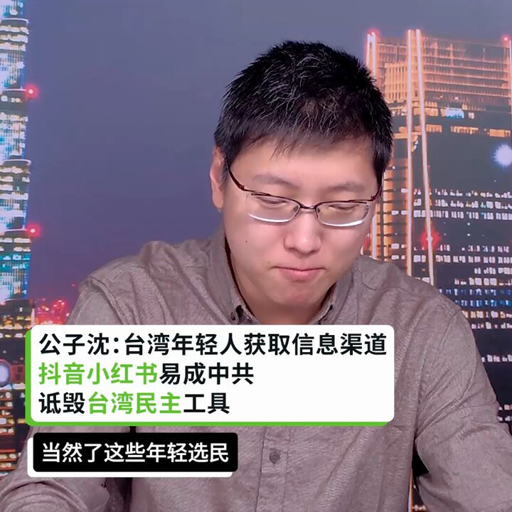

自由亚洲电台 北京时间 2024-01-20T01:07:59Z 1748391868671656372 “#九二共识”创造者 #苏起 悲观看待未来四年两岸关系
他警告说，中国犯台的决策不会考量经济和成本，习近平更在意的是历史定位。
https://t.co/o8mnFAaJda https://t.co/sR1Rm4OolP   自由亚洲电台 北京时间 2024-01-20T01:32:46Z 1748398103827513590 都在传外资出逃， 中国商务部不承认
https://t.co/1aoebcTbUp https://t.co/ryo322LnK4   自由亚洲电台 北京时间 2024-01-20T01:54:42Z 1748403623791624684 曾经担任澳大利亚驻华大使、目前在中国经商的 #芮捷锐 被指替中共打压人权辩护。中国艺术家肖鲁拒绝出席他在悉尼的收藏展"在我们的时代：中国艺术四十年"。
https://t.co/uwEKKs9etm https://t.co/djERiuaCv4   自由亚洲电台 北京时间 2024-01-20T00:01:59Z 1748375260481606033 RT @asiafactcheckcn: #谣言抓漏：台选做票阴谋论观察（上）⁣

🔗全文：https://t.co/9WqYSunw18 https://t.co/YEUrBkKmSS   自由亚洲电台 北京时间 2024-01-20T00:08:22Z 1748376865092624483 【台湾选后“作票”传闻 攻击台湾民主】
 #瑙鲁 断交  #作票 传闻，让台湾内部自我攻击，怀疑民主可信度。 #公子沈 和 #悉尼奶爸 在 #亚洲很想聊 解析 中国如何持续分化台湾社会? #习近平“#亲自指导”金融,中国经济持续看坏，未来对台湾还能有多大的施压空间？
https://t.co/iEumYNq0ZU https://t.co/a4nQIiK65Z   