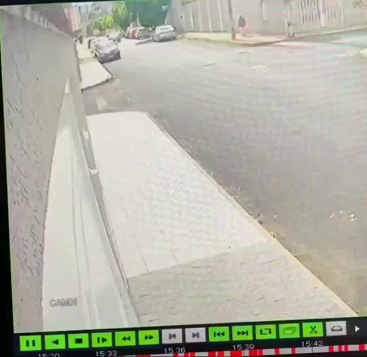
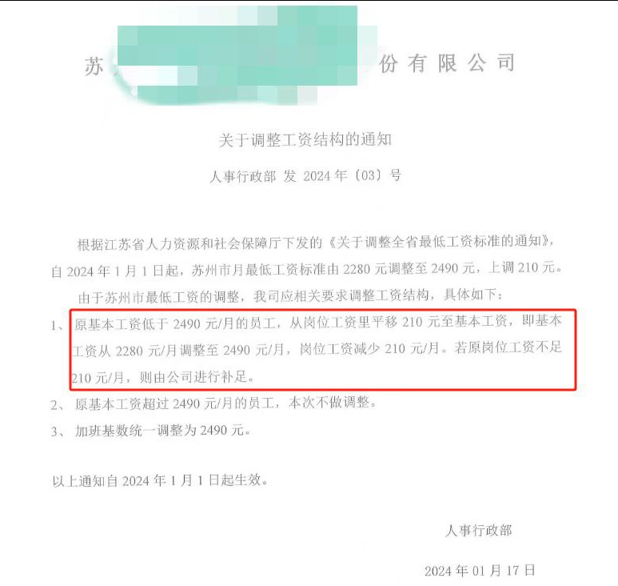

谁将十万横扫三江 北京时间 2024-01-20T12:29:10Z 1748563293940445661 RT @ReiwaLuna06013: 还能发生这样的事情🤔：一名男子忘记了自己还把女儿挂在脖子上，他惊慌失措，还要尝试报警🤭😂 https://t.co/nvktpCaE12   谁将十万横扫三江 北京时间 2024-01-20T10:32:12Z 1748533856045613461 网友投稿：中国所谓提高基本工资的实际操作 https://t.co/L2RFIPr6Ee   谁将十万横扫三江 北京时间 2024-01-20T10:17:24Z 1748530131402957277 RT @YesterdayBigcat: 「18天内因商家卷款跑路引发20起群体事件，经济加速崩溃（1月1日至18日）」在今年1月的前18天里，我们已经统计到20起因车行、物流、健身、早教、装修等机构卷款跑路引发的群体维权事件，受害者达数千人。这些事件的共同特点是，涉事机构在收…   