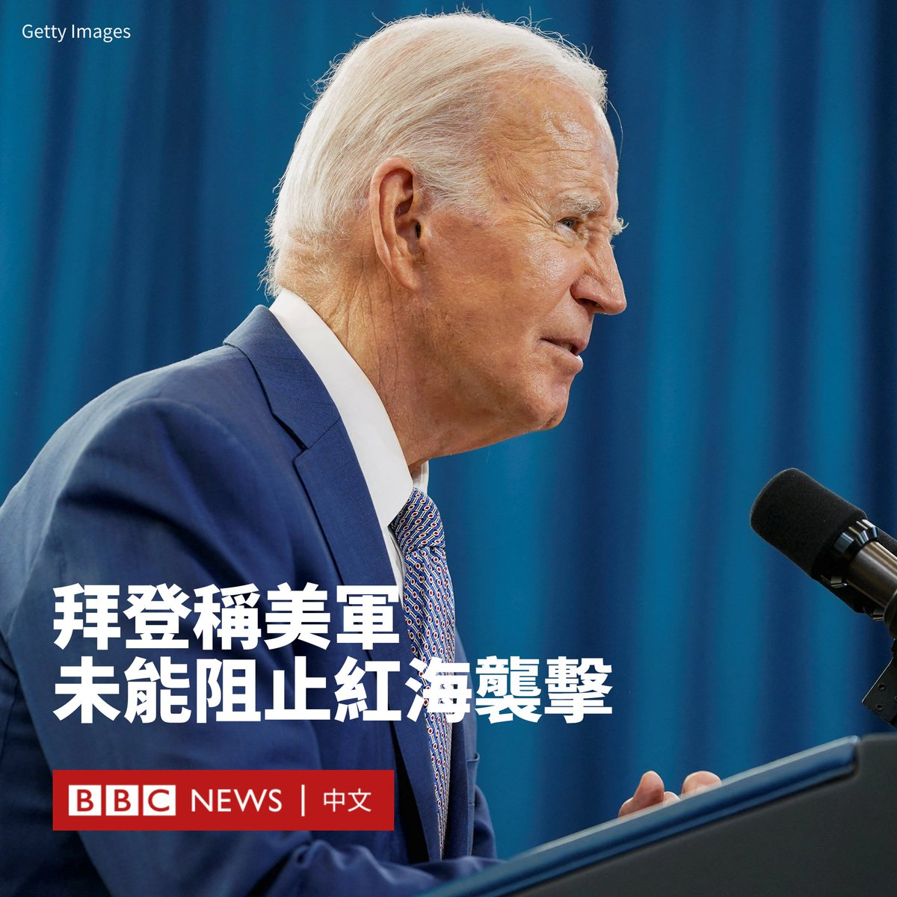
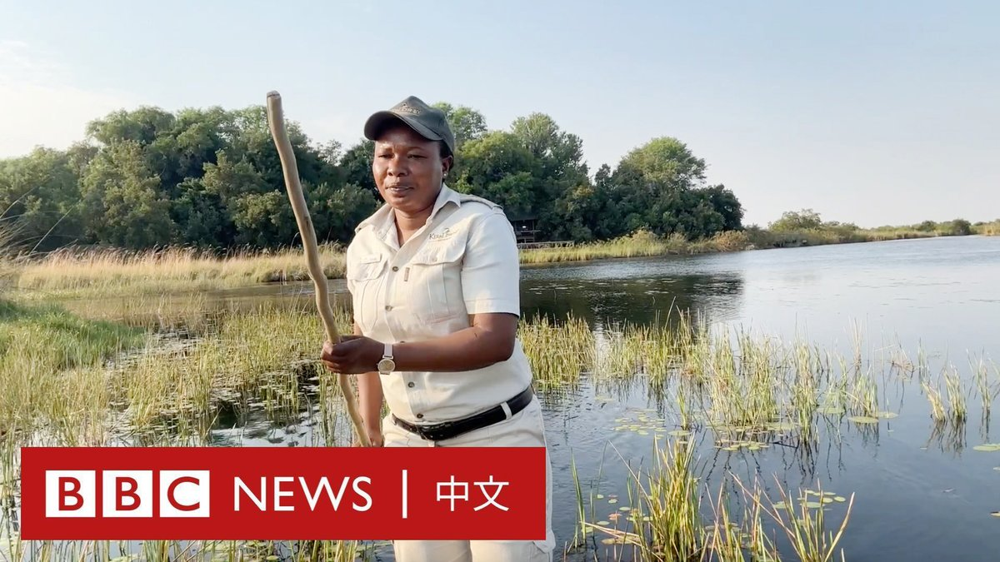

D英国广播公司BBC 北京时间 2024-01-19T15:03:34Z 1748239759514710246 一段BBC朝鲜语（韩语）记者获得的视频显示，两名男性朝鲜青少年因为观看韩剧受到了公开审理，此后被判处12年劳动改造刑。 https://t.co/qgV6Q4CM1P   D英国广播公司BBC 北京时间 2024-01-19T11:57:27Z 1748192925371294148 以也门为基地的胡塞武装星期四（1月18日）对一艘美国拥有的船只发动了新一轮导弹袭击。此前，总统拜登表示美军的打击未能阻止胡塞武装在红海地区的活动。

五角大楼称，胡塞武装向MV Chem Ranger发射了两枚导弹，没有造成任何损失或人员伤亡。

在这次袭击之前，美国对也门进行第五轮打击。白宫表示，美军“摧毁了一系列胡塞武装的导弹”，这些导弹原本将被发射到红海地区。

拜登其后接受记者采访时被问及对胡塞武装的打击是否有效，他说：“当你说有效，它们是否能阻止胡塞武装？不。”，他再说道： “它们会继续吗？是的。”

美国中央司令部在一份声明中说，他们于星期四“对胡塞武装瞄准南红海并准备发射的两枚反舰导弹进行打击”，并指美军以自卫的方式摧毁了导弹。

美国国防部副新闻主秘萨布丽娜・辛赫（ Sabrina Singh）在新闻发布会说：“我们不是寻求战争”、“我们与胡塞武装并非交战。我们所采取的行动是防御性质的。”   D英国广播公司BBC 北京时间 2024-01-19T10:25:08Z 1748169693171421448 在博茨瓦纳梅科罗河上，一名女撑船人正在重塑传统的水上划船（mekoro poling）景观。她除了带领游客领略独特的野生动物之外，还在挑战陈规陋习，引导变革。 https://t.co/qUJBzYPGXy   