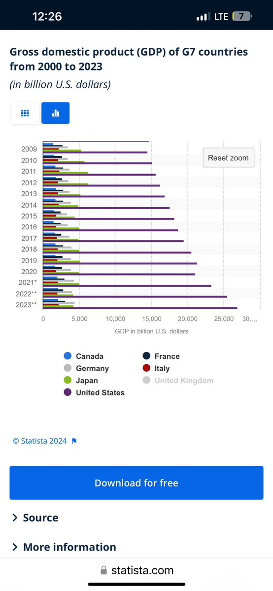
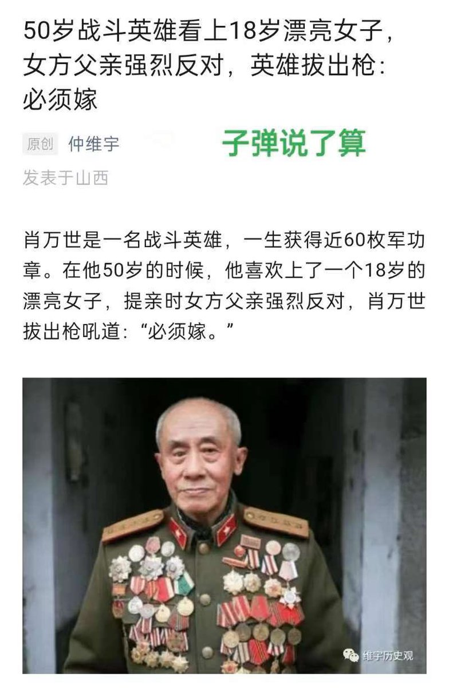
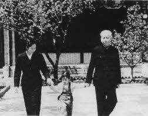
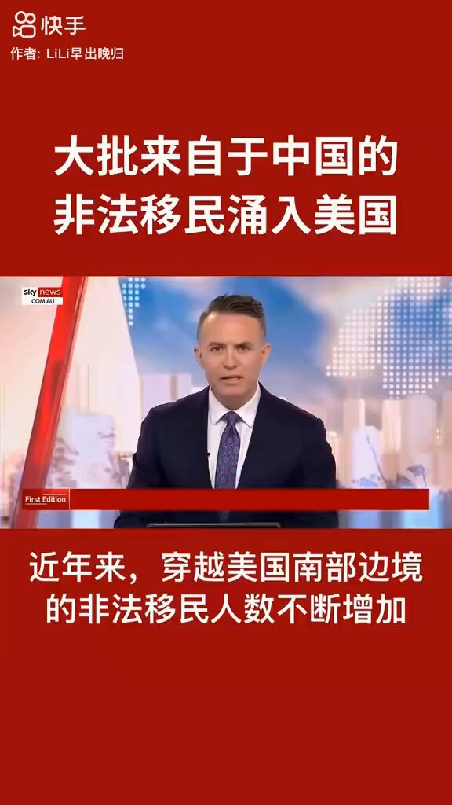

Petrichor 北京时间 2024-01-19T23:55:58Z 1748373745041834172 撸，撸起袖子加油干。 https://t.co/PEI2OEBFvJ   Petrichor 北京时间 2024-01-19T16:42:03Z 1748264545125081533 2022年中国的人口比2021年减少85万人，这是近几十年来的首次下降，标志着中国已经进入了人口负增长的时期。根据刚公布的2023年人口数据，2023年末全国人口比上年末减少208万人，其中全年出生人口902万人，死亡人口1110万人。

问题来了，邓江胡时代政府不让生二胎，超生游击队，躲进山里也要生。可是现在，政府提倡生二胎三胎，人们却主动不生了，自觉做最后一代。过去10年，发生了什么？习近平有何责任？他对中华民族的影响是要写进历史的。

生物学常识告诉人们：一个种类的动物或植物繁殖变少了，一定环境出现问题。   Petrichor 北京时间 2024-01-19T11:01:38Z 1748178876960805057 吴晓波博士言论

美国GDP以前占G7的25%，现在占60%。说明两点，首先西方七国所占比例被中国的强劲崛起挑战；其次，美国的发展没有任何放缓的幅度，尤其是美国通过高科技战胜疫情后的复苏十分强劲。美国真是风光独好，怪不得现在教授招不到人，我在美国这30多年从来没有见过这种情况，虽然大量中东和印度人涌入美国的实验室。现在战狼外交诱发的文化正在毒害中国的年轻人，他们普遍知道很少外面的世界，非常仇美，而且孤傲自狂，盲目乐观。实际上中国仍然在很多方面都需要向美国学习，不仅仅是高科技，还包括人文与政治文明。最近十分高兴看到台湾和平与理性的总统选举，为中国文化圈树立了榜样，说明华夏文化圈的人可以通过民主走向昌盛。中国宣传部的家伙如其抗议世界几十个国家对台湾的祝贺，不如要求习近平放权，至少在党内恢复和寻找最高权力平稳交接的机制。   Petrichor 北京时间 2024-01-19T11:20:25Z 1748183602334949651 肖万世（1905年1月—2009年4月2日），男，河北邢台人，中共党员。曾任抗日战争时期八路军排长，中华人民共和国时期四川省凉山州雷波县城区粮站站长。根据雷波县委组织部提供的档案显示，肖万世曾荣立10个一等功，12个二等功。

他妻子夏启芳是云南昭通人，18岁的夏启芳出生在当地一个富户家庭，出落得美丽大方。50岁的副连长肖万世看中她。让自己的女儿嫁给一个50岁的“老头”，夏启芳的父亲更是一百个不答应。面对上门提亲的副连长肖万世，夏启芳父亲破口大骂：“你一个土包子，我凭啥把女儿嫁给你！”此时，憋了一肚子委屈的肖万世一把掏出枪来，对着姑娘父亲说：“嫁也得嫁，不嫁也得嫁，不让我娶你女儿，老子毙了你全家。” 共产党军官就是这么霸道，比黄世仁、南霸天恶霸多了。得天下，抢黄花姑娘。   Petrichor 北京时间 2024-01-19T08:54:11Z 1748146801151021488 感谢今上，中国有了第57个民族。 https://t.co/sAxuafDIAX   Petrichor 北京时间 2024-01-19T09:08:48Z 1748150482193776840 中国老百姓的孩子是棵草，其他国家的孩子是个宝。习近平是中国的主席还是亚非拉国家的主席？

根据《环球时报》的数据，近四年中，对俄罗斯援助款是4000亿美元，委内瑞拉650亿美元，印尼500亿美元，拉丁美洲1180亿美元，巴西100亿美元，厄瓜多尔120亿美元，非洲600亿美元，安哥拉74亿美元，中东国家550亿美元。从2000年开始的15年间，中国共向51个非洲国家提供了1666个官方援助项目，其中，有1110个被定义为官方发展援助项目，作为促进发展中国家经济发展和福利的官方资助项目。另一个重要援助对象是位于中国东边的半岛国家，但是由于援助数据不公开，可跟踪的援助款仅为2.1亿美元。   Petrichor 北京时间 2024-01-19T01:18:44Z 1748032185653703035 在习皇为全球各国指明无数方向、竭力挽救全人类之时，他的臣民缺冒着生命危险走线美国做难民，这让习皇情以何堪？四个自信爆炸了。 https://t.co/ECSaXOalVd   