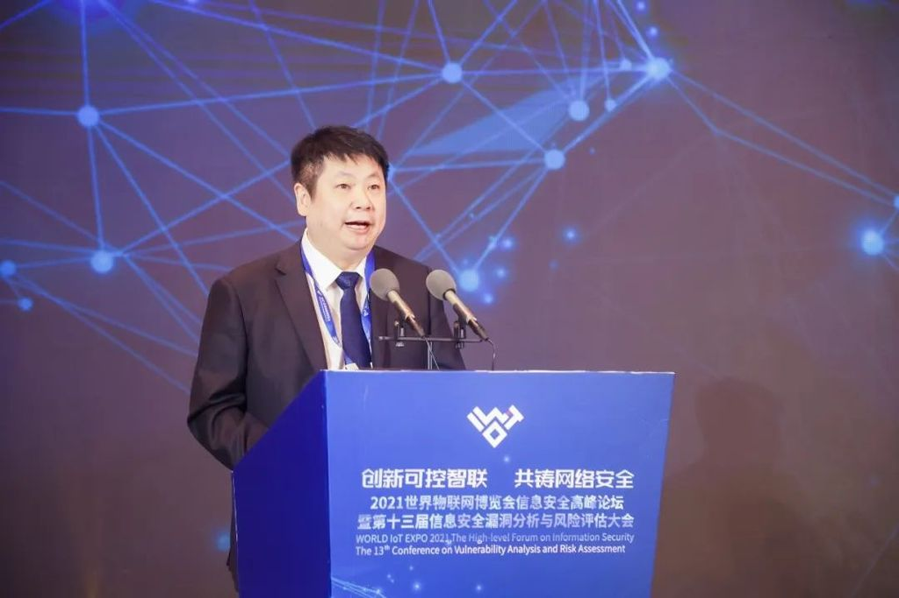

拆墙运动公号 北京时间 2024-01-19T03:01:18Z 1748057998977564894 【 #2259专案组 互联网防火墙第110号嫌犯 #江常青】 性别：男
职务：中国信息安全测评中心副主任委员

中国信息安全产品测评认证中心副主任,系统工程实验室主任,国际组织IEEE,ISSA,ISC2及ACM成员。

官网：https://t.co/LZ1NK8udKm详细资料见: #BanGFW拆墙运动（建墙罪犯录）：https://t.co/HdIDabiUla

从业网络与信息安全多年,一直按着网络与信息安全行业前人提出的各种方法,经验做着网络与信息安全,有IATF的纵深防御,动态安全的PDCR,木桶理论,风险理论等,但这些理论,方法怎么来的却一直没有一个很好的说法,大多说网络与信息安全业界一直就是这么做的,后来逐步发
战略合作伙伴：1、中共恶人榜：#ccpevils    
   2、#zhinawiki   拆墙运动公号 北京时间 2024-01-19T17:34:53Z 1748277842616438951 RT @A_01AAAA: https://t.co/vEcSsDUaVp   