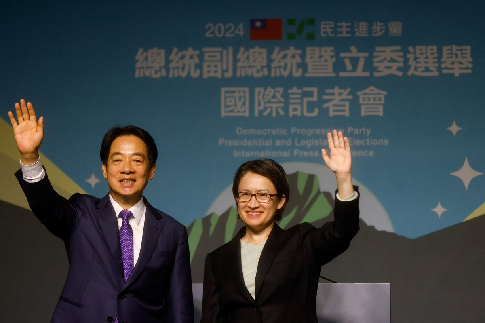
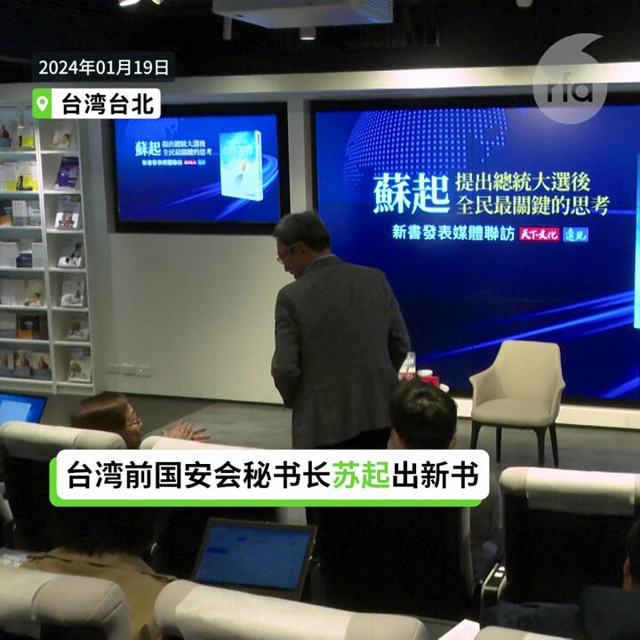
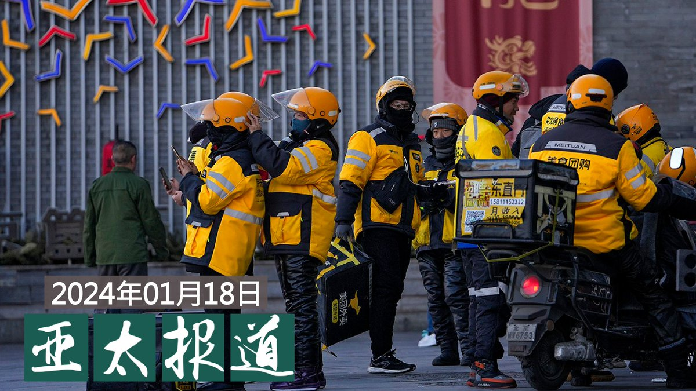
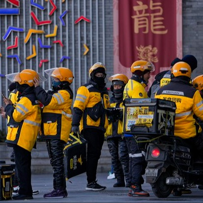
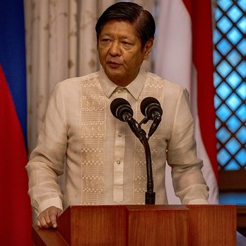
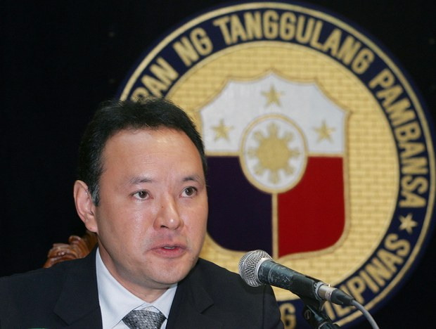
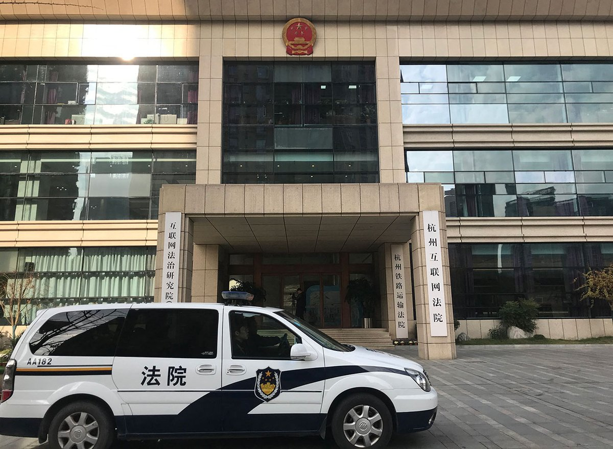
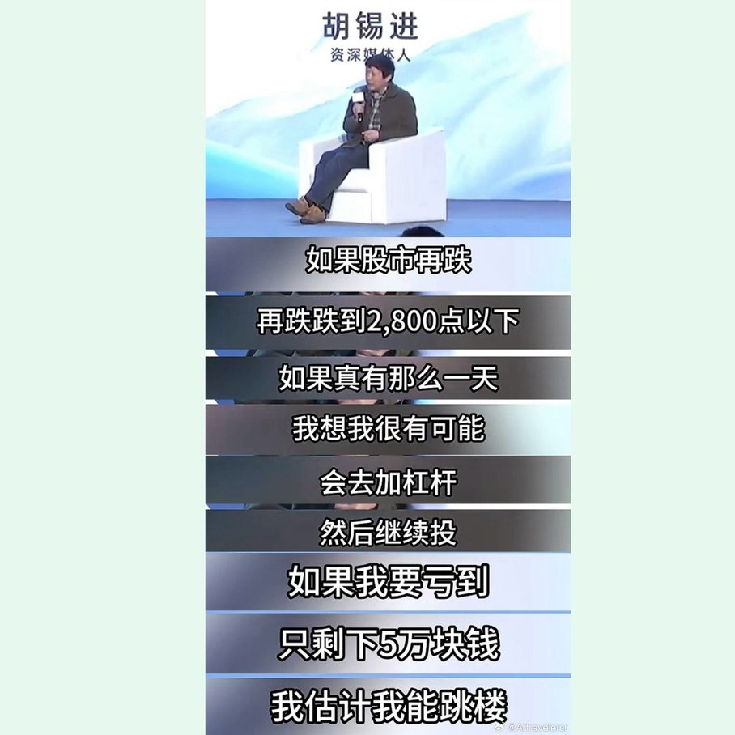
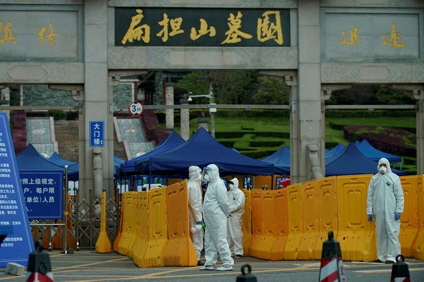

自由亚洲电台 北京时间 2024-01-19T18:41:18Z 1748294554124722225 【台湾选后 中国国安部称“三反”打台独】
【陆委会示警“危邦莫入”】
民进党副总统赖清德获选下届总统后，北京先夺走台湾友邦瑙鲁，中国国安部随后发布抓获一批“台湾间谍”，称“打掉了台湾亲自布建的间谍网”，并扬言将对台展开“三反”打击台独。台湾陆委会提醒台湾人最近非必要“危邦勿入”，若被扣帽子就可能打成间谍。详细报道：https://t.co/nbPcO4Ar5T   自由亚洲电台 北京时间 2024-01-19T17:27:03Z 1748275868374597664 【苏起:两岸未来四年game over机率高】
创造“九二共识”一词的台北论坛基金会董事长、马英九任内的前台湾国安会秘书长苏起19日表示台湾应该主动出击与大陆对话。他说台湾民意离和平统一越来越远，逾六成台湾人认为自己是台湾人而不是中国人，比例历来最高。加上美中斗争的趋势持续。因此苏起说“未来四年game over机率高”，意味中共可能犯台。   自由亚洲电台 北京时间 2024-01-19T12:17:21Z 1748197931046285402 RT @RFA_Chinese: 【2023年中国GDP增幅究竟是多少？】
中国国家统计局1月17日宣布，2023年 #中国GDP 增长5.2%。  但美国智库Rhodium Group（荣鼎集团）1月16日发文称： 2023年中国的实际增长数字可能更接近于1.5%。 您觉得谁…   自由亚洲电台 北京时间 2024-01-19T06:21:16Z 1748108320617922800 自去年11月起，中国的 #字节跳动 便陆续将旗下子公司国际版抖音 #TikTok 的前后端开发、数据及算法工程师从中国境内调职至海外，调职的工作地包含新加坡、澳大利亚、加拿大与美国。
据中国界面新闻16日的报道指出，TikTok的员工表示，如果接受调职，可以得到比当前高一倍的工资，TikTok还会提供两年的住房补贴。如果不愿意调职，目前也还不会强制员工离职，但是TikTok在中国的职位正在大幅缩减，目前，大部分员工都接受了调职的安排。
报道写到，自2020年起，TikTok便被美国、欧盟、澳洲等多地以数据安全为由进行调查。对此，TikTok也在西方各国建立数据中心，接受当地监管，如今TikTok将员工大规模外调至海外，也是为了在全球合规运营操作的一环。   自由亚洲电台 北京时间 2024-01-19T08:00:11Z 1748133215414710642 欢迎收听和订阅播客【＃亚太报道】 https://t.co/MjLNSvVMqc
2024成中国公安 #整治信息专项行动年；#A股大跌 后网民开涮 #胡锡进；中国企业平均 #一周工作49小时；#郭飞雄 罹病后监狱拒保外就医；香港议员质疑“#小红书治港” https://t.co/7F3UZwgspT   自由亚洲电台 北京时间 2024-01-19T08:37:30Z 1748142604552646906 RT @RFA_Chinese: 【2023年中国GDP增幅究竟是多少？】
中国国家统计局1月17日宣布，2023年 #中国GDP 增长5.2%。  但美国智库Rhodium Group（荣鼎集团）1月16日发文称： 2023年中国的实际增长数字可能更接近于1.5%。 您觉得谁…   自由亚洲电台 北京时间 2024-01-19T04:46:14Z 1748084404449350039 中国人工作时长  全球遥遥领先！
中国官方近日公布的最新数据显示，去年十二月，中国企业员工的每周平均 ＃工作时长 再次突破新高，长达四十九个小时。
https://t.co/QA6xVXwWgZ https://t.co/TPUfdzNnQG   自由亚洲电台 北京时间 2024-01-19T05:08:14Z 1748089939680776571 【大陆不会有 ＃施明德　台湾不会有 ＃王炳章】
本台记者王允 @Jeff23Wang 报道
https://t.co/PX8tA8HSbX https://t.co/5lktjRqMA0   自由亚洲电台 北京时间 2024-01-19T05:37:30Z 1748097305188925865 今年是《#朝鲜停战协定》签署的第七十一个年头，但分裂的 #朝鲜半岛 非军事区仍是世界上最危险的边界之一。美国韩战专家、前和平队赴韩志愿者马克尔·迪瓦恩本周四表示，美国、韩国、朝鲜和中国对韩战的官方叙事表述不一，但均随着时间推移而有所演变。 
https://t.co/7GadCvbltT https://t.co/64W9FjDDz5   自由亚洲电台 北京时间 2024-01-19T06:02:21Z 1748103561068900643 #传播观察｜各国对 #台湾大选 的祝贺是如何被扭曲的？
https://t.co/YbSPEBxDek
@asiafactcheckcn https://t.co/d0FrsBZXvU   自由亚洲电台 北京时间 2024-01-19T06:13:35Z 1748106386033315872 #胡舒立 出席财新午餐会：中国要与世界同行
外界关注，胡舒立的一席话是否具有更深层的隐喻。
https://t.co/bQ5GA1V21T https://t.co/2BYKNuCDFk   自由亚洲电台 北京时间 2024-01-19T06:15:12Z 1748106792486510692 据自由亚洲电台下属的东南亚新闻网站“博纳新闻”（BenarNews）本周四报道，尽管台湾是东南亚国家的主要贸易伙伴，但为了避免激怒中国，东南亚各国的领导人都避免在 #台湾大选 后对总统当选人 #赖清德 表达祝贺。
https://t.co/mIl5BZGXfM https://t.co/fe4c5WB66r   自由亚洲电台 北京时间 2024-01-19T02:46:04Z 1748054165136310774 ＃菲律宾 总统 ＃小马科斯 祝贺 ＃赖清德 当选台湾总统；
中国外交部发言人 ＃毛宁 警告菲方不要玩火，建议菲总统多读书；
菲防长Gilbert Teodoro Jr.批评毛宁以低级下流的言论侮辱菲总统和人民；
毛回应，台湾问题是中国核心利益中的核心，任何涉台挑衅，必坚决回击。
中菲关系悬了！
https://t.co/0SiDd1A85v   自由亚洲电台 北京时间 2024-01-19T02:50:35Z 1748055301696192570 近日，遭中国当局以"颠覆国家政权罪"判刑入狱的异议人士 ＃郭飞雄 停止了狱中绝食行动，其健康状况受到外界关注。据悉，郭飞雄在体检中发现肠有息肉，但当局却以没有恶化迹象为由拒绝让他保外就医。
https://t.co/7XXDOgyqRT   自由亚洲电台 北京时间 2024-01-19T03:16:43Z 1748061876100174188 近期，上海、南京以及内蒙等地公安公布"＃打击网络谣言"案，众多涉案者遭到处罚，言论涉及经济、社会、卫生各领域。当局警告不得在微信、抖音等社交平台"造谣", 日前公安部也已将2024年作为"打击整治网络谣言专项行动年"。
https://t.co/N0nwCbJpyX https://t.co/R7725XpJMh   自由亚洲电台 北京时间 2024-01-19T03:32:15Z 1748065787754250755 周四一早，＃A股上证指数 一度跌破2800点冲上热搜，不少网民制作哏图，拿资深媒体人 ＃胡锡进 说跌到 ＃2800点 以下要跳楼来消遣他，胡锡进本人发文宣称他没那么说过。
https://t.co/3rGkdXpFhO https://t.co/f3ejsY1vGa   自由亚洲电台 北京时间 2024-01-19T00:55:17Z 1748026282233712915 评论 | 胡平 @HuPing1：#赖清德 当选 #台湾总统，两岸关系何去何从？
https://t.co/JX2Pf6TK9P   自由亚洲电台 北京时间 2024-01-19T01:01:42Z 1748027899553165590 #小红书治港？
香港立法会议员指出，大陆网民透过"#小红书"投诉香港后，经常获得港府迅速、高姿态的回应，反而本地居民就施政提出意见却未能得到同等重视。 https://t.co/jF71f4p3hC   自由亚洲电台 北京时间 2024-01-19T01:40:13Z 1748037590836556234 【2023年中国GDP增幅究竟是多少？】
中国国家统计局1月17日宣布，2023年 #中国GDP 增长5.2%。  但美国智库Rhodium Group（荣鼎集团）1月16日发文称： 2023年中国的实际增长数字可能更接近于1.5%。 您觉得谁的数据更接近您的真实感受？   自由亚洲电台 北京时间 2024-01-19T02:00:30Z 1748042697729048730 【＃新冠溯源 最新进展】
据华尔街日报周四报道，美国国会调查人员指出，中国的科研人员早在2019年12月底便已经为 ＃新冠病毒 绘制图谱，这比中国向世界公布新冠病毒的细节提前了至少两周，此信息再度引发外界对于北京当局隐匿新冠疫情重要资讯的质疑。
https://t.co/y2ay33ULYA https://t.co/0GOhTX7mMy   自由亚洲电台 北京时间 2024-01-19T02:13:14Z 1748045901673767327 过去民进党认为母公司在中国的 #抖音，有国安疑虑，包括党主席 #赖清德 带头不用，大部分民进党候选人也都未用。
选后首次民进党中常会检讨年轻人选票流失的问题，#抖音重挫民进党，激辩是否该使用抖音。＃您怎么看？
https://t.co/GnWu9rcaID https://t.co/Of5LSnyYsn   