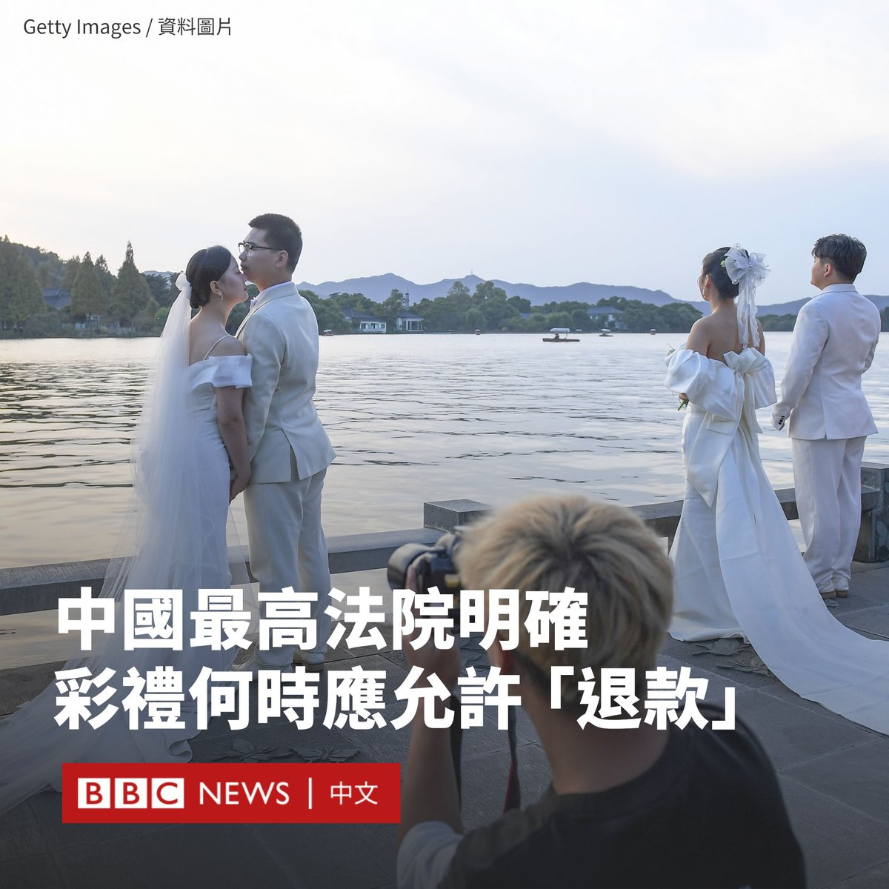
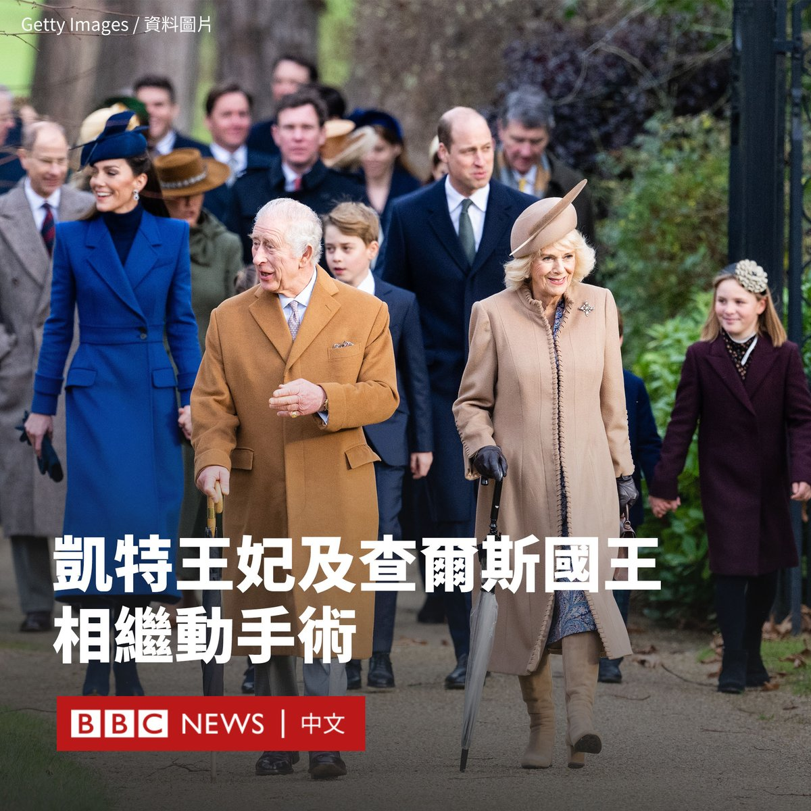

D英国广播公司BBC 北京时间 2024-01-18T19:51:52Z 1747949927341187080 80多名单身男女在上海一家爵士酒吧参加一场假面相亲舞会。

32岁的活动参与者李先生表示，为尽快结束单身生活，他已参加多场相亲交友活动。同许多年轻人一样，他也面临着结婚带来的巨大经济压力。

随着中国经济增长放缓，青年就业前景不佳，越来越多的年轻人选择推迟甚至放弃结婚。 https://t.co/oIsUjmzQ2w   D英国广播公司BBC 北京时间 2024-01-18T17:24:47Z 1747912913837551995 英国女歌手杜娃‧梨波（Dua Lipa）是当代最著名的流行歌星之一，她曾因其政治观点而成为新闻头条，包括批评英国政府对移民问题的立场，以及呼吁加沙停火。近日，她对公众对自己的看法表达沮丧。

她说：“他们不希望你参与政治，不希望你聪明。对我来说，除了我的工作，还有很多其他的东西。”

自从她在2017年推出突破性单曲《New Rules》以来，这位英国和阿尔巴尼亚裔歌手创办了在科索沃普里什蒂纳推出了读书具乐部、生活方式通讯和国际音乐节。

她接受音乐杂志《滚石》（Rolling Stone）访问时指，父母逃离科索沃战争的经历影响了她的世界观。

她说：“我的存在本身即具有某种政治性，我住在伦敦是因为我的父母从战争中离开。”

“我同情那些不得不背井离乡的人。从我在科索沃的经历和对战争的理解来看，没有人真正愿意离开自己的家。”

她表示，她看到自己父母的经历与巴勒斯坦人目前的处境相似，这促使她在一份呼吁停火的请愿书上签名。

不过，她也对哈马斯在去年10月对以色列发动的致命袭击中实施的暴行提出批评。

她说：“我不会宽恕哈马斯的所作所为”、“我为每一个失去生命的以色列人和10月7日发生的事情感到难过。”

“目前，我们必须关注的是加沙有多少人丧生，有多少无辜平民丧生，有多少生命正在逝去。”她说道。   D英国广播公司BBC 北京时间 2024-01-18T15:01:03Z 1747876742067265548 伊朗伊斯兰革命卫队（IRGC）对伊拉克、叙利亚和巴基斯坦领土进行的导弹袭击，显示它已成为一个主要的区域军事力量。https://t.co/yqYQubVDz7   D英国广播公司BBC 北京时间 2024-01-18T13:18:58Z 1747851051833954432 中国最高法院周四（1月18日）发布了处理彩礼纠纷的司法解释，明确结婚时支付的彩礼在哪些情况下应被允许“退款”。

在中国，新郎向新娘家庭付钱作为结婚条件的习俗由来已久，但经常发生的彩礼纠纷和持续下降的结婚人数引起了官员和法官的关注。

据中国官方媒体报道，该国最高人民法院在该文件中强调法院在审理彩礼相关纠纷时，不应只关注夫妻是否登记结婚，还应更全面地评估双方同居时间长短、彩礼使用目的和金额等因素。

根据该文件，在“彩礼数额过高”的情况下，即便双方进行了结婚登记，但一方随后“闪离”（即很快地离婚），彩礼可能被要求返还。

而如果双方没有登记结婚，但在已共同生活的情况下，一方请求返还彩礼后，法院需根据具体情况，确定是否返还以及返还的具体比例。

该司法解释还重申了“禁止借婚姻索取财物”，表示若一方以彩礼为名、借婚姻索取财物，另一方要求返还的，法院应予支持。

该规定将从今年2月1日开始实施。目前，如果满足《民法典》规定的三个条件之一，法院将支持返还彩礼的请求：未办理结婚登记手续、未共同生活，或导致给付人“生活困难”。

去年12月，当局举办了一场记者会，公布了四个“典型案例”，其中一个案例是男女双方同居了三年以上，已育有一子，但未办理结婚登记。在感情破裂后，男方要求女方返还其支付彩礼的80%，但被驳回。

法院强调，虽然双方没有合法结婚，但“不应当忽略共同生活的夫妻之实”。

近年来，不断上涨的彩礼价格在中国持续引发争议。许多人认为这种做法已经过时，也造成了结婚率下降。

在一些地区，彩礼的价格甚至可以高达数十万元人民币。部分男方家庭还面临着提供房和车的压力。

去年，中国很多地方政府将打击“高价彩礼”列为重要任务。有地方发布了针对彩礼的“限价”政策，还有年轻人被召集签署“抵制高价彩礼承诺书”。   D英国广播公司BBC 北京时间 2024-01-18T10:30:37Z 1747808682191241681 肯辛顿宫周三（1月17日）表示，英国威尔士王妃凯特（Catherine, Princess of Wales）在接受腹部手术成功后，正在医院康复，但她将退出履行王室职务数月。

同日，白金汉宫透露，英国国王查尔斯三世（Charles III）因前列腺疾病将于下周接受治疗。

英国王室很少对外公布王室高级成员的健康状况细节，但此次两条信息披露仅相隔两小时。

肯辛顿宫表示，凯特于周二（1月16日）住进中伦敦的私人医院接受手术，目前正在康复。据悉，她的情况良好，但预计将住院两周，随后将继续长达数月的恢复，直到复活节后才会出现在公众面前。

从其休息时间可以看出她的病情严重，尽管声明强调手术按计划进行，并且取得了成功。

肯辛顿宫呼吁外界尊重王妃的医疗隐私，并补充道：“她希望公众能够理解她尽可能让孩子们维持正常生活的愿望。”

白金汉宫则在另一份声明中称，国王下周需要对前列腺增生进行“矫正手术”。

这种情况在老年男性中很常见，不属于癌症。查尔斯于去年11月年满75岁。

国王和王后目前住在巴尔莫勒尔附近的私人住宅里。王室消息人士称，国王“状态良好”、“精神饱满”。

关于查尔斯的病情不得不公开很可能是因为其原计划在苏格兰会见外国政要和内阁成员，而医生建议取消这些会晤。   