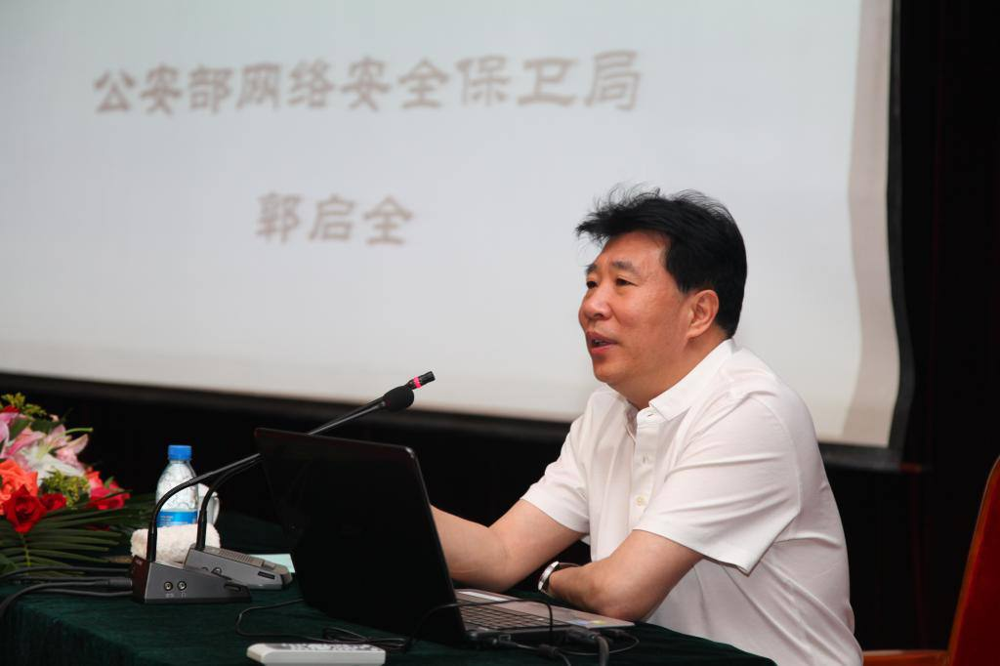
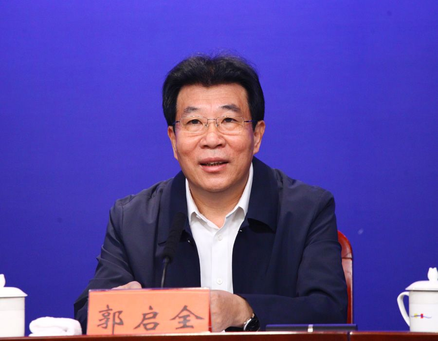

拆墙运动公号 北京时间 2024-01-18T02:20:17Z 1747685286371320048 【 #2259专案组 互联网防火墙第109号嫌犯 #郭启全】 性别：男  
出生日期：1962年09月
公安大学硕士生导师、中科院兼职博士生导师。
职务：公安部十一局党委委员、副局长、一级巡视员、总工程师  

郭启全，现任公安部十一局（网络安全保卫局）党委委员、副局长、一级巡视员、总工程师。

  郭启全,参加制定《中华人民共和国治安管理处罚法》、"国家信息安全战略"等国家法律和政策文件，以及《互联网安全保护技术措施管理规定》(公安部82号部长令)。 

 官网：https://t.co/LZ1NK8udKm
详细资料见: #BanGFW拆墙运动（建墙罪犯录）：https://t.co/kkCnC8vj8y

组织起草了《信息安全等级保护管理办法》、《关于开展全国重要信息系统安全等级保护定级工作的通知》等国家有关等级保护工作的政策、文件。  主持完成了"基于移动终端的可视化警力布控与网上追逃系统"、"全实时数字视频监控系统"等公安部重点科研项目。

  战略合作伙伴：1、中共恶人榜：#ccpevils  
    2、#zhinawiki   拆墙运动公号 北京时间 2024-01-18T05:11:14Z 1747728306978357369 RT @CECCgov: #JoshuaWong is arbitrarily detained because #HongKong authorities have criminalized the championing of democracy and human rig…   