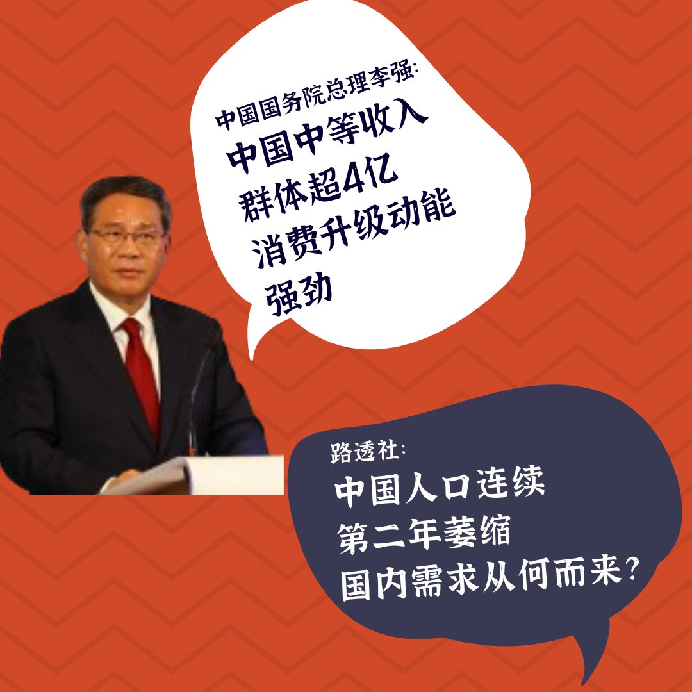

自由亚洲电台 北京时间 2024-01-18T06:26:45Z 1747747312074371144 1月15日，菲律宾总统费迪南德·马科斯向台湾新领导人赖清德表示祝贺。
1月16日，中国外交部发言人毛宁在记者会上说，我们建议马科斯总统多读读书，以正确了解台湾问题的来龙去脉，从而得出正确结论。
菲律宾国防部长发声明，指责毛宁发表“低级粗俗的言论”，并指其“散布国家批准的宣传和虚假讯息”，特奥多罗说：中国外交部发言人侮辱了我们的总统和菲律宾民族。
您站哪边？   自由亚洲电台 北京时间 2024-01-18T06:29:37Z 1747748034400694728 近日，中国国务院总理李强说，目前中国的中等收入群体超过4亿人，未来十几年将达到8亿人，对越来越多商品、服务的需求从“有没有”向“好不好”转变，消费升级的动能强劲。
但路透社报道指出，中国人口连续第二年萎缩，出生率创历史新低，这将意味着未来几年工人和消费者的减少，引发更多关于国内需求从何而来的问题。
对此，您怎么看？   自由亚洲电台 北京时间 2024-01-18T04:37:22Z 1747719786585612400 #博明 呼吁华盛顿采取部门立法而非基于实体的立法。除了 #人工智能、#量子计算 和半导体等先进技术领域，国会和政府还应考虑制定涵盖所有战略和军事技术的规则，例如生物技术、超高音速技术等。此外，他还表示，投资禁令还应将现有交易纳入立法范围内。https://t.co/aTsweAb3VH   自由亚洲电台 北京时间 2024-01-18T05:13:33Z 1747728891311964393 #加拿大 公布一份"#敏感技术研究领域清单"，点名来自中国、俄罗斯和伊朗三个国家共103家机构对加拿大造成国安风险，其中来自中国的就有85个。渥太华称，如果与名单上的机构合作，将无法获得联邦资助。

https://t.co/QETPeFGwvf   自由亚洲电台 北京时间 2024-01-18T05:42:59Z 1747736299547619341 台驻美代表 #俞大㵢：#台湾 是以最大的诚意和互惠互利的方式跟所有的 #邦交国 交往。他也呼吁各国不要被北京的“幌子”所利诱:“他们很多的对我们被夺走邦交国所做出的这些个承诺，几乎往往都是空洞的，不会实现的。”他以洪都拉斯为例，指其与北京建交后，北京当初给予的购买白虾和自由贸易种种承诺都没有兑现。"

https://t.co/j1Z40IdRFD   自由亚洲电台 北京时间 2024-01-18T03:20:34Z 1747700458712391934 台湾人工智慧实验室 @labs_taiwan 创办人 #杜奕瑾 17日发布“#台湾大选认知操作观察讨论会议”数据指出，AI系统分析过去一年4500多万则社群平台互动，发现有73万多则互动内容被操作。1万4千多个操作帐号，4万8千多场攻防论战...
https://t.co/wElI3i0uZd   自由亚洲电台 北京时间 2024-01-18T04:19:41Z 1747715333803122846 1月17日，中国国家统计局公布的最新数据显示，中国连续第二年出现 #人口负增长。中国人口学专家 易富贤 @fuxianyi   认为，#中国人口衰退 将是长期问题，将会影响到中国的经济和在国际上的话语权。 https://t.co/9DsL1UHk2T   自由亚洲电台 北京时间 2024-01-18T00:42:15Z 1747660617794937132 这届台湾大选首度有七名西藏流亡政府官员抵台观选。藏人行政中央内阁噶厦政务秘书长 #札西嘉措，接受自由亚洲电台采访，提到印象最深刻的是：“台湾候选人扫街拜票、摇旗呐喊的情况，在流亡藏人选举中很少见，在印度也没有这种造势活动，台湾的选举情况非常壮观。”
https://t.co/pfnHOJtKtJ https://t.co/Mra7NLnIup   自由亚洲电台 北京时间 2024-01-18T01:51:31Z 1747678047820738872 #台湾大选 结束后，西方国家纷纷祝贺民进党在台湾选举中获胜，但两年前通过军事政变上台的缅甸军政府迅速表示支持中国对台湾的主张。他们图啥？
https://t.co/Upt7ZrddsW   