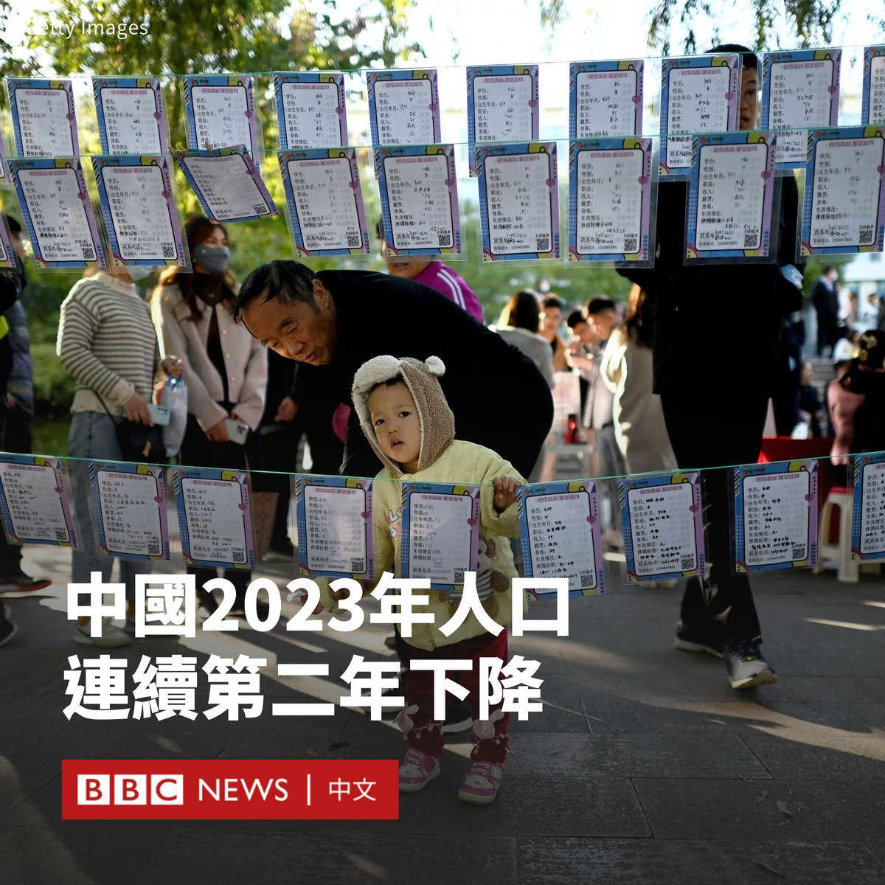

D英国广播公司BBC 北京时间 2024-01-17T10:35:07Z 1747447427899232521 中国官方数据显示，中国人口在2023年减少了208万人，延续2022年开始的萎缩态势。

此前的数据显示，2022年中国人口比2021年末减少85万人。这是自1960年代初大饥荒以来，中国首次出现人口萎缩。目前中国的人口为14.097亿人。

中国国家统计局周三（1月17日）发布年度数据，显示2023年该国全年出生人口为902万人，死亡人口1110万人，自然增长率为-1.48‰。

这也意味着中国去年的人口出生率为6.39‰，创下历史新低。

过去两个世纪，中国都一直保有全球第一人口大国的称号，但在去年，印度超过中国成为世界上人口最多的国家。

尽管政府在几十年的限制性生育政策之后鼓励民众生育更多的孩子，但出生率仍在放缓。

据中国媒体报道，中国国务院发展研究中心发布的《中国发展报告2023》称，预计中国未来年度出生人口“约每十年下一个百万台阶”。   D英国广播公司BBC 北京时间 2024-01-17T09:17:54Z 1747427995336556787 你能想象这位103岁的泰国老人，在过去五年里获得了59块体育奖牌吗？

萨旺·詹普拉姆97岁时，在看到一位好朋友因病卧床不起后，才开始运动。但现在他已经在多项国际赛事中斩获金牌。 https://t.co/3UEjtiR9AR   