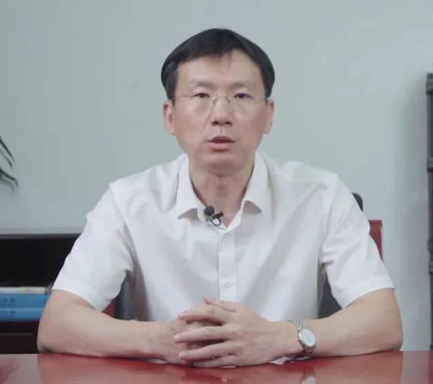
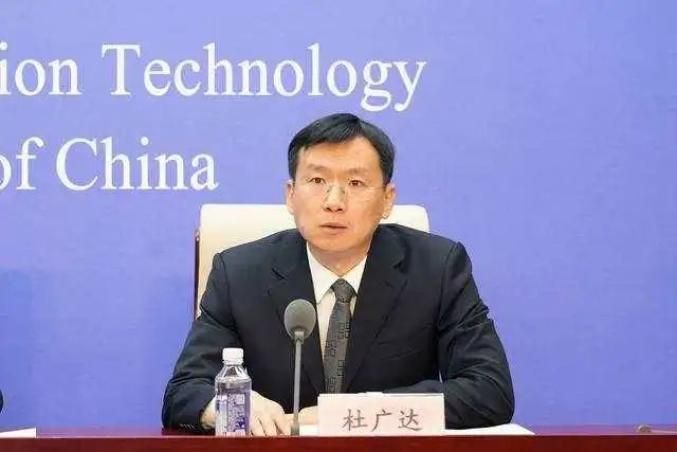

拆墙运动公号 北京时间 2024-01-17T04:49:33Z 1747360465401905599 【 #2259专案组 互联网防火墙第108号嫌犯 #杜广达】 性别：男
职务：工业和信息化部网络安全管理局副主任委员，
现任中华人民共和国工业和信息化部网络安全管理局副局长。
官网：https://t.co/LZ1NK8udKm
详细资料见: #BanGFW拆墙运动（建墙罪犯录）：https://t.co/Vcn04OEjBO

中华人民共和国工业和信息化部网络安全管理局
中华人民共和国工业和信 息化部网络安全管理局是工业和信息化部内设机构

主要职责
拟订电信网、互联网及其相关网络与信息安全规划、政策和标准并组织实施；承担电信网、互联网网络与信息安全技术平台的建设和使用管理；承担电信和互联网行业网络安全审查相关工作，组织推动电信网、互联网安全自主可控工作；承担建立电信网、互联网新技术新业务安全评估制度并组织实施；指导督促电信企业和互联网企业落实网络与信息安全管理责任，组织开展网络环境和信息治理，配合处理网上有害信息，配合打击网络犯罪和防范网络失窃密；拟订电信网、互联网网络安全防护政策并组织实施；承担电信网、互联网网络与信息安全监测预警、威胁治理、信息通报和应急管理与处置；承担电信网、互联网网络数据和用户信息安全保护管理工作；承担特殊通信管理，拟订特殊通信、通信管制和网络管制的政策、标准；管理党政专用通信工作。
战略合作伙伴：1、中共恶人榜：#ccpevils   
 2、#zhinawiki   