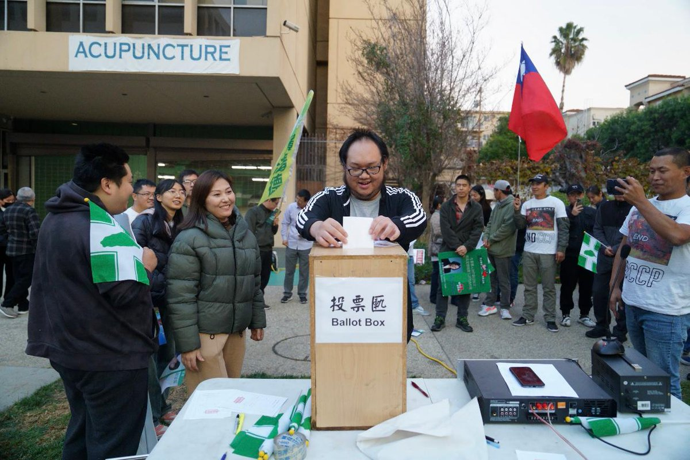
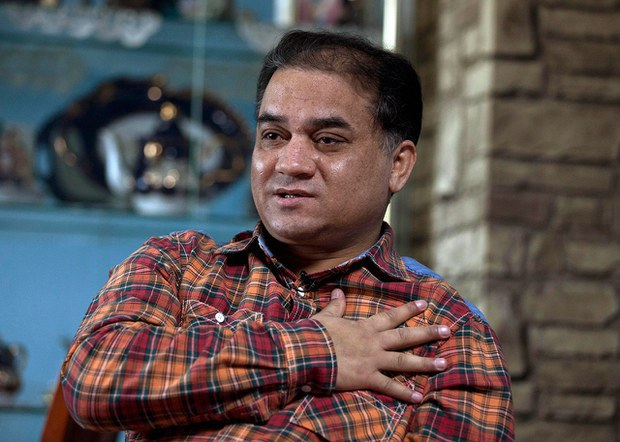
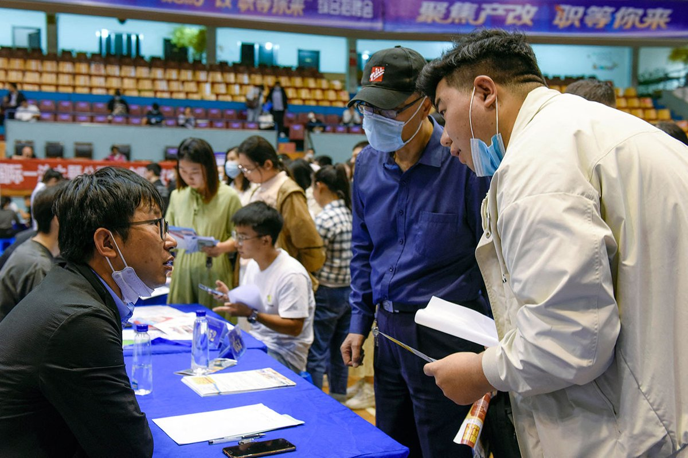
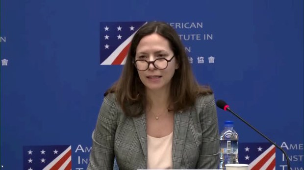
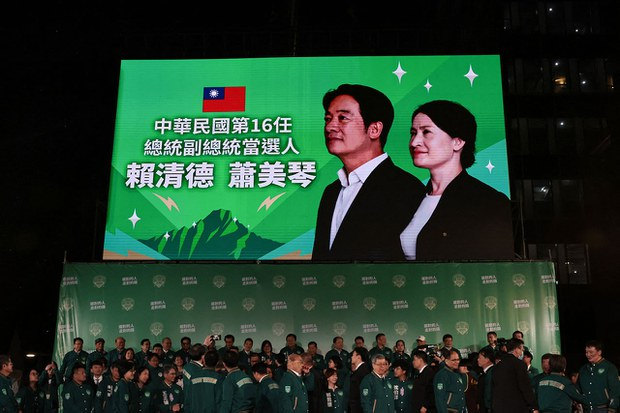
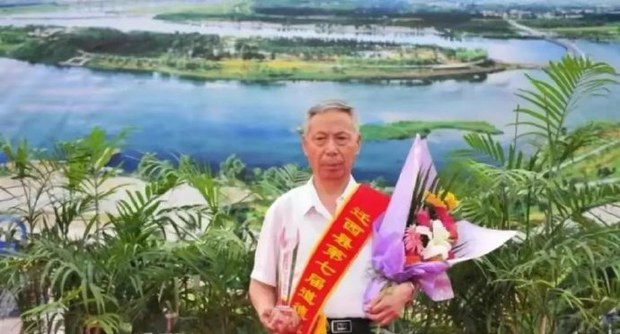
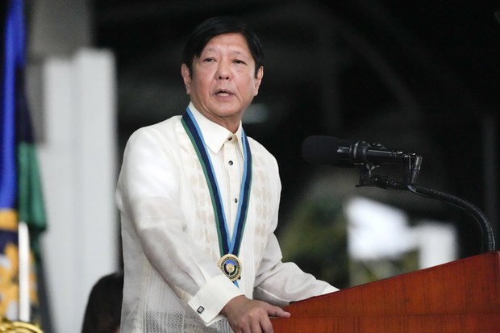

自由亚洲电台 北京时间 2024-01-17T05:23:14Z 1747368939108348060 据中央社报道，中国大陆舞蹈“科目三”抖音爆火后，台北市宁夏夜市以此为主题举办舞蹈比赛，引发了网友论战。
有网友反对，认为“科目三”是要“舞统台湾”，是“2024第一无脑活动”；
宁夏夜市观光协会则透过媒体群组表示文化之间会交流，且交流有助于降低双方敌意及风险。
台湾是否应该这么做？#您怎么看？ https://t.co/KAbdceEe9q   自由亚洲电台 北京时间 2024-01-17T05:50:38Z 1747375833449476153 【#民进党连任 #台湾大选 后两岸关系如何走？】
本周二，美国华盛顿智库战略与国际研究中心发布的即时民调显示，有多达七成以上的受访者认为，2024年中国使用大幅军力惩罚台湾的机率很低（不到20%）。尽管如此，专家提醒这并不代表 #台海局势 就能保持稳定。 
https://t.co/qKhJVzRNCK https://t.co/YLwxjBGL28   自由亚洲电台 北京时间 2024-01-17T06:13:10Z 1747381506325319793 1月14日下午，近百人聚集在 #洛杉矶中国领事馆 门外，举行了以抗议中共威胁台湾自由及安全为主题的集会，并在活动中模仿 #台湾大选 的形式进行了一场模拟总统选举活动。
https://t.co/fh34mRMXdu https://t.co/BNtPDGfwo1   自由亚洲电台 北京时间 2024-01-17T02:51:22Z 1747330722237706461 1月15日，是新疆维吾尔族学者 #伊力哈木 遭中国当局拘押的十周年纪念日。国际社会就此向这位人权活动者表达声援，并敦促中国政府无条件释放伊力哈木及其他所有被不公正拘押的人士。
https://t.co/fzrVhDAaRU https://t.co/TyGpXHz4dR   自由亚洲电台 北京时间 2024-01-17T03:47:28Z 1747344841489764514 1月16日，中国国务院总理 #李强 在瑞士出席 #达沃斯世界经济论坛（WEF）并发表演说。李强表示，中国经济在去年实现了5.2%的增长，超过官方5%的目标。
你信吗？
https://t.co/heOTncHhwk https://t.co/eJGcr7lCtp   自由亚洲电台 北京时间 2024-01-17T00:37:21Z 1747296995021320502 近期，众多曾经在公司内部担任高管的员工被裁员后，瞒着家人继续外出假装上班，却躲入 #图书馆 消磨时光。这一现象成了网络热门话题，有网民感叹中国进入了 #全面裁员时代。
https://t.co/09JP8vuXKC https://t.co/mJebv13r29   自由亚洲电台 北京时间 2024-01-17T00:59:24Z 1747302543921942972 #台湾大选 后，由资深前官员组成的美国代表团抵台访问。针对太平洋岛国 #瑙鲁 以 #联合国2758号决议 为由与台湾断交，美国在台协会(AIT)主席罗森柏格（Laura Rosenberger）表示，这项联合国决议并没有决定台湾的地位。
https://t.co/QpxFiKT1QC https://t.co/fukya0bXoX   自由亚洲电台 北京时间 2024-01-17T01:14:20Z 1747306302144123387 #台湾大选 后，中国除与太平洋岛国 #瑙鲁 建交外，国安部门也老调重弹《#反分裂国家法》，对所谓的“台独分裂势力”提出警告。有学者认为，未来中国将软硬两手加速“#促统”，两岸面临一场“没有烟硝的战争”。
https://t.co/eteTgLmaBr https://t.co/t7YFeOWPXs   自由亚洲电台 北京时间 2024-01-17T01:47:35Z 1747314670514684166 被封为”迁西好人”的迁西县退休干部 #马树山，因为实名举报迁西县县委书记 #李贵富 等官员，迅速被当地公安、检察院拘捕和起诉。事件曝光后成网民讨论焦点，网上有大量以“#匿名举报不受理实名举报逮捕你”为题的转发文。马树山事件如何反映中国的社会实况？
https://t.co/40aZFBF2nL https://t.co/Y6QXwrUS6P   自由亚洲电台 北京时间 2024-01-17T02:21:17Z 1747323152311660824 在菲律宾总统 #马科斯 周一（15日）祝贺 #赖清德 当选台湾下届总统后，中国周二召见菲律宾大使，警告菲方“不要在台湾问题上玩火”。
https://t.co/cP5QMWuB4L https://t.co/6dt3cITmXH   