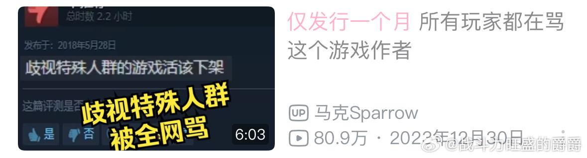

谁将十万横扫三江 北京时间 2024-01-17T17:11:17Z 1747547127184584984 如果你有幸在一个正常的人类家庭长大，请注意，还有很多不幸的人在中国人做父母的家庭生存 https://t.co/StJhrNjEaK   谁将十万横扫三江 北京时间 2024-01-17T17:14:25Z 1747547914396713383 在B站看到这个标题，你的第一反应会认为评论区是什么样的？

是不是会觉得是这样的：

“欧美游戏的一股清流👍不向zzzq妥协”

“这下不得不玩了”

”薄纱叠buff哈哈”

然而这个评论区，却没有如同往常一样，给这个【歧视特殊人群】的游戏点赞，而是一面倒地怒骂，抵制这个游戏。为什么呢？因为游戏里被歧视的特殊人群是男胖子...
对，这个游戏作者专门做了个游戏歧视男胖子。换成任何一个在欧美政治正确之下被保护的群体，比如女性，黑人，性少数，评论区孙吧男都会给这个游戏点赞。但唯独换成了男胖子，他们第一次破天荒支持政治正确了。为什么呢？   谁将十万横扫三江 北京时间 2024-01-17T10:33:03Z 1747446906622513276 RT @starlightcaesar: 我二一年之前也打游戏，二一年有了喜欢的偶像团体后就不打了。现在回想起来，打游戏真的很像咗奶嘴，只能暂时分散注意力，实际上收获不了多少快乐的体验。打游戏的社交体验也很差，帮会里几乎都是男的，黄赌毒都有沾，有喝了酒发自己妻子裸照的，还有借钱…   谁将十万横扫三江 北京时间 2024-01-17T10:23:14Z 1747444437167280364 RT @YesterdayBigcat: 我看评论和私信里有些人没搞明白，再次澄清一下，这里指的收费，是指我们搜集起来但没有公开的那些资料，目前有900G，如果需要用来研究或者做别的用途，是需要付费的。

我们已经公开的，是不用收费的，但如果需要引用的话，必须注明出处。

另外…   谁将十万横扫三江 北京时间 2024-01-17T10:23:36Z 1747444529618194621 RT @lilaoshizuikeai: 爱国博主千万不要有自己是意见领袖的错觉，以为自己随便发条微博就能掀起风浪
坦白讲政府让你吃20元的员工餐也是服从性测试，看看你们是不是上了实名制还是不老实，别说员工餐了，给你屎你也要吃完。更何况你们的流量也证明了其实屎都不配吃。…   谁将十万横扫三江 北京时间 2024-01-17T10:23:57Z 1747444619443380295 RT @YesterdayBigcat: 「河南宁陵、广东东莞两地工人因低薪以及变相裁员问题同日罢工（1月16日）」1月16日，河南省商丘市宁陵县的一家服装厂和广东省东莞市的一家精密技术公司的工人同日举行罢工，抗议薪资太低以及遭遇变相裁员。

月工资1100，河南宁陵东隆服装公…   