A李老师不是你老师 北京时间 2024-01-16T19:46:45Z 1747223863488922073 有山东网友称，当年的山东电视台可不是这样的。 当初山东电视台有个叫《调查》的节目，在报道全国一些影响比较大的事件的时候，都会派记者去当地采访。例如说14年上海外滩踩踏事件发生之后，第二天山东台的记者就到了上海做采访。
另外09年的时候有个事，山东有个人去天津打工，他儿子掉进工厂的废水池里了。然后当时齐鲁电视台(现在和山东电视台合并了)的女记者王曦去天津采访的时候还被工厂老板打了一巴掌。
这一幕被跟着一起去的报社记者拍到了，这张照片在当年影响力非常大。
 当时不管是有上了卫星可以全国播出的山东电视台，还是播出范围只有省内的齐鲁电视台，都能去省外做舆论监督采访。结果时过境迁，现在山东电视台台长站出来说““我们只转发正能量””这种话，真是感觉不胜唏嘘…… 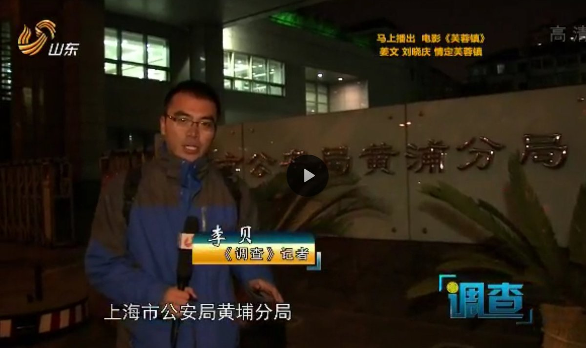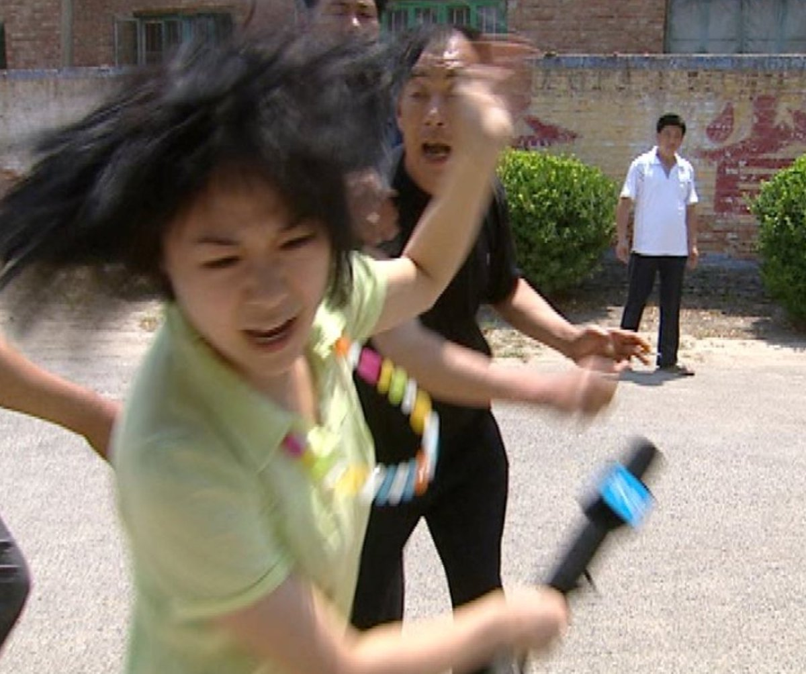  A李老师不是你老师 北京时间 2024-01-16T20:22:17Z 1747232805031907386 独家
1月9日，中央学习贯彻习近平新时代中国特色社会主义思想主题教育领导小组向全国各地党委政府发出内部批示文件推动党政机关习惯过紧日子。
文中称，要深刻把握习近平重要批示的精神实质，敦促各级党政机关，党员干部形成过紧日子的习惯。
并指出，目前政府工作中存在经费开销把关不严，公务接待存在奢靡享乐之风，民生项目烂尾，“民心工程”变成了“闹心工程”。有的地方把较多资金投入到政务信息平台开发，挤占了基层工资和运转开支。如果不及时纠正，必将严重影响人民群众对党和政府的信任和信心。
各地各部门各单位要从关系党的执政基础和执政地位的高度，充分认识到党政机关过紧日子的极端重要性和现实紧迫性。 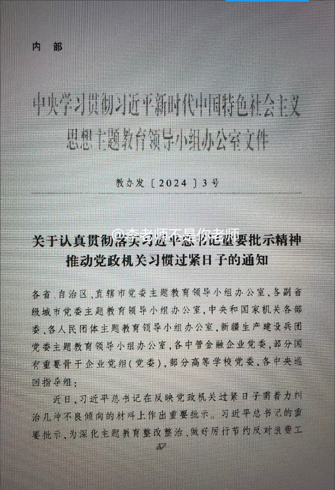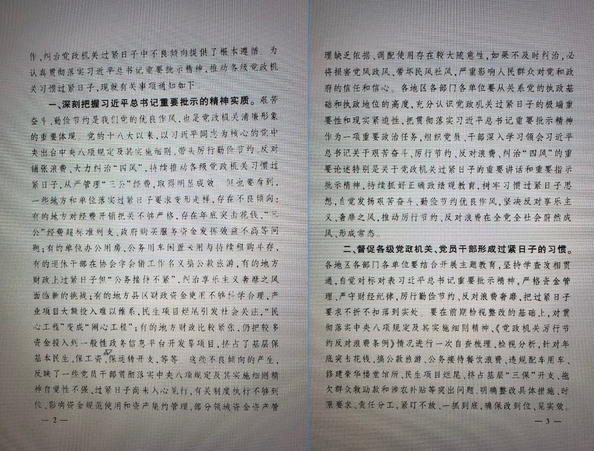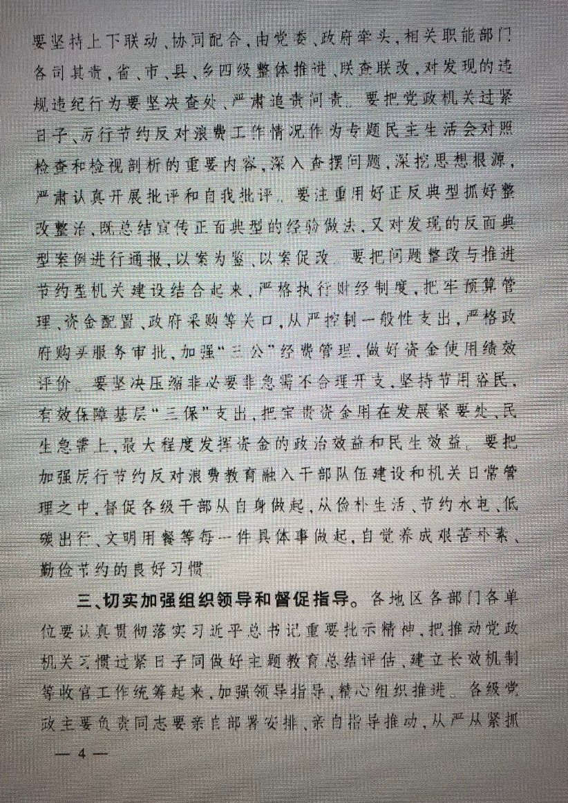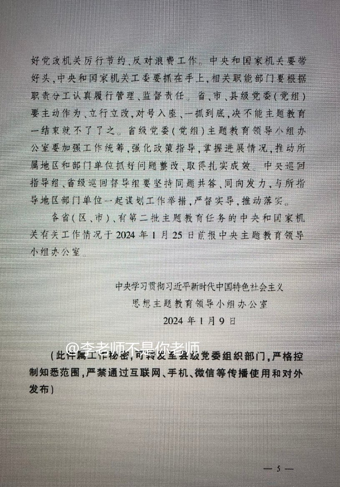  A李老师不是你老师 北京时间 2024-01-16T20:32:47Z 1747235449863614667 1月16日，网传华中农业大学11名在读学生集体向社会实名举报动科动医学院教授黄飞若的学术造假问题。
文中称，黄飞若及其指导的两名博士后存在严重学术不端，在学生们就读期间逼迫他们进行数据篡改，编造实验结果等违反学术道德的行为。
同时，在指导学生的过程中采用高压，严苛的方式，频繁进行人身攻击和辱骂，严重伤害了学术的自尊和自信，致使多人产生精神焦虑和抑郁。同时还强迫学术们进行和学业无关的私活。
学生们对科学和教育怀有忠诚之心，因此不能袖手旁观。并呼吁学校领导加强对教师队伍的管理，保障学生和科研人员的合法权益和学术道德，还受影响的师生一个良好的学习环境。 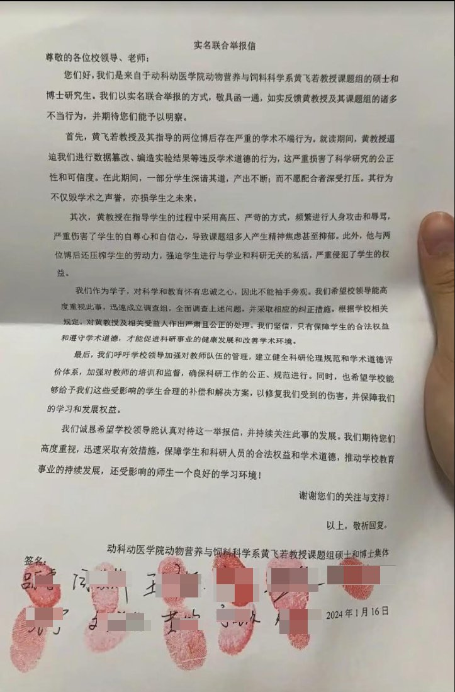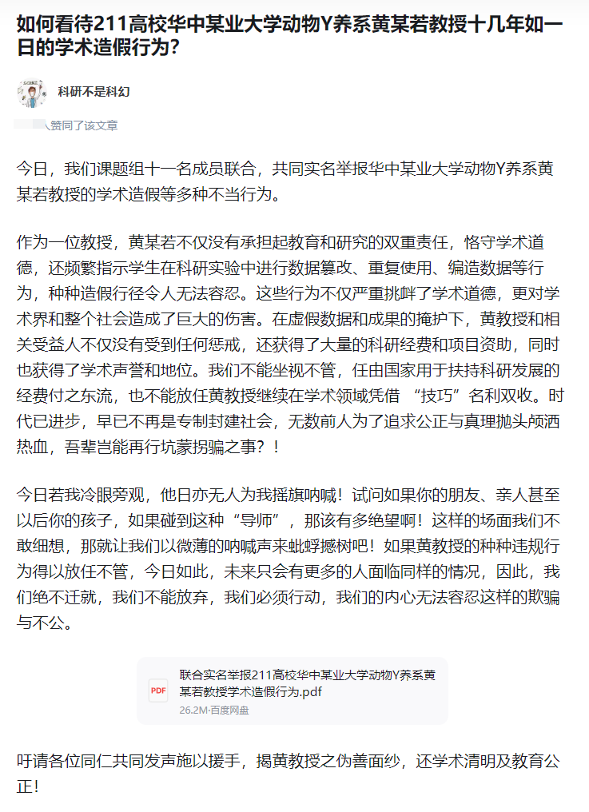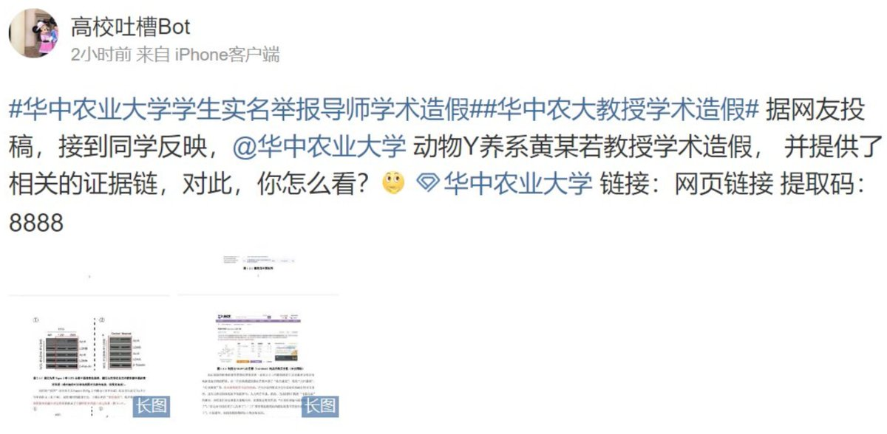  A李老师不是你老师 北京时间 2024-01-16T17:13:43Z 1747185351410540567 1月15日，浙江衢州。一男子持刀刺伤前妻后自残，周围路人吓得惊叫连连。
据浙江衢州开化县公安局通报，1月15日14时许，开化县马金镇天童路发生一起刑事案件。经初步调查，犯罪嫌疑人吴某(男，44岁，开化人)因感情纠纷用水果刀将前妻(女，36岁，开化人)刺伤，随后自残。目前，两人经抢救无效死亡，案件正在进一步侦办中。   A李老师不是你老师 北京时间 2024-01-16T17:30:07Z 1747189478400160250 “我们从来不看别人的笑话”1月16日，媒体报道，在第四届中国短视频大会上，山东广播电视台党委书记、台长吕芃表示：“有一点我必须向各位领导们汇报，闪电新闻从来不做跨省的舆论监督，我们从来不看别人的笑话，我们从来不转播任何灰色地带的东西，我们只转发正能量。因为山东广电是孔子家乡的电视台，我们牢记孔子有一条被全人类各个民族共同接受的金科玉律般的格言，那就是己所不欲，勿施于人。做人尤其做山东人，一定要厚道，这是我们的基本原则，我们从来不看别人的笑话。” 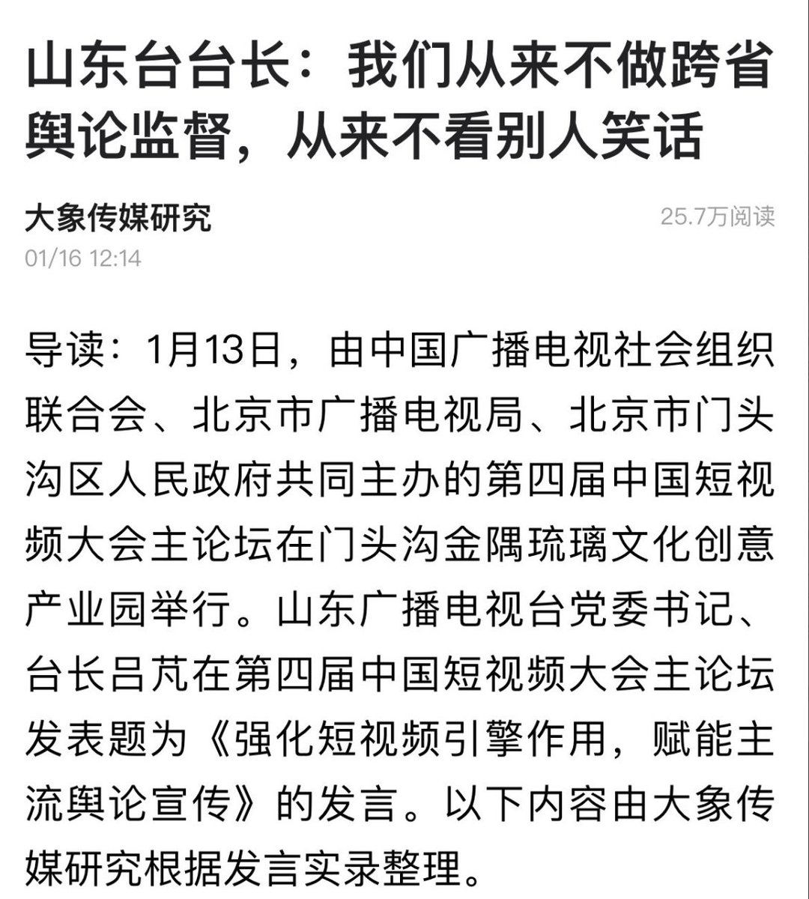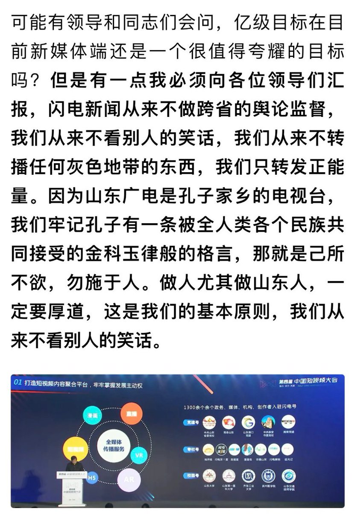  A李老师不是你老师 北京时间 2024-01-16T18:09:48Z 1747199464576586123 近日，台北市长蒋万安再度走红
在一则海峡新干线“蒋万安指责民进党执政下越来越专职，一党独大，贪污腐败，高官赚饱饱民众苦哈哈”的视频下方
六万网友集体阴阳怪气“骂的好，同感” https://t.co/6pJVjqsPr7   A李老师不是你老师 北京时间 2024-01-16T16:10:38Z 1747169477161013490 1月16日，胡锦涛之子胡海峰被任命为民政部副部长。 https://t.co/cy9kg6lLQu 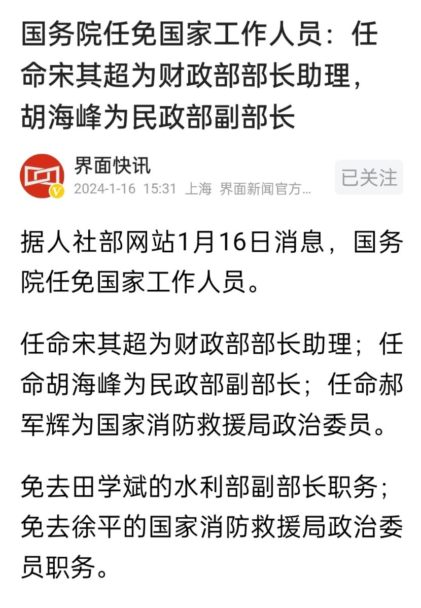  A李老师不是你老师 北京时间 2024-01-16T02:58:14Z 1746970060738945293 网友来信：对现状的思考，我们还能做什么。李老师您好，我看您的报道很久了，通过twitter也获取了许多信息。感谢您始终全心全意地进行报道，但不得不说，这些新闻大多有一些沉重，看多了之后，总有些无力感（不知道多少人有同感，似乎可以做个调研）。我知道很多人已经政治性抑郁了，我之前也有点这样的倾向，因此我在想，怎么才能摆脱这种状态呢？身边是没有什么可以交流的人，网上建政也浮躁得很，于是想了想，还是多读一些书吧。从《西方哲学史》，《顾准文集》，《李慎之文集》，还有福柯，王小波的书籍，找到了一些我想要的答案，也获得了一些力量，消解了很多悲观的情绪。最大的体会是：你想明白的，历史上或许已经发生了，或者已经有了答案，而个人之于历史，实在过于渺小，如果有什么悲观情绪，多去读些历史书好了。

最近台湾大选，造势、投票和最终结果，当然很令人振奋，但我也在想，为什么台湾可以民主化？似乎并没有人跟我提过。中国大陆能从中学到什么？就算根据拿来主义的“传统”，就没有什么作业可抄吗？遗憾的是，我很少看到媒体进行这样的分析。看到 reddit 上有人发，台湾出了个蒋经国，结束了专制。不可否认蒋先生的伟大，但总感觉这种论述还是有其历史偶然性（这点是受到了福柯的影响：如果没有希特勒，纳粹同样会灭亡，一个道理），我希望找到的是那束“必然的火”。

在此期间，看到很多人的思考，比如李慎之老先生的分析：中国的文化传统是专制主义。我深刻认识到，文化因素才是最重要的，中国社会的最大矛盾，是落后的专制主义与现代化文明的冲突（按照福柯的描述，现代社会存在着一个无孔不入的权力体系，这个权力是网状，且具有中性、生产性等特征的，但是在专制的土壤下，表现出的便是各种消极的因素），同时还看到了十年前张维迎等人对于语言腐败的分析（因为话语即权力，所以可以理解为权力的腐败），那为什么台湾可以摆脱那样的专制文化呢？

我的理解是：台湾的文人，尤其是龙应台这样的呐喊者扮演了很重要的因素。

抱着这样的心态，我读了龙应台的《野火集-30周年纪念版》，受到了很大的震撼。她的文字很通俗，没有王小波那样的黑色幽默，但是尖锐且真挚的文字，直击心灵。让我感觉，难道她在看着我们？这不就是完完全全的中国大陆，奥威尔笔下的大洋国吗（事实上，书中也提到了，88年的来自大陆的读者，也深有此感）看完的第一时间，我便想：这样的书，我一定要推荐给身边的所有人！正想发个pyq时，我却退缩了。正如福柯描述的那样，摆脱不了权力的规训，不断做着这样的自我审查，这个不敢发，那个也不敢发，让我很沮丧，很讨厌（索性还能做个观察者）。

李慎之先生构想的中国民主化进程中，为了解决制度和国民性的”鸡生蛋，蛋生鸡“的问题，构想的是制度先行，然后进行公民教育等等进行改造。但是既然如今有了网络，我们可以做的远不止那样。但我个人的力量过于渺小，我希望，大V们可以发文做一些呼吁，从鼓励每一个人有意识地提升自己的公民意识与认知开始

比如就从读《野火集》开始，从读里面的《中国人，你为什么不生气》开始，我认为这是和新闻报道同等重要的事情。这便是我思考的“还能做什么”。

我本想的是躺平、犬儒主义，但骨子里是个王小波那样的理想主义者，受到包括您在内的很多人感染，发了这封信，去做我坚信正确的事情。

最后，希望您万事顺利（越办越好还是不要啦，那国内不得越来越糟），也十分期待您的回信。   A李老师不是你老师 北京时间 2024-01-16T03:02:54Z 1746971235383173375 就业形式一片大好，各行各业纷纷开始放卫星
前几日，网易新闻和第一财经“恶意抹黑”中国底层劳动者的生存状态后
近日，国内媒体持续发力。相继推出外卖三年102万，95后小伙干瓦工日薪两千，00后捡破烂年入20万等 https://t.co/4eBB8pfQX5 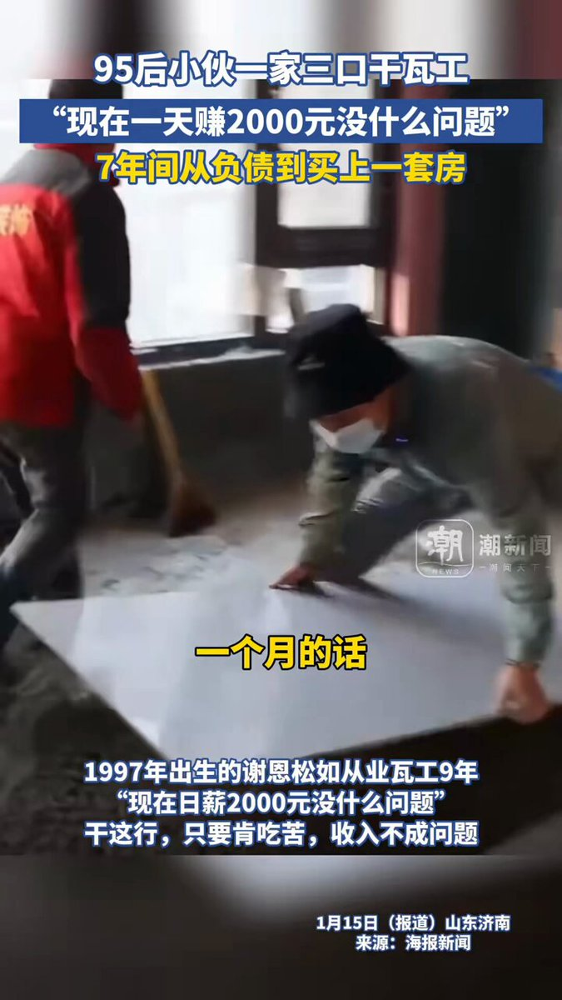  