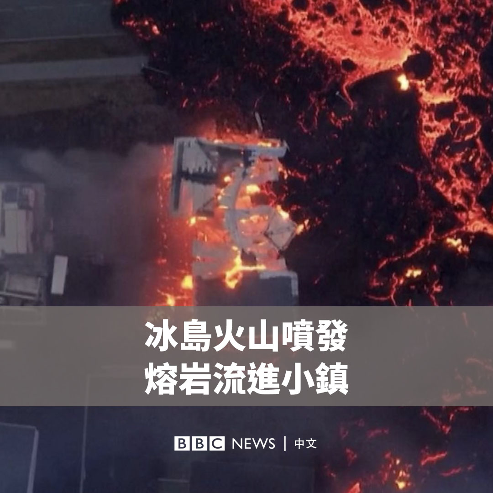
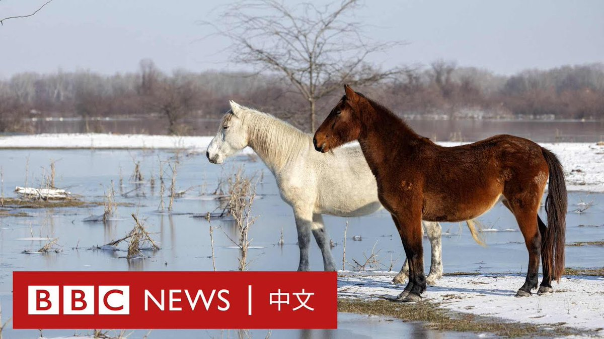
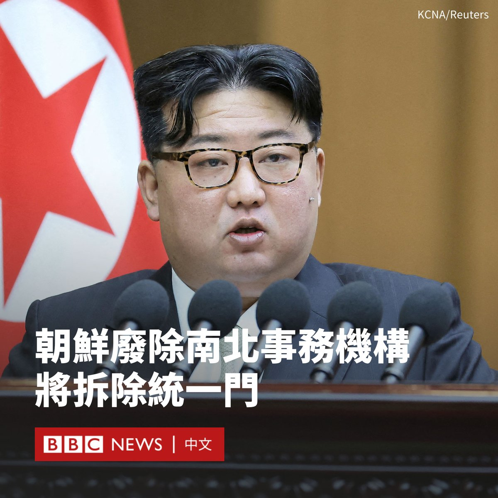

D英国广播公司BBC 北京时间 2024-01-16T16:45:14Z 1747178184226017492 冰岛西部的火山喷发后，熔岩吞噬了格林达维克镇的多栋房屋。航拍画面显示，橙色的熔岩流从地面裂缝喷涌而出。当地的居民此前已经被疏散。 https://t.co/Rlrc4VZOIy   D英国广播公司BBC 北京时间 2024-01-16T14:53:23Z 1747150034267742396 特朗普在爱荷华州党团会议投票中取得压倒性胜利，巩固了他拿下2024年共和党总统提名的领先地位。https://t.co/B4jhXbVJZE   D英国广播公司BBC 北京时间 2024-01-16T13:18:57Z 1747126268867575959 在塞尔维亚，由于水位急剧上涨阻塞了通道，200多只牛和马被困在多瑙河的一个小岛上无法离开。救援人员正在与时间赛跑而进行疏散行动，避免它们因严寒和饥饿死亡。 https://t.co/5KMuViRsrK   D英国广播公司BBC 北京时间 2024-01-16T10:25:45Z 1747082683958915562 朝鲜表示，应在宪法中将韩国列为“头号敌国”，并宣布将废除该国的祖国和平统一委员会等多个对韩机构。

这似乎体现了平壤正加速修改该国的统一政策，并加剧与首尔的敌意。朝鲜领导人金正恩去年12月曾表示，朝韩关系不再是同一民族关系，而是敌对国关系。

据官方通讯社朝中社报道，朝鲜在周一（1月15日）召开第十四届最高人民会议第十次会议，金正恩在讲话中表示，应在《宪法》中将韩国定义为“头号敌国”，如果发生战争，“应完全占领、平定、收复”韩国，并将其纳入朝鲜领土。

报道还称，金正恩表示，朝鲜已“彻底消除”将韩国视作和解与统一对象以及同族的矛盾概念。

他表示，应当拆除位于平壤南部的“祖国统一三大宪章纪念塔”（统一门），并禁止民众使用“三千里锦绣江山”“八千万同胞”等词汇。

据朝中社报道，该会议同时决定将废除朝鲜的多个与韩国有关的机构，包括祖国和平统一委员会、民族经济合作局和金刚山国际旅游局等。

此前，朝鲜各类宣传媒体已开始抹去“统一”印记。据韩联社报道，朝鲜外宣网站“我的国家”删除了强调韩朝统一的“我们是一体”栏目，朝鲜国营网站“由我们民族自己”和“统一的回声”也已无法打开。   D英国广播公司BBC 北京时间 2024-01-16T09:12:31Z 1747064253176045748 北京称他为“麻烦制造者”和危险的“分裂分子”，现在他将成为台湾的下一任总统。在中国看来，民进党已过于接近其毫无疑问的红线——台湾独立。https://t.co/KNN8IKVuuE   