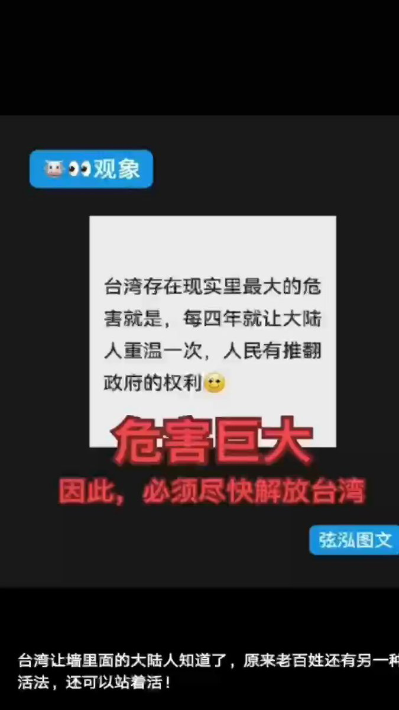
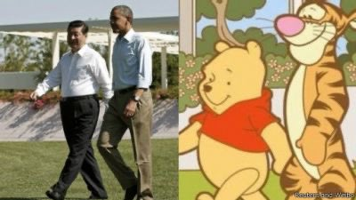
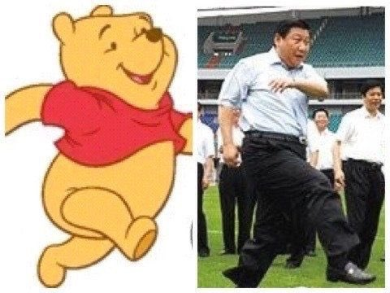
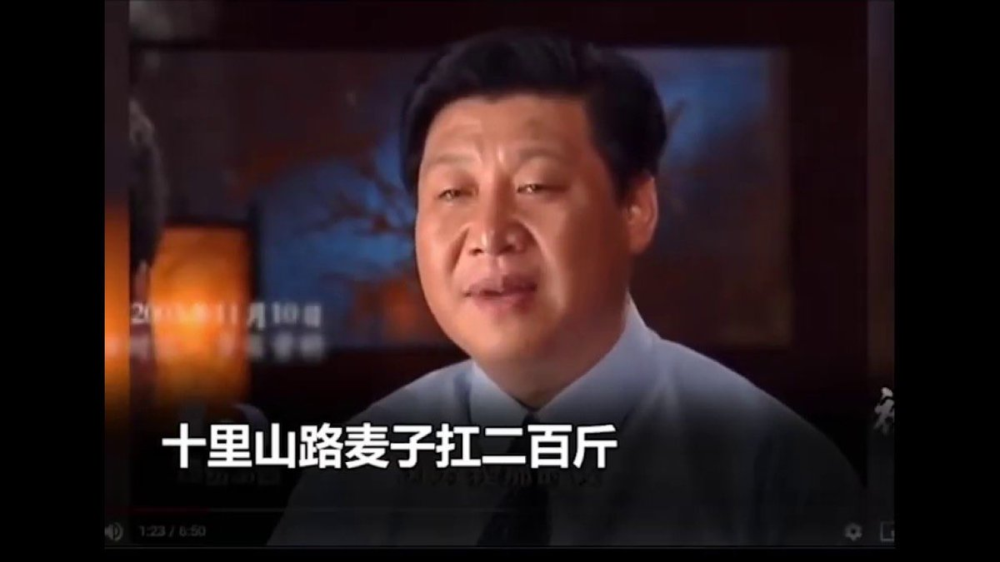
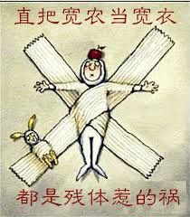
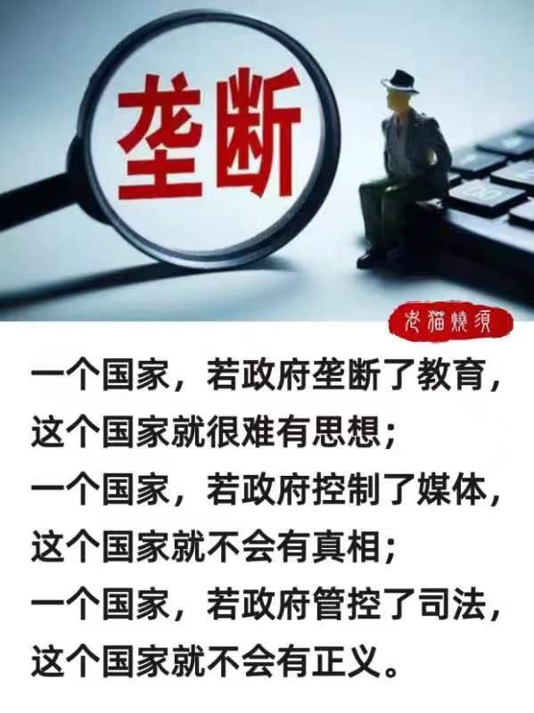
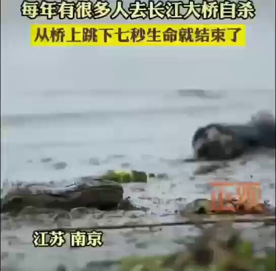
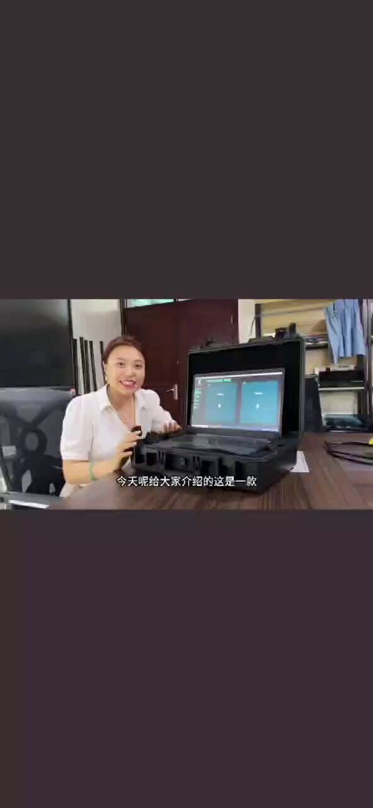
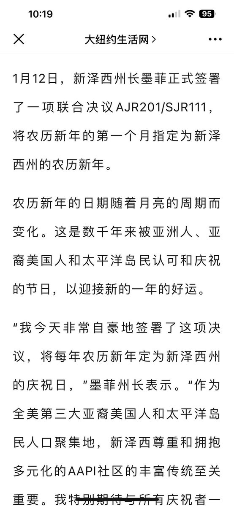

Petrichor 北京时间 2024-01-16T22:17:07Z 1747261703644123590 这才是真正的政治智慧！且看这边装聋作哑，无言以对。   Petrichor 北京时间 2024-01-16T18:42:12Z 1747207618441965777 转发

听赖致词有感：
  1，全程脱稿讲演，而不是见个下属也要唸稿；
  2，向对手表示感谢，而不是对己下野的、有不同政见的同事也要下毒手；
  3，检讨自已政党不足，虚心向对手党派长处学习，而不是一党独大，自命不凡，不准妄议。
   4，尊重民意，人民至上，关切的是民生，要让人民过好日子，而不是专注自已坐穏位置，巩固专权，说一套做一套，让人民准备过苦日子；
  5，对前任表示感谢，要继承发扬，而不是抛弃倒退，忘恩负义，无礼架走；
   6，致词思路清晰，言短意深，实实在在，而不是空话、大话、套话、胡话；
   7，用人唯才，实行民主大联盟，而不是任人唯亲，全用听话效忠的奴才。

         汪洋元月14号於海南   Petrichor 北京时间 2024-01-16T10:32:38Z 1747084417267306956 习近平为什么要武统台湾？原因原来是这个。 https://t.co/IAXVUTR16d   Petrichor 北京时间 2024-01-16T10:50:26Z 1747088896691757479 民眾對中共中央總書記習近平的負面稱呼很多，多如牛毛，例如，總加速師、小熊維尼（習維尼）、包子、習包子、清零帝、慶豐帝、小學生、後昭和天皇、崇禎帝、不換肩、扛麥郎、寬衣帝、習一尊、習禁評、袁二、薩格爾王、寬衣帝、习卒、习二卒、小學博士、習特勒、红漆马桶、雕花屎等。据学者考察，他是中國5000年歷史上外號最多的人，远超王莽。   Petrichor 北京时间 2024-01-16T11:03:25Z 1747092162062250293 转发

本次大选双方都使出了绝招。
国民党打出的口号是：“投票民进党，青年上战场”
民进党打出的口号是：“投票国民党，台湾变香港”

民进党以超出国民党近百万票，高票当选，继续执政，看来台湾百姓不怕上战场，就怕变香港[呲牙]。 https://t.co/GnIAmO3kd3   Petrichor 北京时间 2024-01-16T10:22:17Z 1747081809995686122 南京长江大桥横跨长江，总长4588米，宽15米，高150米，两侧都有约1.5米高的护栏。据不完全统计，大桥建成至今，跳江自杀的人超过2000人，是中国自杀率最高的桥梁。 https://t.co/ufsSGbOexj   Petrichor 北京时间 2024-01-16T10:28:39Z 1747083411372511389 许多中国人对美国限制高科技产品对华出口举双手赞成，原因是中共得到高科技立马用于监控人民，限制人民的言论自由和思想解放。例如，视频所示的手机监视系统以及脸部识别系统。 https://t.co/y3wCqUNzoi   Petrichor 北京时间 2024-01-16T04:31:40Z 1746993575957524706 中共抵制洋节，是文化不自信的表现。
中共建网络防火墙，是制度不自信的体现。
中共不允许其他党派成立和发展，是政治不自信的原因。
中共不许新闻自由，是道德不自信的标志。

中共最了解中共，自知之明呢。 https://t.co/Kf2UQlHKz9   