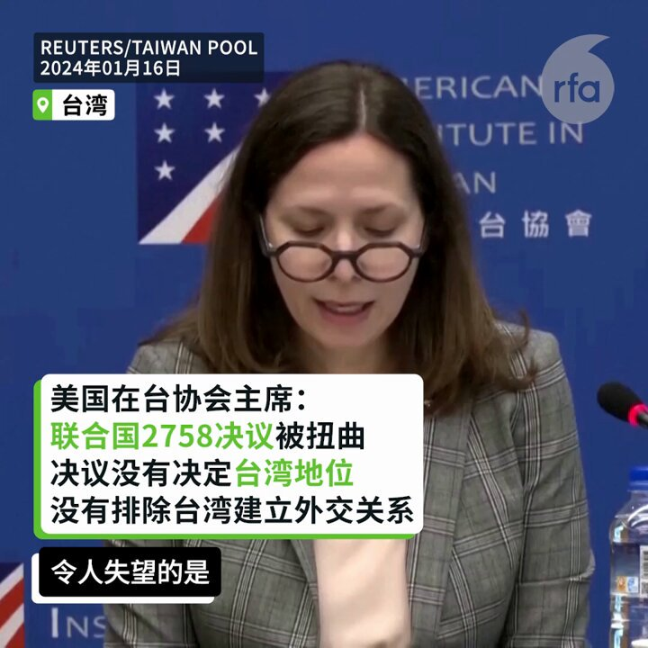
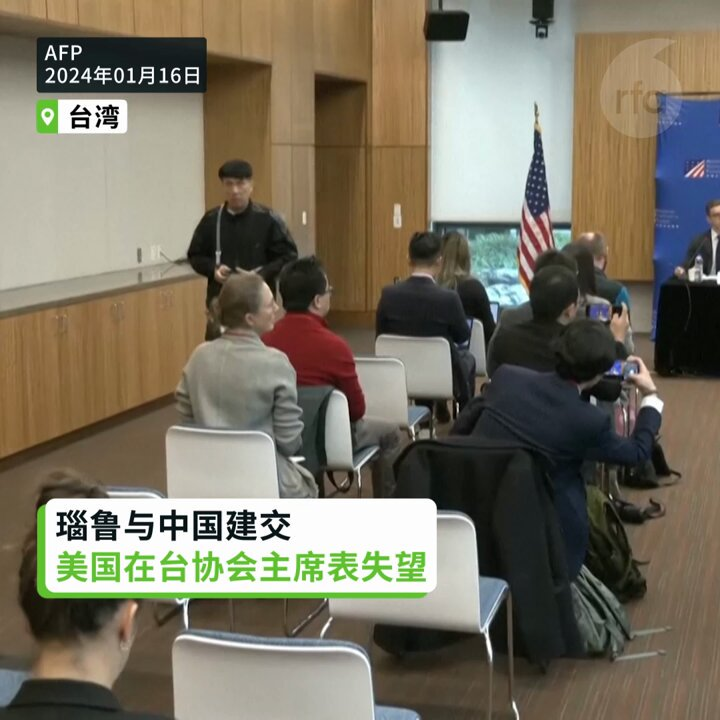
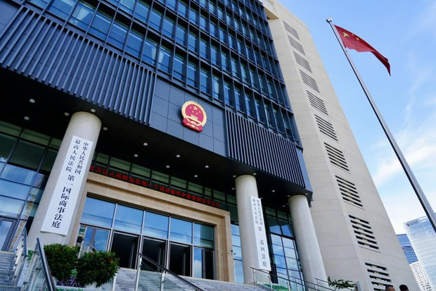
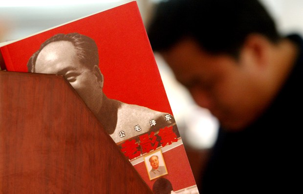
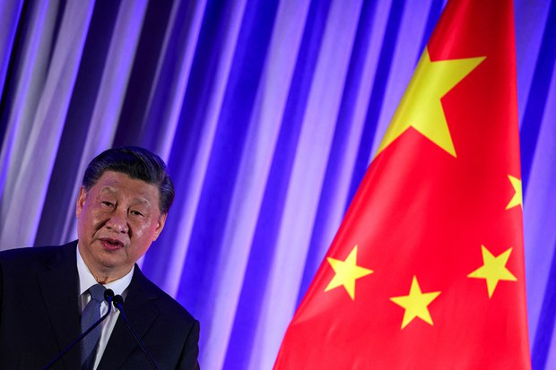
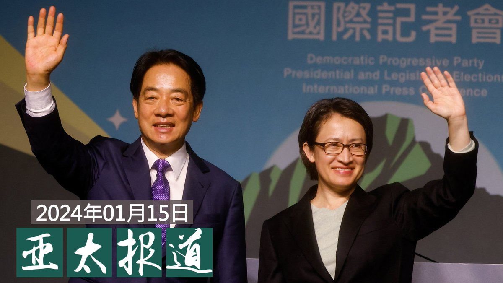

自由亚洲电台 北京时间 2024-01-16T19:07:27Z 1747213973530017982 【AIT主席罗森伯格：2758决议未定台湾地位 对瑙鲁感失望】
#瑙鲁 罕见地以联合国 #2758号决议 及一中原则为由与 #中华民国 断交，美国在台协会主席 #罗森伯格 表示，2758号决议没有决定台湾地位、没有排除任何国家与台湾建立外交关系，也没有排除台湾有意义参与联合国体系空间。 https://t.co/RglANbJf5b   自由亚洲电台 北京时间 2024-01-16T20:19:08Z 1747232013063524737 RT @RFA_Chinese: 美国、日本、法国、英国、德国、加拿大、新加坡、捷克、澳大利亚等超过50个国家的行政部门向台湾顺利完成选举祝贺，引发中方“强烈不满”，并针对美国国务院有关声明提出“严正交涉”。
详阅：
https://t.co/TZ8SmAtcLF   自由亚洲电台 北京时间 2024-01-16T17:41:57Z 1747192457836859473 【AIT主席罗森伯格：对瑙鲁與台湾断交的决定失望】
美国在台协会(AIT)主席 #罗森伯格(Laura Rosenberger)16日表示，对瑙鲁的决定感到失望，2758号决议没有决定台湾地位、没有排除任何国家与台湾建立外交关系，也没有排除台湾有意义参与联合国体系空间。 https://t.co/HiPhgUQVA6   自由亚洲电台 北京时间 2024-01-16T14:08:11Z 1747138658321461431 评论｜魏京生 @WEI_JINGSHENG：回忆台湾民主先驱 #施明德 先生
https://t.co/g8eenumv67 https://t.co/1MlYvzkbqA   自由亚洲电台 北京时间 2024-01-16T11:46:45Z 1747103066225311750 【一月三变   中国司法到底要不要公开？】
中国最高法院1月14日表示要加大裁判文书上网力度。
12月中旬，最高法要关闭全国法院裁判文书库，仅对法院人士使用。
12月22日，最高法院相关负责人表示，从未“叫停”过裁判文书上网，而只是减少公开率，进行整改和优化。
https://t.co/U3H1jmNNCI https://t.co/DXU3fGDTX4   自由亚洲电台 北京时间 2024-01-16T11:48:16Z 1747103449207222545 专栏 | #夜话中南海：#习近平 评“#文革”为何只敢淡化不敢美化？
https://t.co/7XkQf3Wjwt https://t.co/62x56YpVXg   自由亚洲电台 北京时间 2024-01-16T11:53:38Z 1747104798649028877 评论 | #余杰：总书记与总统的差别，是独裁与民主的差别
https://t.co/SBacmugCcU https://t.co/iexFqQFIu1   自由亚洲电台 北京时间 2024-01-16T09:09:06Z 1747063391330717972 欢迎收听和订阅播客【＃亚太报道】 https://t.co/MjLNSvVMqc
#瑙鲁与台湾断交 转向北京；两岸关系走向成焦点；美日访团抵台表达支持；新疆警方刑讯逼供致人死亡案件曝光；辽宁家庭教会牧师 #阚小勇 遭重判 https://t.co/TVH8O12sXM   自由亚洲电台 北京时间 2024-01-16T09:19:25Z 1747065991287464187 中国国务院总理 #李强 当地时间周日（1月14日）下午抵达苏黎世，对 #瑞士 进行正式访问。瑞士联邦主席阿姆赫德在瑞士首都伯尔尼会见了李强。
https://t.co/J0boVYjJuN https://t.co/NGoHT06YpC   自由亚洲电台 北京时间 2024-01-16T09:21:04Z 1747066404711637096 台驻美代表 #俞大㵢 投书美媒：台湾选择民主不会被任何人改变
https://t.co/0YoKdZWvG4 https://t.co/ZG7LWWC1je   自由亚洲电台 北京时间 2024-01-16T05:22:53Z 1747006464517079433 #台湾大选 结果出炉后，#英国 外相随即祝贺赖清德当选总统。但此举遭到中方“坚决反对”，并促请英方恪守承认台湾是“中国一个省”的立场。不过有学者认为，英国政府在此问题上其实一直模糊；也有学者表示，两岸保持现状对台湾和英国都最有利。
https://t.co/uz0STEP37O https://t.co/xyh88zuqAb   自由亚洲电台 北京时间 2024-01-16T05:29:02Z 1747008013146448241 #加拿大 政府日前祝贺 #台湾大选 结果后，中方随即批评加拿大“违反一中原则”。有学者就此呼吁加拿大政府与盟国合作，共同用实际行动支持台湾。

https://t.co/ofpgTGVPYx https://t.co/6oS7R7x01l   自由亚洲电台 北京时间 2024-01-16T04:09:55Z 1746988103418732560 赖清德13日获选总统，友邦瑙鲁才发贺电，但15日台湾外交部却紧急召开记者会表示，获悉瑙鲁政府将以联合国第2758号决议及“一中原则”等理由，与中华民国断交。为维护国家的主权与尊严，决定自即日起终止与瑙鲁的外交关系，全面停止合作、撤离人员、关闭使馆。
https://t.co/i55ubIXwVp https://t.co/RAh0T628Ye   自由亚洲电台 北京时间 2024-01-16T04:18:54Z 1746990363079016922 #事实查核  @asiafactcheckcn | 台湾计划引进非洲男子与台湾女子通婚？
https://t.co/uMZ8r9Cvv0 https://t.co/5JNqAvQxyj   自由亚洲电台 北京时间 2024-01-16T00:45:23Z 1746936628076236954 据维权网的消息，四川网络异议作家 #刘尔目 的朋友透露，目前居住在四川省酉阳县异议作家刘尔目于2024年1月初与外界失联，至今已超过一周时间无法取得联系。
https://t.co/kIvRvBgeoy https://t.co/CYsceeNokF   自由亚洲电台 北京时间 2024-01-16T00:58:52Z 1746940023394714044 继国台办、外交部后，中国外长 #王毅 也针对刚过去的 #台湾大选 结果发表措词强硬的回应。王毅强调，台湾的选举结果无法改变世界上只有一个中国的事实，并严厉抨击”台独”必受到历史和法律的严惩。那么，中国官方对台湾大选结果的表态会变成进一步的行动吗？
https://t.co/cNu9G1mU8Q https://t.co/TLj7q1RwPM   自由亚洲电台 北京时间 2024-01-16T01:43:10Z 1746951172559389057 近日，辽宁大连家庭教会牧师 #阚小勇 夫妇和4名教会义工被控涉嫌“利用迷信破坏法律实施”，以及“非法经营罪”一案宣判。法院裁定6人罪成，其中阚小勇被判14年有期徒刑，其余5人分别被判处3到10年不等的刑期。阚小勇夫妇在受审期间透露，警方曾对两人刑讯逼供。

https://t.co/IKxHyl2wiB https://t.co/v9MAsCh4BG   自由亚洲电台 北京时间 2024-01-16T02:09:21Z 1746957759873175756 评论｜王丹 @wangdan@1989：#台湾民主 如何引导中国政治变迁？
https://t.co/sx4Y80LCvB https://t.co/By1YdDLzpK   自由亚洲电台 北京时间 2024-01-16T00:00:57Z 1746925446594244783 自上周三开始，日资企业 #上海东洋塑胶制品有限公司 的众多员工发起 #罢工，抗议资方终止劳动合同、未按《劳动合同法》的规定实施补偿。该公司员工接受本台查询时表示，目前罢工还在持续，当地政府已派人介入调停。
https://t.co/r0cy6I3otj   