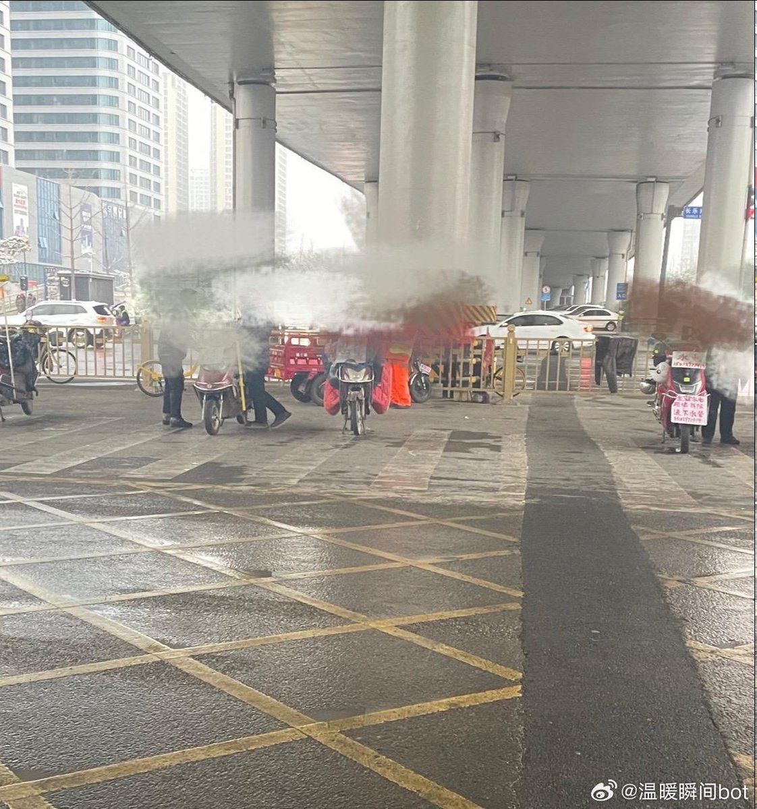
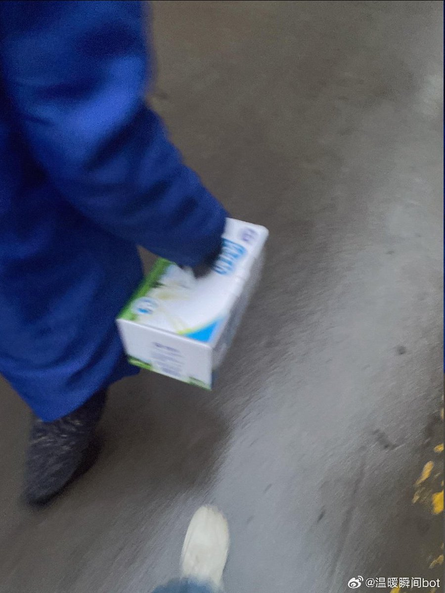
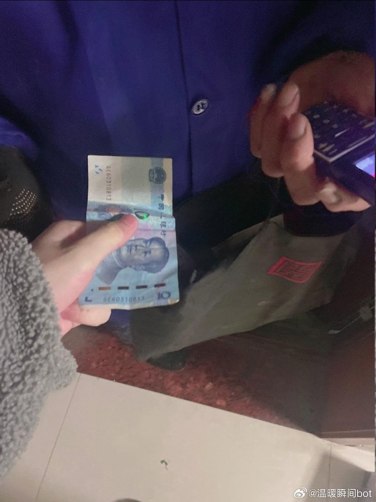
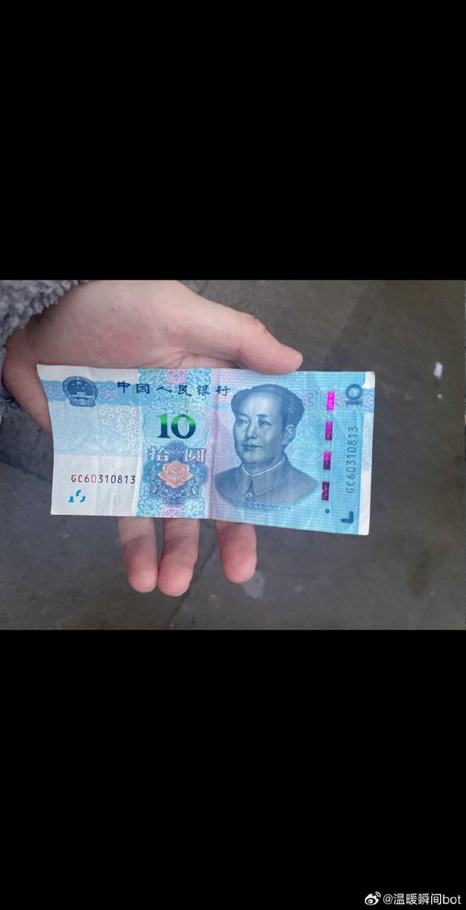

谁将十万横扫三江 北京时间 2024-01-16T22:26:22Z 1747264033974374590 下午散步，途经一个人才市场，周围聚集着大批中年揽工者。我刚停下脚步，就有四五人向我靠拢过来，他们中间有挑夫，有水泥工，还有木匠等等。

随着过来的人越来越多，我表明自己没有招工的想法后，便打算离开。他们也没有恼，想必早已习以为常。

忽然，我注意到人群中有一个女人，在男人堆里，格外显眼。她在我驻留时，试探性地走了过来，或许感觉到了我没有招工的意图，又默默退了回去。

这是一个将近六十岁的女人（后面得知实际只有四十九岁）。她的衣服有些单薄，再加上今日降雪，整个身子也有些瑟缩。

感受到我的目光，她立即站了起来，努力挺直身子，仿佛自己是件商品一般，等待客人挑选。

我不禁内心一颤，也暗自决定尽力帮她一下。

交流中，我得知她的丈夫几年前在工地干活，腰受伤了，她就顶替了丈夫的位置。不过她在工地干的都是小工，也有一点贴瓷砖的经验。

言罢，我脑中飞速运转，终于想到一个计划——让她帮我提箱牛奶。我佯装胳膊受伤，不方便携带，并表示家就在附近。

她欣然应允，转身掏出一部老式手机，向着好友传达着她的捷报。此刻，她的动作神态，分明是一个二八少女所拥有的调皮可爱。

来到了小区楼下的便利店，买了一箱牛奶，顺便换了一些现金。

等她帮我送到，我询问价格，她略显犹豫地说：“十元可以吗？”

“十元？”我有些惊讶，虽说家离的不远，也有一公里多，还要爬楼梯，显然这远远低于我心里的价位。

“那八元也可以。”她明显底气不足的再次说到。

最终她坚持最多只收十元。并告诫我十元钱已经很多了，她干小工一天才七十五元，况且十元可以吃一天的饭。细问下，了解到，她到现在才吃了两个馒头，一碗面，一时心中苦涩不已。

我突然一拍脑门说：“我买错了，买成了纯牛奶，你拿回去喝吧，我改天再买。”

看着她半信半疑的样子，我再三肯定是真的，她才接受。只是无论如何，又把十元钱还给了我。

担心其找不到小区入口，我和她一起下了楼，目送着她离开。我又掏出那张去而复返的十元钱在手里仔细查看，整个人却是怅然若失。

她的力气似乎很小，小到甚至不值十元钱。但她的力气似乎又很大，大到撑起了一个家。   谁将十万横扫三江 北京时间 2024-01-16T18:53:25Z 1747210441254944980 RT @torontobigface: 最近赖清德当选
小粉红纷纷叫嚣这是台湾最后一次大选
那么中共到底会不会武统台湾呢？
武统台湾只是个口号，还是真实的既定目标？
支持中共武统台湾的动机是什么？
阻止中共武统台湾的阻碍又是什么？
从中共视角分析，武统台湾的可能性
方脸说：中共…   谁将十万横扫三江 北京时间 2024-01-16T18:55:54Z 1747211065770000413 RT @whyyoutouzhele: 1月16日，独生子女一人照顾四名生病老人的新闻引发网友关注。来山东济南的丑宝(网名)其爷爷在2023年5月检测出肠癌晚期，于10月份离世，妈妈患上了神经纤维瘤，外婆近期又突发脑梗下半身瘫痪，外公还有心脏病。身为独生子女的丑宝，一个人挑起了…   