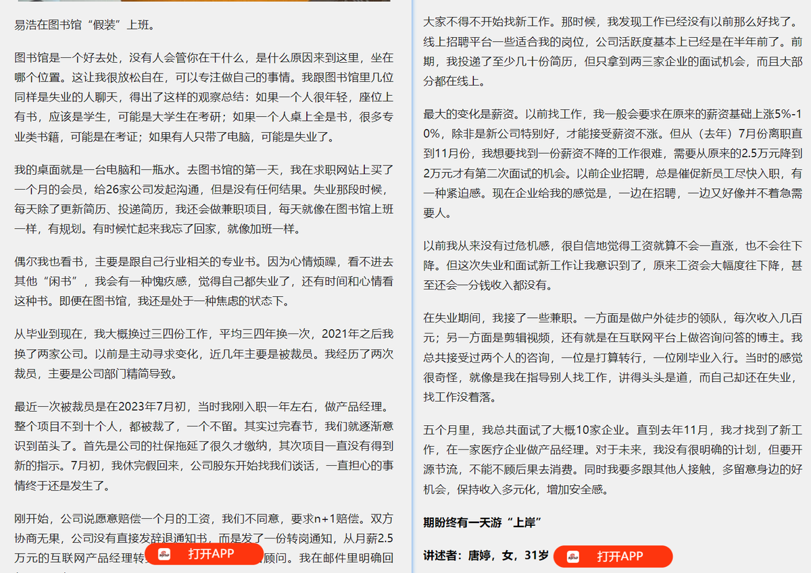
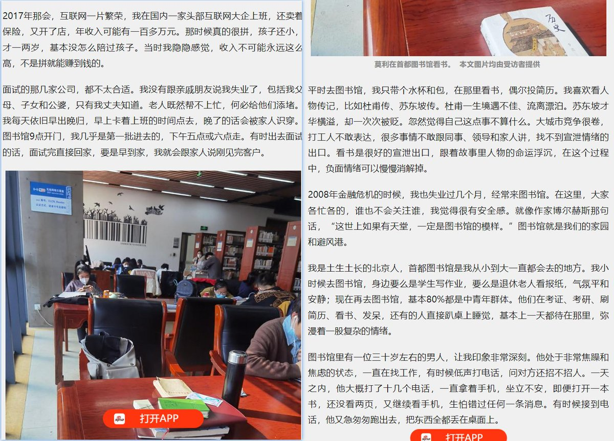
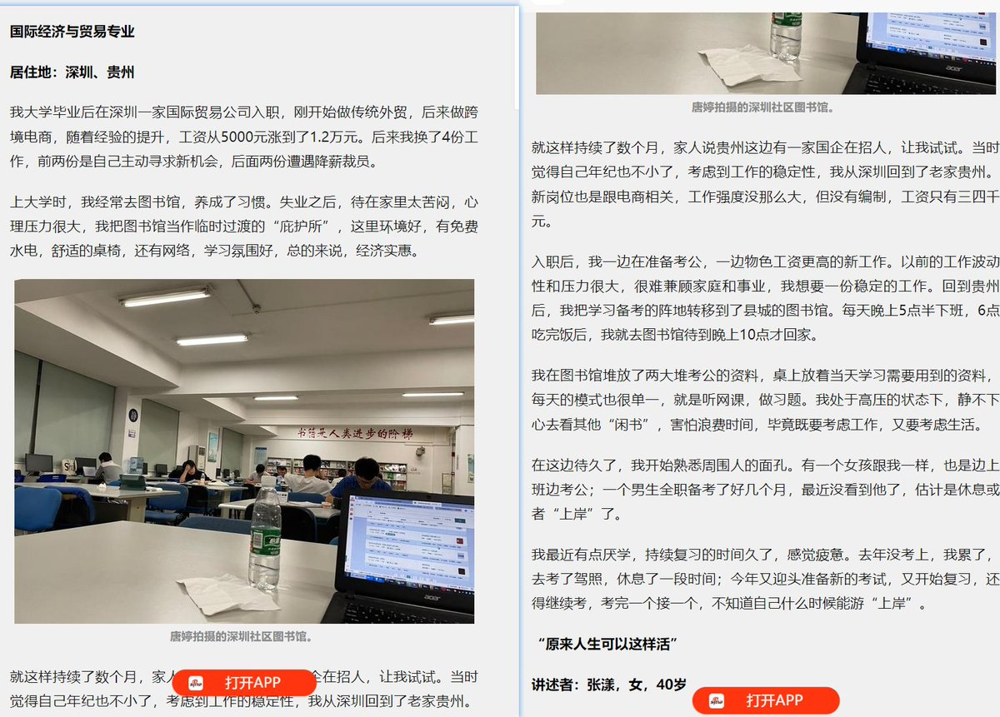
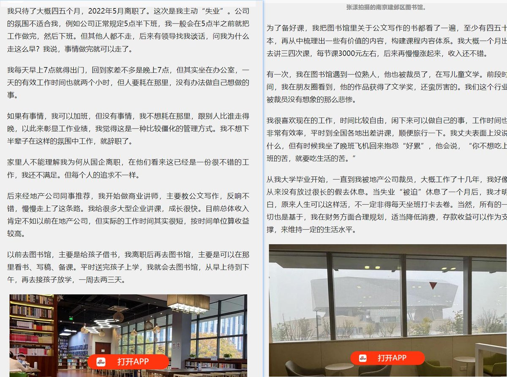
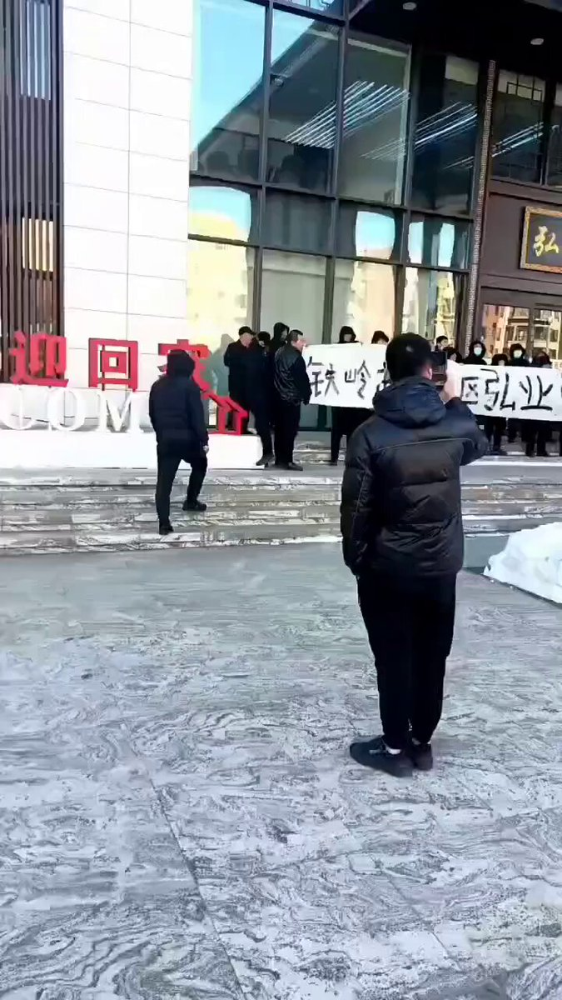
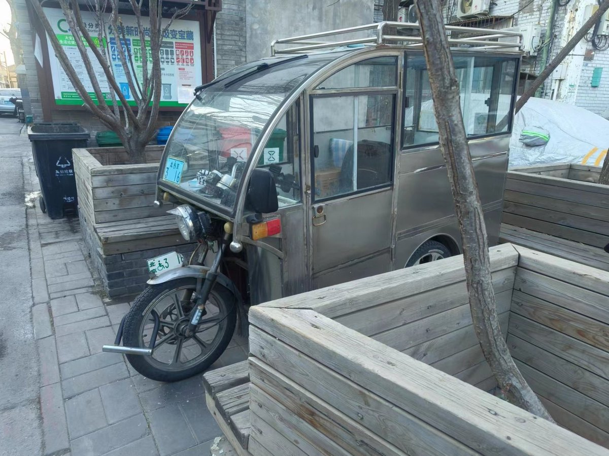
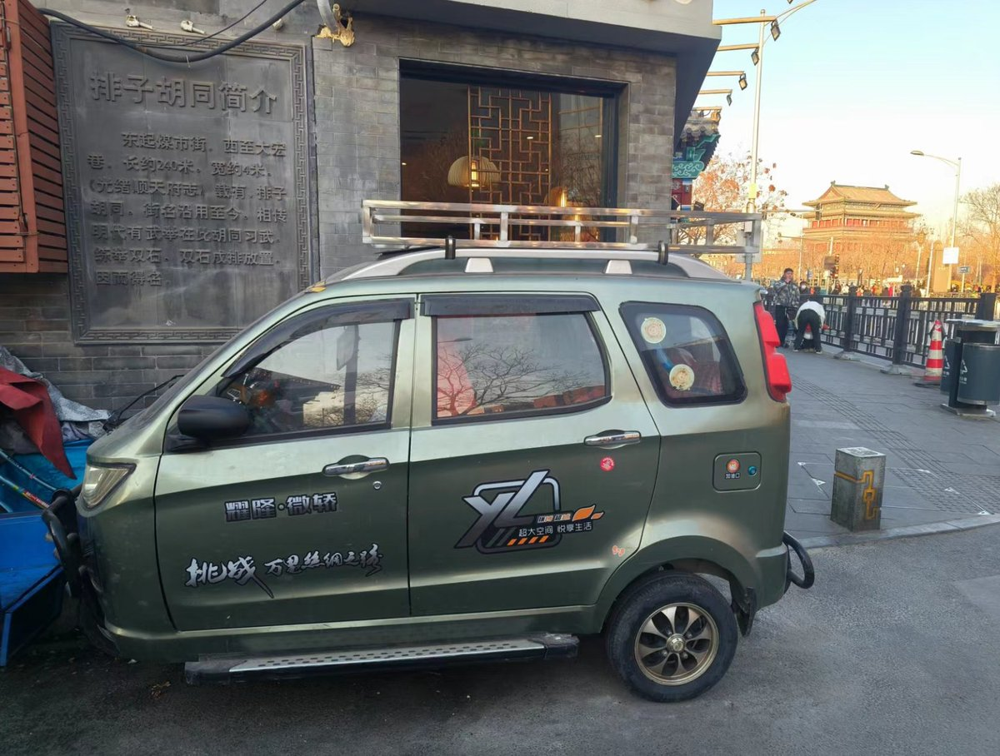

A李老师不是你老师 北京时间 2024-01-15T22:44:27Z 1746906193514422598 1月14日，多家媒体发文《躲进图书馆，他们“伪装”上班》
讲述经济下行的当下，很多遭遇降薪裁员，或主动“裸辞”的人们为了向家人隐瞒自己已经失业的窘境，每天早上卡着上班的时间点出门，背着公文包或者双肩包带着电脑，一如往常开着车或者挤上地铁，只不过目的地并不是上班的公司，而是呆在图书馆。 https://t.co/asvWlcGAsx   A李老师不是你老师 北京时间 2024-01-15T20:42:45Z 1746875566257537390 外卖小哥分享他对于“跑外卖三年赚102万”的看法以及自己的亲身经历：很多人对于城市底层不怎么了解，希望我的经历能让他们了解更多吧。

李老师，您好，看到您最近的陈思辟谣的视频，我给您以及其他朋友们解释下我所知道的外卖吧。

首先是几家配送平台：                                                                   目前主流的外卖配送是美团，饿了么，它们外卖订单也有帮买帮送 。                                                                                   达达，主要是配送京东到家的(或者是超市，)，或者帮送（帮送就是给顾客送东西，比如说送钥匙扣，鲜花这些）。顺丰同城，有外卖订单也有帮送订单，闪送，帮送，查征信。 uu跑腿，帮送。

我觉得陈辟谣说的整体没错，但是，细节与我所知道的有出入。陈的辟谣，他自己的论点有：                                                         1.每天18小时    这个在我看来，他已经不是人了，是超人。什么美利坚农场主雇员中的楷模。我在025跑的众包，断断续续3年左右。我的众包圈子里没有这样的人物。
                                                                                                    2 每天早上5点多就起来  这个没毛病。跑过外卖的都知道，哪个时间段最挣钱，是晚上11点过后，一直到早上8点前，单价高。比如说中午午高峰一单单价也就4.3元，而23-8这个时间段最低单价都是6.1元，他5点起来，可以有一段时间是高价单时间，没毛病。但是，他所表现出来的给我的感觉是皇帝的金锄头，我起的够早了吧。结合下面推断他是美团专送，那么问题不大了。可能上海的专送渠道开得早吧，025专送一般早班是7点左右，你七点前起来渠道没开，专送也跑不到单啊，那么他这段时间在跑饿了么？
       
3 美团每天限制12小时，所以下班后会跑其他平台    据我所知，没有。众包没有，转送也没有。他所说的每天12小时是为了和后面的跑饿了么相呼应。但是，两者这件没有必然的联系。反而让我知道他是跑美团专送的。美团专送的骑手注册不了美团众包，同一个账号。所以美团专送的骑手兼职都是下班后跑饿了么众包。如果他是跑美团众包的，哪怕白天他也可以双开，同时跑饿了么和美团众包。但是陈的视频里并没有提到白天双开。他提到的是跑完12小时的美团，然后跑饿了么。   
                        
 4.李老师引述，但视频内没有提到的奖励补贴    专送，这补贴能高到哪去？ 据我所知，众包一年的节日活动，如端午节，春节这些，包括春季赛，夏季赛，一年加起来有2个w吗？而且，专送有冲单奖吗？如果是冲单奖，可能每天能拿个200左右，但有个条件，渠道商是他爹。这种冲单奖，一般是一个骑手很久没跑，或者过几天有极端天气，系统推测运力可能紧张，而设置的。而且，这种活动是美团的代理商设置的。

其实辟谣很简单，晒出银行卡流水，晒出跑单记录，一切不就水到渠成了吗？反而是发了一个视频，到处充斥着道德绑架。小学文化，冻伤，出交通事故。哪个跑外外卖的不是一身伤？长时间坐在电瓶车上，戴头盔，5个小时左右，脖子就酸了。哪怕是最轻的夏盔

其实不想发帖，玛德，评论区里的某些又说三道四了。

其他骑手怀疑的和站点合作冲单，在我看来是很有可能的。饿了么专送就有这种，而且一单价格是10块，有专门的调度负责他的监控订单情况。好送的具给他，不好送的调度把单子调走。那哥们从10点跑到晚上8点，多的时候能跑100单

评论区说上海疫情，那几个月跑60-80万？那几天单价是高，每单100元，但是，就那一个星期啊。而且，除了美团平台给的高单价，剩下的钱哪来的？是上海市民打赏的啊。还记得那个打赏的少的被逼自杀的吗？

而且，美团的高单价是针对众包的，跟他专送有什么关系？评论区如果质疑他不是专送，是众包，那么往上翻，他整个澄清视频的思维逻辑就是错的。

接下来具体分析下年入34w的可能性：如果是众包，可能。有跑同城的大佬。我先说明下美团众包的工种吧，    普通众包骑手，想跑就跑，不想跑就不跑。工资日结。    
                                                                                                           畅跑，一开始是负责跑拼单的，拼好饭的单子，6.9的餐品比比皆是。后来畅跑演变成接3公里之内的单子。单价不超过5.3元.如果恶劣天气，每单有补贴。从0.5元到2元，视天气恶劣程度而定。这个所有的众包都有。工资中的一部分日结，底价2.8的那部分。一部分3天后到账。活动奖励，单单奖，时段奖。                                            
乐跑：畅跑没出现前的大佬，如果我记得没错，是19年出现的，有出勤任务，工资周结。  

同城核心：专门跑远距离单子，能月入3w的，这个比较有可能，据我所知025顶级大佬能跑到。吃装备，摩托车。周结。

 时段：午高峰，一般是10：30-1：30。 晚高峰，17-20。夜宵：23-06，早高峰：06-08，前面提到过，夜宵早高峰单价高。我认识的众包大佬，从晚高峰跑到早上5-6点，加上冲单奖，能跑600，恶劣天气，单子没人接，下线，等单价自己涨，能涨到15一单，那么一晚上运气好能跑1000。夜班跑完回去睡觉，然后白天跑个午高峰。我尝试过，不是一般人能扛得住的。

专送？美团专送降底价了啊，最低每单3块。你月入3万？

然后说说饿了么众包吧，已经半死不活的了，没单子。饿了么也有类似于美团乐跑畅跑一样的分类，忘了说了，他们是优先派单的，好送的单子会优先派给他们。

疫情那2年单价高？疫情那2年外卖行业涌入了多少新人？2021年开春，大妈大爷们开始出现在早高峰。2022年夏天，年轻小伙子多了。2023年夏天，午高峰出现了年轻的姑娘。

我看到评论区还有说什么底层互害的。你妹的。2021年，美团众包有个周计划，现在也还有。那时候加入进去，优先派单。完成出勤任务，一周奖励200元。很好吧。嘿嘿。想要完成出勤任务？午高峰3小时要跑15单，结果午高峰快要结束了，跑不到啊，那就抢单呗，不管单价高低。单价低距离远也没事，不是有周计划200补贴吗？听起来像不像是朝三暮四？美团众包的冲单奖就是这样的，降单价，然后降的那部分用冲单奖的形式补贴回来，按照概率学的角度，总会有一部分的人拿不到。这是不是底层互害？

美团众包的畅跑，一开始专门跑拼单的。但是，为什么会演变成跑3km甚至超过3km内的近单？白天，美团众包普通的订单底价4.3，3公里内的单子，最高不超过6.5元。但是，这个单子，畅跑的骑手接了，价格是多少？不超过5.3元。拼单，畅跑接是3.8-5.3，到众包那就变成2.9起步。于是就变成，畅跑接众包单，众包接拼单。这算是底层互害吗？

大家倒是知道工资每年要涨啊，为啥外卖单价却在降呢？这两年对外卖骑手的风评相对好多了。无知之幕吗，怕自己将来也会去跑外卖？哈哈哈。外卖行业还是一种供需主导的行业，体现在他的单价。就像我前面提到的，恶劣天气，单子没人接，单价会涨。于是夜班恶劣天气，老手都会默契的下线，等涨价。但是，如果有一个人破坏了行业规则，他没有等单价涨，想着尊重他人，服务他人，解决顾客需求，把单子接了。于是那些老手看到平台单子少了，也会争先恐后，不等涨价，上线抢单。

就先说这么多吧，李老师。这其实可以定性了，就是上海某个代理商和骑手达成合作，冲单，然后给大家一种来跑外卖都有光明的未来的感觉。跑外卖可不仅仅是坐在车上啊，还要跑着去取餐送单啊。一天18小时什么概念？能休息的好吗？3年啊。我曾经有一次，没休息好，直接闯了红灯，还好当时红灯刚起来，车辆没起步。我过了路口才回味过来，下的一身冷汗。

只是为了更好的未来尽一点微薄之力。很多人对于城市底层不怎么了解，希望我的经历能让他们了解更多吧。   A李老师不是你老师 北京时间 2024-01-15T20:50:24Z 1746877495268286577 1月14日，辽宁省铁岭市。弘业悦府项目拖欠工人工资，工人们拉横幅讨薪 https://t.co/vPSlslKG4m   A李老师不是你老师 北京时间 2024-01-15T21:00:15Z 1746879971434397983 网友补充后续：今天去到大爷骑电三轮上天安门广场冲塔的地方附近简单走访调查了一下，咨询了住在附近的老年人，根据当地老年人说，一月初开始警察就开始跟各个主要路口设卡，也有进到胡同里去查抄老年人的无牌老年代步车，都是被强制回收，事后给几百块钱了事，截至目前大街上跑的和胡同里停的基本上都是上了残摩牌照的老年代步车，无牌的老年代步车几乎已经绝迹了。
其实那个冲天安门广场的看视频里貌似是有拍照的，前挡风玻璃一侧放着一个白色的残摩拍照，但是长安街本来就不让三轮车行驶，应该就是误入，而非故意冲塔。
视频里那个老年代步车，是从东长安街开到天安门广场东侧的广场东侧公路在往前门方向开。
很多类似于快递，外卖之类的发现自己走到地方违规了也会通过快速通过规避检查。
目前胡同里除了少数无牌老头乐，剩下的几乎都是上了残摩拍照的老头乐。目前天安门周边地区的警察与城管也并未对已经上牌的老年代步车加强管控，基本上就是这样。   A李老师不是你老师 北京时间 2024-01-15T21:04:42Z 1746881090734678193 1月15日，有网友实地走访之后发现，去年7.31北京 暴雨中被洪水冲垮的北京小清河桥至今仍未修缮。 https://t.co/0lLDUNzphy   A李老师不是你老师 北京时间 2024-01-15T21:51:09Z 1746892780402561101 1月14日，陕西铜川市瑶曲镇杏树坪村上空，出现一个巨大的黑色烟圈悬浮在空中。
铜川市耀州区应急管理局称，目前暂不清楚该烟圈成因，并未接到事故报告，工作人员表示他们将进一步进行核实。 https://t.co/HDEbUezJu5   A李老师不是你老师 北京时间 2024-01-15T18:24:42Z 1746840825026199659 江苏养老金后续 https://t.co/lfumbA8pqv   A李老师不是你老师 北京时间 2024-01-15T18:53:22Z 1746848042156724552 1月14日，四川成都，一网友发视频称，自己是一位研三学生， 找工作时意外发现自己名下有4家公司。他怀疑是2019年的人脸识别视频别人盗用。注册的几家公司开了五百万的发票，导致无法找到工作，对自己造成了较大的影响。
工商局称公司无法撤销 https://t.co/uHRqIfsP0F   A李老师不是你老师 北京时间 2024-01-15T20:08:55Z 1746867055121334659 1月14日，上海象屿交控中环云悦府小区，因豆腐渣工程，偷工减料房屋质量差等问题，业主们聚集在售楼部大喊退房。 https://t.co/qghKbIiTDg   A李老师不是你老师 北京时间 2024-01-15T20:34:47Z 1746873563926176073 在一则东京股市一度突破36000点的新闻下方： https://t.co/buo1WGQOT8   A李老师不是你老师 北京时间 2024-01-15T16:30:50Z 1746812172901011498 1月14日，浙江杭州一动漫展上，有多名女生点燃仙女棒拍照时遭遇一男子持灭火器喷射。随后男子在丢下灭火器扬长而去。
现场民警表示，他们（园区保安）负有安全管理责任的，他们处理方式上我们不管，他们也是为了大家的安全。
15日，主办方表示，园区禁止燃放烟花，暂不清楚男子身份，已报警处理。 https://t.co/2u4VbhZZJ1   A李老师不是你老师 北京时间 2024-01-15T16:32:17Z 1746812537499222517 1月13日，四川西昌。一辆公交车从西昌市城区往安宁镇方向行驶时，车辆突然失控冲向护栏和村民。视频显示，护栏被撞到，有人倒地不起。
事故共造成一死四伤。 https://t.co/nUJVrr2bXN   A李老师不是你老师 北京时间 2024-01-15T16:34:29Z 1746813089498996787 1月14日，汕头两英镇东北村。因政府禁止饲养家禽引发居民不满，村民们来到东北村党群服务中心维权。 https://t.co/kOGzSuID9j   A李老师不是你老师 北京时间 2024-01-15T16:42:52Z 1746815201310015902 1月15日，陈思辟谣称，网传被打照片是他之前上火流鼻血，餐厅老板给了他一碗水在路边洗干净，不是最近的事情，更不是被打。
投稿人表示，他赚100万确有其事，他一天跑18小时，美团为了不让骑手过劳，一天限制最多跑12小时，他就去继续去饿了么跑，现在网上质疑他的收入，是因为按每单5块钱算，怎么算都算不过来，但其实骑手除了每单的配送费，还有冲单奖励、天气补贴，这些加起来，是可以超过配送费本身的。   A李老师不是你老师 北京时间 2024-01-15T16:55:01Z 1746818257166700920 1月15日，山东临沂掌舵龙湖业主维权被抓 https://t.co/9IjpD5Xj9B   A李老师不是你老师 北京时间 2024-01-15T16:59:30Z 1746819387321917700 RT @bbcchinese: 太平洋岛国瑙鲁（诺鲁）政府周一（1月15日）表示，瑙鲁将与台湾断交，转而与中国复交。

这标志着瑙鲁成为台湾刚刚结束的总统大选后，第一个转向与北京建交的台湾外交盟友。

瑙鲁政府表示，为了国家和人民的“最大利益”，该国正在寻求与中国全面恢复外交关…   A李老师不是你老师 北京时间 2024-01-15T17:47:42Z 1746831514128580931 1月15日，一位博主发文：黑社会为什么不能管理高科技？之所以黑社会不能管理高科技，是因为极权政治是一个非常简单的政治组织形式，假设一个黑帮进入机械生产领域，他们只会有两种结果，一是完全玩不转最后破产，二是将权力下放给专业人士，最后实际权力被专业人士把持。
在复杂的产业中，对知识的依赖，会使得黑帮这种简单的权力操作出现困境，太过复杂而无法管理。
该博文发布后，截至目前已得到了一千多次转发，但评论区只有两条留言。   A李老师不是你老师 北京时间 2024-01-15T18:05:09Z 1746835908224000393 网友表示，在押人员死亡并不罕见，这还仅仅是报道出来和能搜索到的。 https://t.co/5w2l0jBGOk   A李老师不是你老师 北京时间 2024-01-15T06:49:40Z 1746665914097979747 RT @YesterdayBigcat: 「上海东洋塑胶工人连日罢工抗议公司搬迁赔偿标准不公（1月10日至1月14日）」上海松江东洋塑胶制品有限公司，近期即将搬迁至越南，但未就赔偿标准与工人达成一致。2024年1月10日至14日，工人集体罢工，要求公司提高赔偿标准。… http…   A李老师不是你老师 北京时间 2024-01-15T01:02:38Z 1746578581361201274 14日当天，陈思送外卖三年赚102万的新闻爆火后，有上海的外卖员发布当月的榜单，上面显示并没有他的名字，怀疑新闻是作假。
随后网传上海的外卖员们开始狙击陈思，并流传出了他被打出鼻血的照片。 https://t.co/Os0Po4lazy   