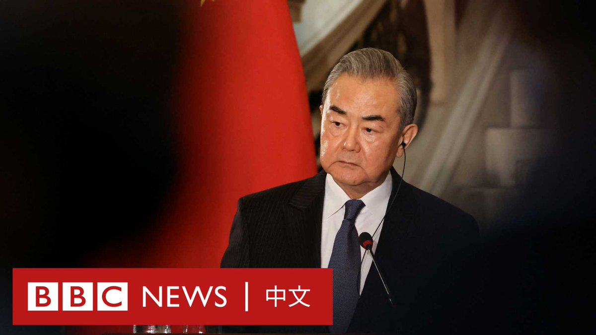
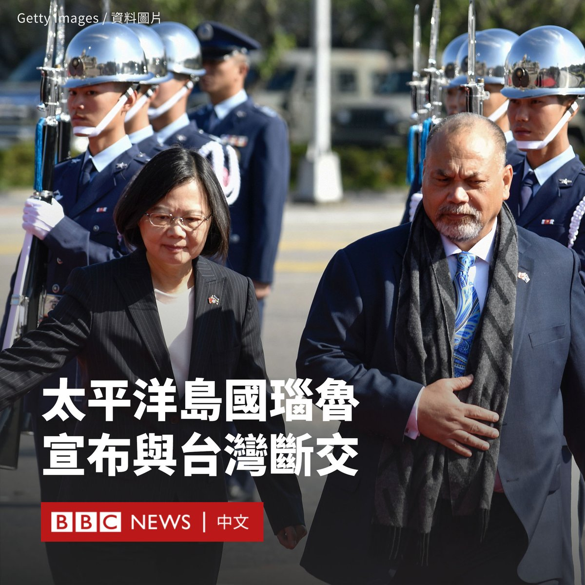
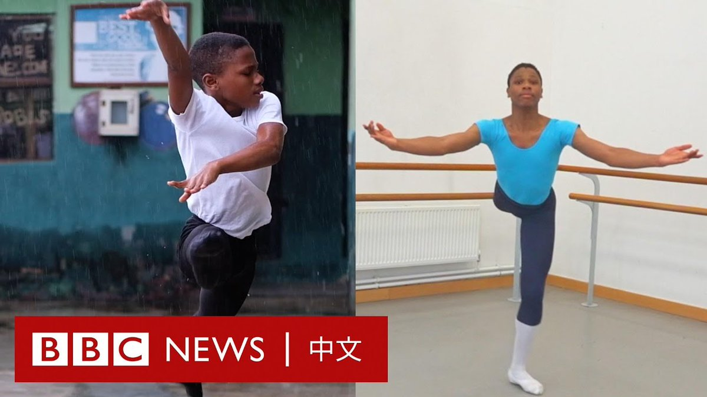
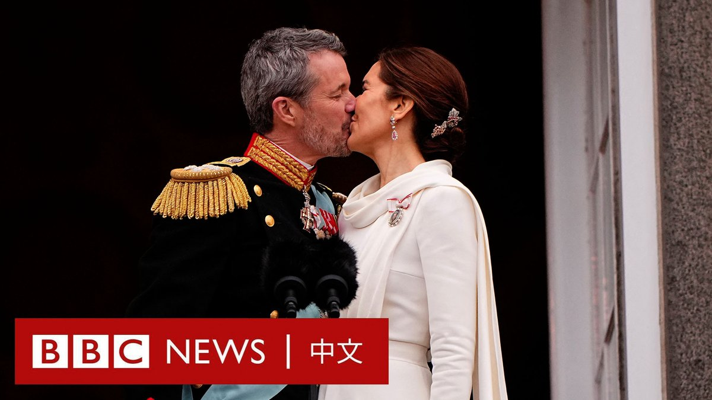

D英国广播公司BBC 北京时间 2024-01-15T22:03:32Z 1746895898528063970 美国前总统特朗普在爱荷华州的一场竞选集会被抗议者打断后，他回应道：“回家找妈妈去，妈妈在等着你”。

共和党爱荷华州初选1月15日登场。据美联社报导，民意显示特朗普仍在共和党总统候选人提名战中拥有绝对优势。 https://t.co/QfEvKIwlw5   D英国广播公司BBC 北京时间 2024-01-15T19:11:52Z 1746852698316849450 在赖清德当选台湾下一任总统后，正在埃及访问的中国外交部长王毅表示，“台湾从来不是一个国家”。中国国台办等部门也接连表态。

1月14日，中国东部战区公布了导弹潜艇实弹演习的画面。台湾国防部回应称，正严密监控台海周边海空域状况，目前暂无异常。 https://t.co/xQZ1SAHslY   D英国广播公司BBC 北京时间 2024-01-15T20:21:03Z 1746870107169828932 2024台湾大选落幕，赖清德带领执政的民进党历史性地实现了三连胜，但民众党作为第三势力异军突起，立法院也呈现“朝小野大”的局面。台湾民众如何看待这样的政治新格局？ https://t.co/J7FcmjTMoN   D英国广播公司BBC 北京时间 2024-01-15T17:57:39Z 1746834019839332495 施明德一生冲撞极权体制，长期入狱，参与及献身台湾民主运动。他曾是民进党主席，但也曾带领“百万倒扁红衫军”与在野党一起要求曾经的盟友、时任总统陈水扁下台。https://t.co/bTXEVQpTM7   D英国广播公司BBC 北京时间 2024-01-15T15:18:08Z 1746793873958121919 太平洋岛国瑙鲁（诺鲁）政府周一（1月15日）表示，瑙鲁将与台湾断交，转而与中国复交。

这标志着瑙鲁成为台湾刚刚结束的总统大选后，第一个转向与北京建交的台湾外交盟友。

瑙鲁政府表示，为了国家和人民的“最大利益”，该国正在寻求与中国全面恢复外交关系。

“这意味着瑙鲁共和国将不再承认中华民国（台湾）为一个独立国家，而是中国领土不可分割的一部分，并将从今天起与台湾断绝‘外交关系’，不再与台湾发展任何官方关系或官方交流。”声明写道。

台湾总统府在一份声明中，对瑙鲁的决定表示“强烈遗憾”，并称“北京当局在全球祝福台湾顺利完成大选的此刻，进行这样的外交打压，是对民主价值的报复，更是对国际稳定秩序的公然挑战”。

中国外交部表示，中方对瑙鲁政府决定表示赞赏和欢迎，并称该决定表明“一个中国”原则是“人心所向，大势所趋”。

瑙鲁曾在1980年与台北建交，在2002年转向北京，但在2005年与台湾复交，与中国断交。

瑙鲁此举意味着台湾只剩下12个邦交国，包括危地马拉（瓜地马拉）、海地、巴拉圭、梵蒂冈、帕劳（帛琉）和马绍尔群岛等。   D英国广播公司BBC 北京时间 2024-01-15T14:14:01Z 1746777738701357409 13岁的尼日利亚男孩安东尼·马杜（Anthony Madu）被视为是该国最火的芭蕾舞者。

从在拉各斯街头跳舞开始，安东尼在社交媒体上走红，甚至被好莱坞女演员维奥拉·戴维斯（Viola Davis）看中，他还获得了美国舞蹈学校的奖学金。

现在，安东尼·马杜离开了拉各斯的家人，来到了英国最知名的芭蕾舞学校。 https://t.co/L2WHVBYffz   D英国广播公司BBC 北京时间 2024-01-15T11:00:02Z 1746728921138135239 在丹麦女王玛格丽特二世正式退位后，她的儿子继承王位成为腓特烈十世（Frederik X）。

成千上万的人聚集在克里斯蒂安堡宫外见证历史时刻。

83岁的玛格丽特是近900年来第一位自愿禅位的丹麦君主，其已统治丹麦超过半个世纪。

这位新君主在向欢呼的人群致意时，强忍泪水，他还亲吻了妻子玛丽王后。 https://t.co/1qUrcP9R6P   D英国广播公司BBC 北京时间 2024-01-15T08:45:56Z 1746695176679043131 台湾此次选举获得国际社会关注，结果牵动“美中台”三角关系。各国在大选结束后有何反应，大选后台湾政治又将如何洗牌？https://t.co/0gwnMXSXoP   