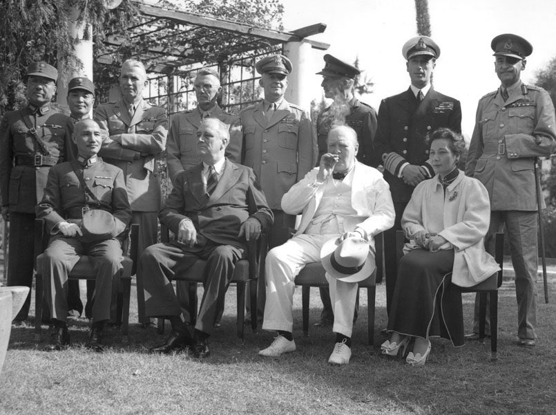
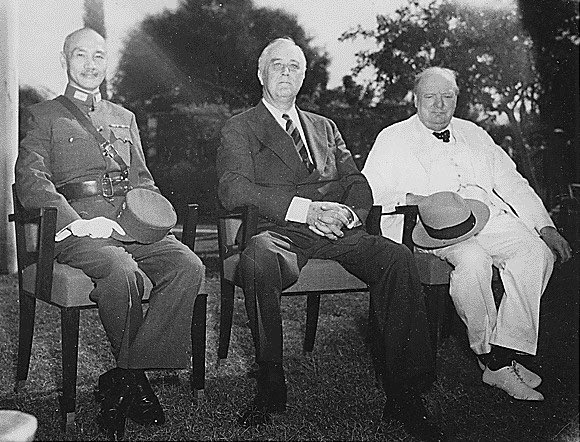
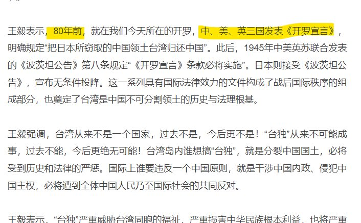

Petrichor 北京时间 2024-01-15T11:58:57Z 1746743751525962157 仇外、防火墙，堵塞言路、战狼外交、到处抓间谍、狂妄的民族自大、闭门锁国，必然落后、贫穷、愚昧。这么做唯一的好处就是独裁者可以搞个人崇拜，容易维护其愚蠢的统治。 https://t.co/jpbDJEOQp1   Petrichor 北京时间 2024-01-15T07:37:47Z 1746678023284265224 她模仿有些领导做重要讲话时的语气和表情，她至少没有把重商宽农读成重商寬衣。这一点就比200斤强。在她这个年纪，200斤在巷子里打群架呢。 https://t.co/REkyL48u4V   Petrichor 北京时间 2024-01-15T03:10:24Z 1746610736736903637 前排依序：中国国民政府军事委员会委员长蒋中正、美国总统罗斯福、英国首相丘吉尔、中国蒋宋美龄。后排依序：中国的商震与林蔚；美国的布里恩·萨默维尔、约瑟夫·史迪威、亨利·阿诺德；与英国的约翰·格瑞尔·迪尔、路易斯·蒙巴顿、阿德里安·卡尔东·德维亚尔，摄于1943年11月25日开罗会议。

开罗宣言上明确规定：台湾属于中华民国。王毅拿开罗宣言说话，说明他的无知。你中共那时候还在延安窑洞里呢。《开罗宣言》、《波茨坦公告》与《日本降书》——构成中华民国光复台湾的法律基础。   Petrichor 北京时间 2024-01-15T01:54:18Z 1746591586287341720 中共的教育是残害祖国花朵的毒药。

 https://t.co/qwscMtJD8E   Petrichor 北京时间 2024-01-15T02:05:56Z 1746594510413410816 习近平在戗害中国教育，重回文革。
政教分离，政治滚出校园，还孩子一个清洁健康的环境。 https://t.co/Ec81hQgluz   Petrichor 北京时间 2024-01-15T00:19:46Z 1746567793682579496 警察国家，无所不用其极。
警察为什么敢如此猖狂？因为有习的尚方宝剑，一切作恶的根源来自习皇。习皇不倒，中国不会好。

听说有一个事业有成的美国华人学者回国参加大学同学聚会，国安光临，强行带走审问8小时，因为他在美国私下批评大外宣“劳民伤财，毫无效果，帮倒忙，猪队友”。结果被同城靠微信公众号做大外宣（骗中共钱）的一个女人向当地中领馆举报，中领馆将之放进需要调查威胁的黑名单中。各地中领馆都在帮助国安干这种缺德的事。他提醒海外同胞防火、防盗、防侨领、防大外宣、防中领馆，不要认识他们，离得远远的。

 https://t.co/gNGKpUdVRr   