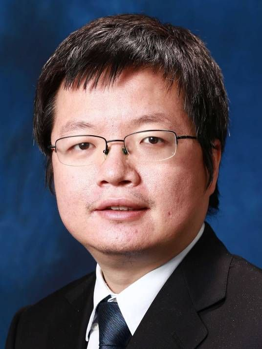
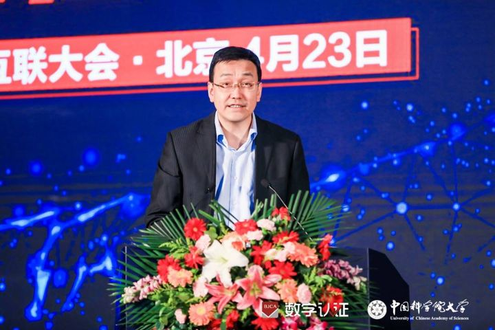

拆墙运动公号 北京时间 2024-01-15T23:45:04Z 1746921449183498720 【 #2259专案组 互联网防火墙第107号嫌犯 #王晓刚】
性别：男
学历：博士
职务：商汤研究院院长、香港中文大学教授

王晓刚博士，2001年获得中国科技大学电子工程与信息工程系学士学位，
2003年获得香港中文大学硕士学位，
2009年获得美国麻省理工学院博士学位。 
王晓刚为商汤科技联合创始人，现任商汤研究院院长、香港中文大学电子工程系教授。
 
官网：https://t.co/LZ1NK8udKm
详细资料见: #BanGFW拆墙运动（建墙罪犯录）:https://t.co/bwBeLpDTTS

主要研究领域包括视频监控、运动分析、目标跟踪及识别、人脸识别及机器学习等。
人物简介
王晓刚博士，2001年于中国科技大学少年班获得电子工程与信息科学学士学位，并获郭沫若奖，2004年获得香港中文大学信息工程硕士学位，2009年于麻省理工学院人工智能实验室获得计算机博士学位。他现任商汤研究院院长，也是香港中文大学电子工程系教授。

战略合作伙伴：1、中共恶人榜：#ccpevils   
2、#zhinawiki

#汤之铭，
性别：男
出生于2003年3月9日，
人工智能科学家、
职务：香港中文大学教授、
商汤科技创始人汤晓鸥的儿子。   拆墙运动公号 北京时间 2024-01-15T04:50:45Z 1746635990842695834 【 #2259专案组 互联网防火墙第105号嫌犯 #高林】    性别：男，汉族，
出生日期：1973年7月出生
学历：工学博士
入党时间：2005年11月
地址: 上海市浦东新区浦东南路1835号
职务：国家互联网信息办公室网络安全协调局副主任委员

官网：https://t.co/LZ1NK8udKm
详细资料见: #BanGFW拆墙运动（建墙罪犯录）:https://t.co/2jgaDGAPJy

高林，男，汉族，1973年7月出生，内蒙古包头人，1999年4月参加工作，2005年11加入中国共产党，工学博士，中华人民共和国工业和信息化部信息化和软件服务业司副司长。 现任鞍山市委常委、副市长，市政府党组成员。

负责专业范围为信息安全信息技术标准化研究, 电子信息、标准化, 网络安全。

1989.08--1993.09东北大学自动控制系工业自动化仪表专业学习
1993.09--1996.03东北大学自动控制系工业自动化仪表专业硕士研究生
1996.03--1999.04东北大学自动控制系系统工程专业博士研究生
1999.04--2001.05清华大学自动化系控制科学与工程学科博士后
2001.05--2002.11友邦软件技术有限公司高级技术顾问
2002.11--2003.05友邦创新资讯科技北京有限公司高级系统分析员
2003.05--2004.04信息产业部电子工业标准化研究所高级工程师
2004.04--2004.08信息产业部电子工业标准化研究所科技发展部副主任(副处级)
2004.08--2006.11信息产业部电子工业标准化研究所科技发展部副主任、标准化发展研究中心主任
2006.11--2007.06信息产业部电子工业标准化研究所标准化发展研究中心主任
2007.06--2012.09信息产业部电子工业标准化研究所信息技术研究中心主任(正处级)
2012.09--2013.08工业和信息化部电子工业标准化研究院(中国电子技术标准化研究院)信息技术研究中心主任、信息安全研究中心主任
2013.08--2016.12工业和信息化部电子工业标准化研究院(中国电子技术标准化研究院)副院长(副局级)
2016.12—2018.04中央网络安全和信息化领导小组办公室(国家互联网信息办公室)网络安全协调局副局长
2018.04—鞍山市委常委、副市长（挂职），市政府党组成员

战略合作伙伴：1、中共恶人榜：#ccpevils  
2、#zhinawiki   拆墙运动公号 北京时间 2024-01-15T23:35:29Z 1746919039673200765 RT @CECCgov: Today #IlhamTohti will spend his tenth year unjustly detained for “separatism”—he was given a life sentence for peacefully adv…   拆墙运动公号 北京时间 2024-01-15T23:37:30Z 1746919545644761110 【 #2259专案组 互联网防火墙第106号嫌犯 #果靖】
职务：宁夏西云数据科技有限公司高级信息安全合规专家

官网：https://t.co/LZ1NK8udKm
详细资料见: #BanGFW拆墙运动（建墙罪犯录）:https://t.co/661OybopPY

擅长网络加密和监控控制
#拆墙运动 #BanGFW #反人类罪 

宁夏西云数据科技有限公司：（NWCD）成立于2015年2月，注册资本 5000万元人民币，是一家致力于成为国内云服务的提供商。拥有完整的IDC，ISP运营资质。志在以先进技术、资源和高品质服务， 向广大开发者，中国本地企业和跨国企业客户提供卓越的云服务。NWCD已与Amazon Web Services, Inc(AWS)展开战略合作，依托其在宁夏中卫的基础设施和AWS云技术，向中国用户提供更优异的AWS云服务。

法定代表人：张联华，任职15家企业
电子邮件：gumeng@nwcdcloud.cn，tyq7771@163.com
网址：https://t.co/MOErykz62D
战略合作伙伴：1、中共恶人榜：#ccpevils  
 2、#zhinawiki   拆墙运动公号 北京时间 2024-01-15T18:46:34Z 1746846330146763213 中国的 #人脸识别 不只识别 #维吾尔人，中国 #人脸识别 在识别每一个抗争者、识别开口说话的每一个抗争的人   拆墙运动公号 北京时间 2024-01-15T18:58:41Z 1746849379288273029 请美国@CECCgov制裁105号 #建墙 恶人 #高林   拆墙运动公号 北京时间 2024-01-15T16:22:03Z 1746809960061714650 违反所有正常持续建立的 #网络防火墙 ，#翻墙 “#违法”就是扣的所谓的 “#帽子”   拆墙运动公号 北京时间 2024-01-15T04:33:17Z 1746631592926204080 【 #2259专案组 互联网防火墙第103号嫌犯 #韩祖利】    性别：男,
 出生日期：1983年
证件:
山东省德州市夏津县
地址: 朝阳区慧忠北里106楼203
手机/微信/支付宝/QQ:
手機/微信/支付宝/QQ: 
邮箱: dzter@huxiu.com
职位：安全产品部总经理
职务：北京百度网讯科技有限公司安全隐私计算副总经理

官网：https://t.co/LZ1NK8udKm详细资料见: #BanGFW拆墙运动（建墙罪犯录）:https://t.co/Xoa5p0OGev

韩祖利，百度安全产品部总经理、前虎嗅联合创始人兼 CTO、TGO 鲲鹏会（北京）董事会成员。
韩祖利
简介： 韩祖利，担任汉森供应链管理集团有限公司、 杭州我们不一样商业管理合伙企业（有限合伙）等公司股东，担任 北京虎嗅科技有。

战略合作伙伴：1、中共恶人榜：#ccpevils
 2、#zhinawiki   拆墙运动公号 北京时间 2024-01-15T04:44:07Z 1746634321585205383 【 #2259专案组 互联网防火墙第104号嫌犯 #葛富斌】    性别：男, 
 出生日期：1978年7月
证件: 
银行卡号: 
籍贯：黑龙江省齐齐哈尔市富拉尔基区 
手机/QQ/微信: 
职务：国家知识产权局公共服务司信息化处处长
地址: 北京市昌平区回龙观龙禧5区9-6-601

官网：https://t.co/LZ1NK8udKm详细资料见: #BanGFW拆墙运动（建墙罪犯录）:https://t.co/XouEV2tR8m

2021年被评为国家市场监督管理总局优秀共产党员

战略合作伙伴：1、中共恶人榜：#ccpevils 
2、#zhinawiki   拆墙运动公号 北京时间 2024-01-15T05:16:58Z 1746642585282560296 RT @V19841989: 无需翻墙且同生态环境替代微信的三种选择，欢迎多选，还可以获得免梯网址收看游兔时政评论。低调做人不耽误安全生产；） https://t.co/ndFvfxN3Na   拆墙运动公号 北京时间 2024-01-15T05:25:17Z 1746644679536373897 #拆墙运动 支持台湾的民主选举，让世界看到台湾的民主。
支持台湾为中华人民树立民主的标杆，感谢台湾坚持民主道路。   拆墙运动公号 北京时间 2024-01-15T05:30:19Z 1746645945406673262 RT @SecBlinken: We congratulate Dr. Lai Ching-te on his victory in Taiwan's presidential election. We also congratulate the Taiwan people f…   拆墙运动公号 北京时间 2024-01-15T05:31:03Z 1746646131533087181 台湾加油   拆墙运动公号 北京时间 2024-01-15T05:44:19Z 1746649469142102158 RT @blumengirl1: 周世锋律师北京的家门口：楼梯三个保安，；楼下还有两个保安、一个国保、一个警察。这些人不过是肉身傀儡，背后却是公权力的滥用。孟建柱、孙立军流毒不彻底清除，司法法律永远是被挟持的私器。 https://t.co/qzzEwxAuhA   