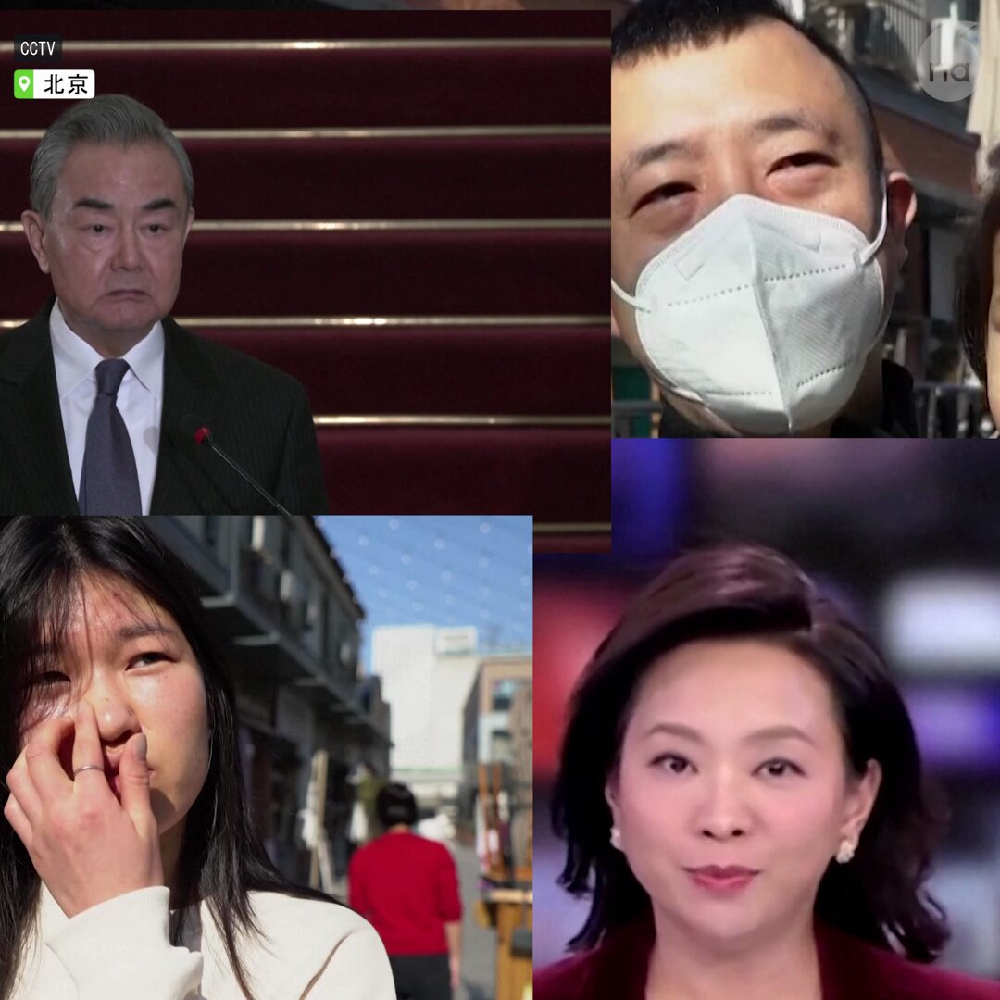

自由亚洲电台 北京时间 2024-01-15T12:21:46Z 1746749489916862833 RT @RFA_Chinese: 网传95歲中国知名自由派学者和经济学家茅于轼，成功离开中国国境，到达“自由之地”。#茅于轼 著作包括《择优分配原理》、《中国人的道德前景》，长期因言论和思想观点遭受当局打压。
详阅：
https://t.co/uLIoF1FfuP   自由亚洲电台 北京时间 2024-01-15T09:42:04Z 1746709301899542671 #国家流感中心 监测数据显示，中国北方近5周乙型流感病毒占比持续上升至57.7%，南方近3周乙型流感病毒占比持续上升至36.8%，一些省份乙型流感病毒占比已超过甲型 #流感病毒。
详阅：
https://t.co/G4FE4htN9T   自由亚洲电台 北京时间 2024-01-15T10:34:44Z 1746722557108027491 韩国外交部官员针对台湾选举结果表示，韩方对台基本立场不变，愿同台方继续加强各领域实质性合作。又强调，#台湾海峡 的和平稳定对朝鲜半岛的和平稳定至关重要。
详阅：
https://t.co/PC1zNFPBbG   自由亚洲电台 北京时间 2024-01-15T06:24:19Z 1746659535194849383 李强1月14日抵达瑞士，预计将于周一出席世界经济论坛2024年年会（#达沃斯论坛），并对 #瑞士 和爱尔兰进行正式访问。
详阅：
https://t.co/XDCa351CPV   自由亚洲电台 北京时间 2024-01-15T07:22:19Z 1746674134107447691 网传95歲中国知名自由派学者和经济学家茅于轼，成功离开中国国境，到达“自由之地”。#茅于轼 著作包括《择优分配原理》、《中国人的道德前景》，长期因言论和思想观点遭受当局打压。
详阅：
https://t.co/uLIoF1FfuP   自由亚洲电台 北京时间 2024-01-15T07:38:57Z 1746678319024587232 RT @RFA_Chinese: 【赖清德：依照中华民国的宪政体制】
【不卑不亢维持现状】… https://t.co/iP4SZ8VNhB   自由亚洲电台 北京时间 2024-01-15T07:47:35Z 1746680490143199617 【中国官媒狂轰台湾大选，但普通民众怎么看?】
中国外交部长 #王毅 就台湾大选回应记者，称选举结果改变不了国际社会坚持一个中国原则的“普遍共识”，国台办更在“#赖清德 未获半数票”这点上大作文章，指 #民进党 不能代表台湾主流民意。但是大陆和香港的普罗大众是否与官方的口径一致呢？ https://t.co/EetDVEfY9n   自由亚洲电台 北京时间 2024-01-15T06:10:56Z 1746656170373173560 【朝鲜不顾中国呼吁，疑似再射导弹】
中国1月5日：密切关注朝鲜半岛形势发展，呼吁各方保持冷静克制，不采取加剧紧张的行动。
朝鲜1月14日：在平壤一带向 #朝鲜半岛 东部海域发射一枚中远程级别弹道导弹。
详阅：
https://t.co/fr1g6DPctf   自由亚洲电台 北京时间 2024-01-15T02:28:28Z 1746600183440314549 “我不认为台湾有义务支持中国的民主化，我们也没有权利要求台湾为中国的未来做什么事情，这是必须由 #台湾 人民自己做出的选择；但中国的民主化，无论如何，都比今天的专制政权对台湾的利益更为有利”。—王丹
详阅：
https://t.co/SjwXdhOZIP   自由亚洲电台 北京时间 2024-01-15T04:05:01Z 1746624480426815900 正在 #埃及 访问的中国外长 #王毅 表示，“不管选举结果如何，都改变不了世界上只有一个中国 ...... #台湾 必将回归祖国怀抱”。
详阅：
https://t.co/BomWWXSWwY   自由亚洲电台 北京时间 2024-01-15T00:49:18Z 1746575224731029634 西藏流亡政府就台湾完成大选向台北政府表示祝贺。海外民运人士在 #西藏 国际问题研讨会上表示，台湾人民以选票对中国领导人 #习近平 投下不信任票，期盼有一天14亿 #中国人 也能以选票决定自己的领导人。
详阅：
https://t.co/iuQgvEFRBa   自由亚洲电台 北京时间 2024-01-15T01:11:04Z 1746580706170487090 新发布的《2023年大陆法轮功学员遭中共当局迫害情况的统计报告》显示，过去一年，209名 #法轮功 学员被迫害致死、1188人被判刑、6514人遭绑架骚扰。
详阅：
https://t.co/SUaKlgTgY8   自由亚洲电台 北京时间 2024-01-15T00:22:18Z 1746568432001089661 民进党赖清德赢得 #台湾 总统选举后，#美国 在台协会(＃AIT)表示，美国政府将遵循先例，在台湾大选后邀请前资深官员以私人身份造访台湾。
详阅：
https://t.co/478qFr07Ay   