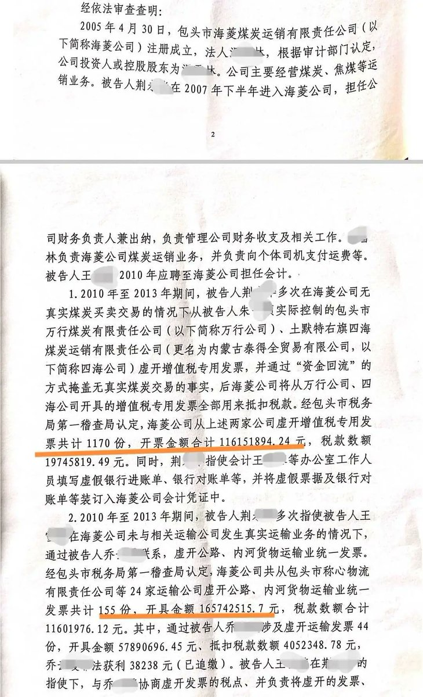
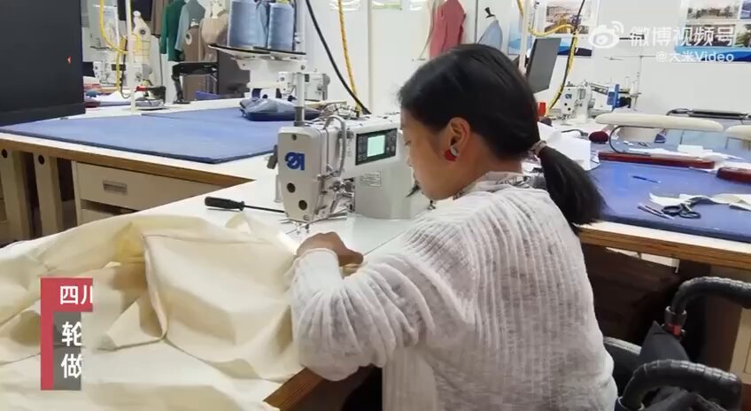

谁将十万横扫三江 北京时间 2024-01-15T19:27:32Z 1746856638622126313 公职人员如何吃垮一家国家的财政？从一家伪私营企业的情况看全体国有企业

“我也不想把事情闹到这一步。”1月15日，包头煤炭公司老板文森（化名）说，他对前财务总监荆某华的举报持续了6年。在此之前，荆某华曾于2007年至2013年在他的公司担任财务总监。

2015年，荆某华离任两年后，文森聘请审计公司对账务审计后，陆续向公安机关报案，称荆某华职务侵占3000万元、虚开发票3亿多元（注：检察院认定为2.82亿元）。2021年，荆某华因虚开发票罪，与另外两名涉案人员先后被逮捕。2023年2月，荆某华被移送法院起诉。

“这可能是包头市历史上最大的虚开发票案，其中还涉及多个乡镇政府。”文森告诉封面新闻记者，当时当地政府有税收任务压力，一些乡政府成立公司对外虚开运输发票，仅荆某华案中就开出了数千万元虚假发票。

文森介绍，他在2005年与妹妹合资开办了“海菱”煤炭运销公司，总计投资约400万元。2007年，当时的大姨子荆某华受邀成为公司财务总监。

“她原本在我大舅哥的两家公司负责财务，想着请别人也是请，不如请自家人放心。”文森说，公司总共有三大块业务，买煤、卖煤和财务，荆某华独立负责财务部分，他带着另外两位骨干负责煤炭的买进和卖出，但这两块业务他只负责大方向，不管细则问题，“我每天都是吃喝玩乐。”

2013年，文森在春节聚餐时提出要把这些年的账目算一算，“我估摸着应该是赚了一个亿，但荆某华说只赚了3000多万元，并且还全部是煤炭库存。结果交账的时候，这3000多万的煤炭也没了，说是损耗了。”

同时，文森与妻子因感情破裂，通过诉讼离婚。2015年，文森聘请审计公司对账务审计后，向公安机关报案，举报荆某华职务侵占3000万元。随后，荆某华被刑事拘留。

2020年，检察机关审查认为，荆某华职务侵占案事实不清、证据不足，作出不予逮捕决定。之后，荆某华被取保候审、监视居住、取消取保候审。

此前的2019年，文森曾再次报案举报荆某华虚开发票3亿多元。2021年12月，当地警方对该案正式立案调查，随后荆某华与另外多名人员被逮捕。

封面新闻记者注意到，被立案调查前一个月，荆某华曾以包头市女企业家商会副会长的身份出席活动并讲话。

荆某华的哥哥荆强（化名）称，文森在合作期间曾多次从公司拿钱，他所做的审计报告未体现这些财务数据，还隐藏了文森的多处财产，导致审计结论不实。

对此，文森称除了自己的审计报告，公安机关也另行做了审计，2023年2月荆某华被移交法院起诉，因案件复杂，至今还没有进一步进展。“因为虚开的发票，荆某华离开公司后，公司还被税务部门罚款4000多万。现在我们是各说各话，一切都可以交给司法机关来调查。”

多个乡镇政府人员在“创税”压力下涉案

公诉机关指控，荆某华在2010年至2013年期间虚开增值税发票约1.16亿元，从多家运输公司虚开公路、内河货物运输业发票约1.66亿元。累计虚开发票额达2.82亿元。

一位曾配合调查的财务人员陈玉（化名）介绍，煤炭运销公司采购、销售煤炭时，进、出两端都需要对应的发票，中间的运输环节也需要对应发票，最后根据发票缴纳税款。“十多年前煤炭行业经营混乱，公司采购的煤炭可能来自私矿，或者大型矿超额开采的煤炭，这些采购无法获得进货发票；销售的时候，一些货销给了小厂或者个人，对方不需要你开发票，公司手里的销售发票就会剩余。”

陈玉介绍，煤炭运销公司缴税的时候，如果提供不了进货发票，核算利润时无法刨除成本，造成利润虚高，缴税额度会很大；如果销售端的发票剩余了，依旧要按比例缴税，企业会想办法把剩余的发票卖出去。“煤炭企业会通过买卖发票来保持进项票、出项票平衡。”

“运输环节的发票，主要是因为很多运输者是个人，没办法开票。而地方政府当时出台的税票政策出现偏差，也促使了煤炭企业虚开运输发票。”陈玉介绍，2010年前后，土默特右旗政府为了增加税收收入，对区域内煤炭公司进行限制，同时给各个乡镇政府下达“创税”任务，很多乡镇政府开办了下属运输公司，挂靠几辆货车，就可以虚构不存在的业务对外开发票。乡镇政府从中获得税点收入，完成任务还有返税奖励。

文森证实，2010年之后几年，当地乡镇的税收任务压力确实很大，为了完成任务，乡镇下属的运输公司开票税率会比税务局还低一些，以此吸引企业来开票。“企业开票交过来一部分税款，镇政府先交给税务局完成税收任务，之后由旗政府给镇政府返款奖励。荆某华案中就涉及两个乡镇政府多名人员。”

煤老板称对虚开发票不知情

官方称“已处罚涉案公职人员”

“文森向我们索要3000万元，称给钱就不举报虚开发票的事。他是实际控制人，虚开发票的事他知道并且经手了，不能只追究财务不追究他。”荆强称，荆某华对虚开发票的罪行认罪认罚，同时也举报了文森虚开发票情况。

对此，文森予以否认称，出于亲戚之间的信任，公司财务大权一直是由荆某华把控，自己对虚开发票事宜完全不知情。“这个案子可能是目前为止包头最大的虚开发票案。还有多少公司、多少乡政府人员涉案？这起案件中，我知道涉及的就有乡镇的副乡长、司法所所长。可以摊开了查，如果查到最后我自己确实要承担责任，我也不逃避。”

封面新闻记者联系土默特右旗委宣传部了解情况时，工作人员表示，当地经济条件落后，在历史背景下确实有多位乡镇公职人员涉案，“是政策导致的一些历史问题，这些人员当时都被处罚过。现在还有人在岗，他们也是执行当时的政策，不能一棒子打死。”   谁将十万横扫三江 北京时间 2024-01-15T19:35:24Z 1746858617033351285 RT @Anthony20211117: 监狱里的警察，如果没有过硬的背景的话，要想升职，就得靠折磨犯人，底线是不要整死。有一个警察，之前是教师，后来考进了监狱系统，举止温文尔雅，不会打骂犯人。找我聊天的时候，还会说些大概是网络上学来的公知话语，“一个国家不能只有一种声音”之类…   谁将十万横扫三江 北京时间 2024-01-15T13:35:43Z 1746768102648602694 RT @whyyoutouzhele: 被全网删除的财新王和岩：《嫌疑人孙任泽之死》全文。庭审中，任亭亭数度伏案⻓泣；休庭前，任亭亭突然从公诉席上站起来，冲台下⼋嫌疑⼈⼤叫：“杀⼈犯，我不会原谅你们。”被告席上⼀阵骚动，审判⻓忙出声制⽌年逾五旬的任亭亭，家住新疆⾃治区伊犁哈萨克…   谁将十万横扫三江 北京时间 2024-01-15T13:38:49Z 1746768882919223476 四川成都，90后女孩张晓丽因下肢瘫痪，从小没有穿过合适的裙子。两年前，她自学考入服装学院，课余和同学专门做无障碍服装设计，帮残障同学穿上了漂亮裙子。张晓丽说，自己26岁才第一次穿裙子，就想让更多残障人士穿上喜欢的衣服。 https://t.co/uW5cNzKjWl   