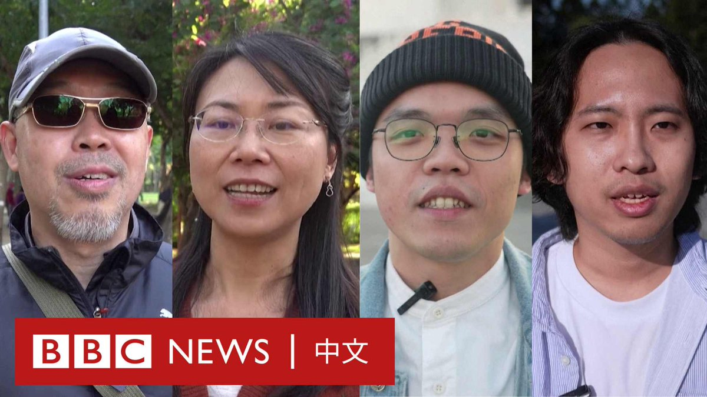
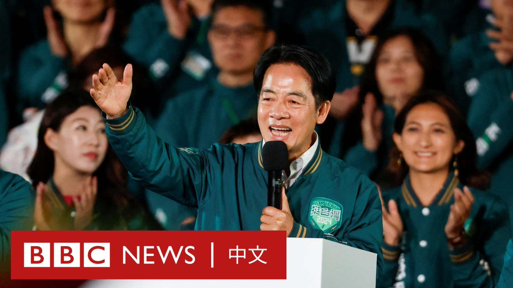

D英国广播公司BBC 北京时间 2024-01-14T15:23:51Z 1746432928345931895 赖清德在周六（1月13日）的一场决定性的总统选举中获胜，延续了民进党继续在台湾的执政地位。

对于前一晚的选举结果以及台湾的未来，台北街头的民众是如何看的呢？ https://t.co/TKtez6h2jX   D英国广播公司BBC 北京时间 2024-01-14T01:49:59Z 1746228110859583643 1月13日，台湾举行2024年总统选举与立法委员选举。执政党民进党候选人赖清德以超过558万票胜选，打破台湾八年政党轮替“魔咒”。

但在立委选举中，没有任何政党获得席位超过半数，民进党总数比国民党少1席，柯文哲领导的民众党获得8席，可能成为未来台湾政坛的关键少数。 https://t.co/N1EYTbpqob   