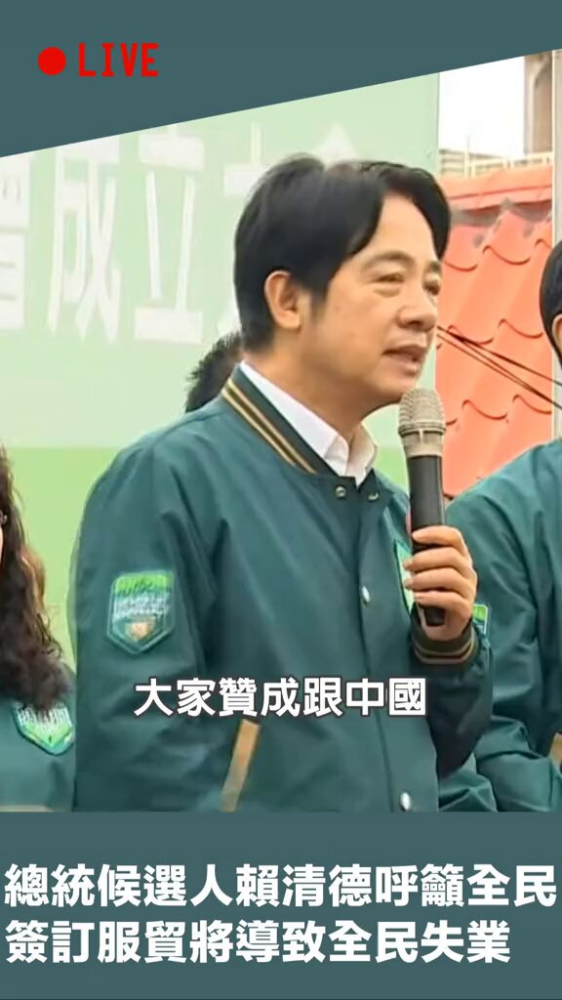
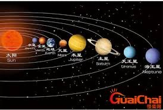
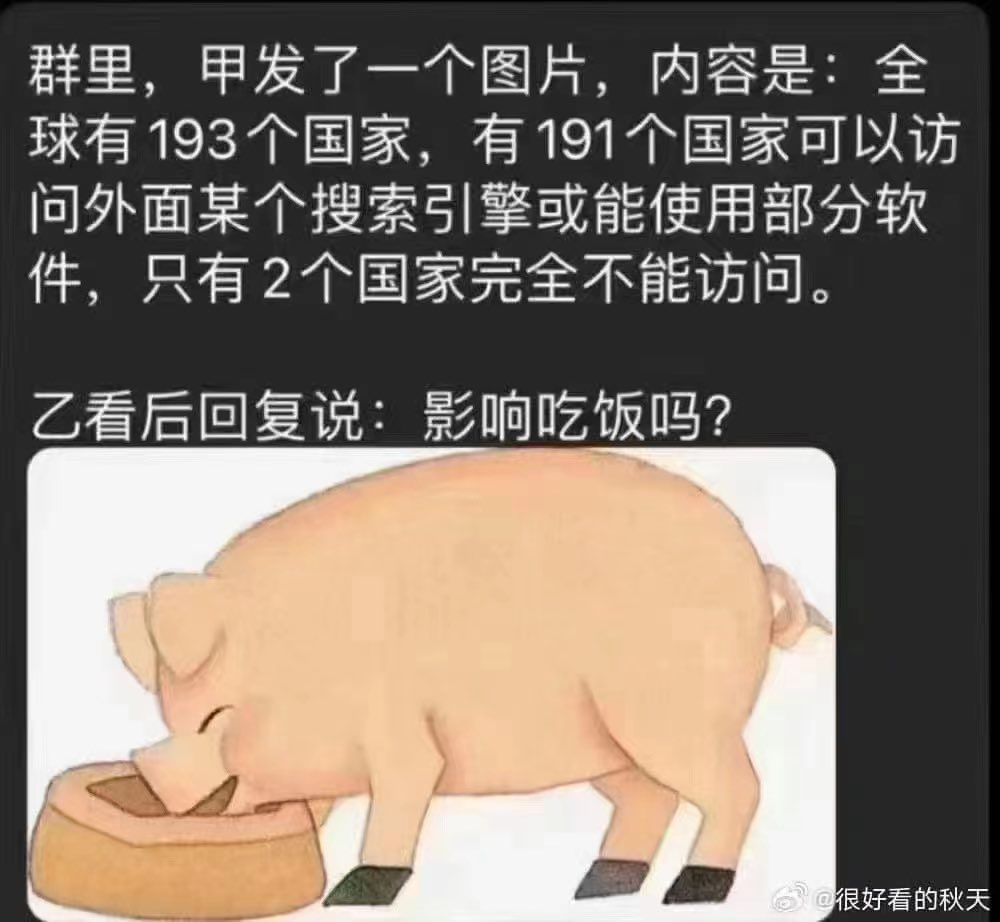
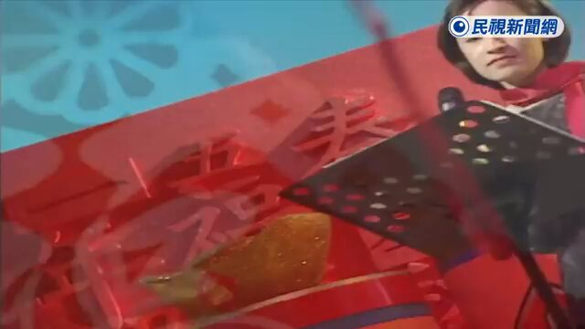

Petrichor 北京时间 2024-01-14T21:47:09Z 1746529389104275965 转发：对比台湾这次选举过程所展现的严谨认真，公民素养，个个参选人的格局包括这个蔡英文的讲话真的让有二百多年选举历史的美国有几分汗颜，特别是老川，不知他能否有自知之明看看台湾大选对照一下自己的所作所为。把前N多任总统骂了个遍，现在骂到林肯了，加上拥众的抬举，他真以为自己是来拯救美国和世界的神了，其他人都在祸害美国！完全偏离尊重包容理解团结的民主精神！一个小小台湾选举为全世界民主树立了标竿！

你们认为这位网友说的有道理吗？   Petrichor 北京时间 2024-01-14T20:28:59Z 1746509717701067041 就这么简单几个亲民的动作，对岸那位做不出来，你们相信不相信？ https://t.co/hDcTqpVsWV   Petrichor 北京时间 2024-01-14T13:54:45Z 1746410501993574872 水星(死亡)，
火星(半死)，
地球(壮年)，
金星(青年)。
再有十亿年地球会达到火星状态，再过四十亿年左右达到水星状态。 https://t.co/EByqOakCaR   Petrichor 北京时间 2024-01-14T14:09:10Z 1746414133803643283 哪天中国人敢对习近平女儿这么讲话，那么就是全方位民主了。

还有多远？ https://t.co/jXQ72g8W3R   Petrichor 北京时间 2024-01-14T06:30:17Z 1746298651549352282 赖清德一路走来的历程与对岸习近平的非常不一样。

习近平的父亲副总理习仲勋，从小家里就有保姆和警卫数人，衣来伸手，饭来张口，公子哥，胡吹瞎侃能喝，就不干实事。走后门上了清华大学，工农兵学员，没有十足学到东西。成绩平平地大学毕业后通过后门给军委耿飚做秘书。然后走后门去河北正定任县委副书记，然后通过项南的关系去了福建为官。步步靠他爸关系，个人没有记录到的政绩。

然而，赖清德出生在一个矿工家庭，父亲在他两岁时死于一场矿难。他在贫民区长大，完全靠自己努力，先后在台湾大学和哈佛大学获得医学学位。他最初加入民进党只是为了提供自己的医学专业知识，如今他是台湾总统。一步一个脚印，实打实，靠实力。   Petrichor 北京时间 2024-01-14T07:43:41Z 1746317123608011009 鬼子进村，最喜欢抓鸡，改善生活。
经济下行，却不许百姓买卖，是何道理？
宁要社会主义的草，不要资本主义的苗。
习近平重走毛泽东的路，割资本主义尾巴？
如此这般，国家经济如何发展？共产党，瞎折腾！ https://t.co/cxq29c4v6y   Petrichor 北京时间 2024-01-14T07:53:07Z 1746319495860240752 假民主、真独裁，增加社会成本。
这种虚头巴脑的选举，完全可以不要，浪费金钱、浪费大家时间。
做婊子，就做真婊子，就不要再花钱建贞节牌坊，让人恶心，贻笑大方。
中共国的四套班子，就是伪民主的银样蜡枪头，骗人的。本来一套班子，偏加另外三套班子做样子，以显中共也有民主。浪费纳税人的钱。 https://t.co/H197O54Ybn   Petrichor 北京时间 2024-01-14T07:59:09Z 1746321014978384059 2024年世界上最强大的护照，免签国家数。

1. 法国、德国、意大利、日本、新加坡、西班牙（194 个目的地）
2.芬兰、韩国、瑞典（193 个目的地）
3.奥地利、丹麦、爱尔兰、荷兰（192 个目的地）
4.比利时、卢森堡、挪威、葡萄牙、英国（191 个目的地）
5.希腊、马耳他、瑞士（190 个目的地）
6.捷克共和国、新西兰、波兰（189 个目的地）
7.加拿大、匈牙利、美国（188 个目的地）
8.爱沙尼亚、立陶宛（187 个目的地）
9.拉脱维亚、斯洛伐克、斯洛文尼亚（186 个目的地）
10.冰岛（185 个目的地）   Petrichor 北京时间 2024-01-14T08:02:05Z 1746321750533587385 把吃食当成生命第一要务的只能是畜牲，而不是人类。 https://t.co/1EGD8Gz6of   Petrichor 北京时间 2024-01-14T00:01:55Z 1746200913683890588 热烈祝贺民进党候选人赖清德、萧美琴当选台湾国正副总统。台湾国立法机构113个席次中，国民党获得52席，民进党51席，民众党8席，无党籍及未经政党推荐者2席。

民进党今后推行立法会很困难，现在需要联合民众党和无党派代表，勉强过半。答应这些人一些政府位置。   Petrichor 北京时间 2024-01-14T03:36:17Z 1746254861056798947 只有民主选举才能让一介平民直接成为国家领导人，这中间没组织部的层层考察，半级半级的升。

当年在美国纽约追求萧美琴的那个刘亚东，能力固然不错、思想也是开明，但在中共体制中，只能做到一个大学的院长，却不能做上副总统。

制度太重要了，独裁统治堵死几乎所有人的路。 https://t.co/W5z3yAb5NJ   Petrichor 北京时间 2024-01-14T01:31:36Z 1746223483393036293 南开大学新闻和传媒学院院长刘亚东实在不走运，这位清华人在纽约死皮赖脸没有追到美国哥大美女学生萧美琴。他沒有展现共产党党员的先锋队的魅力，他本来会是台湾的第二先生，成为共党打入台湾的第五纵队。

有人跟着中国官媒起哄，说赖清德的40%不能代表民意，这种事情在美国经常发生。在1992年美国大选中，克林顿就是以40%多的选票当选的，Ross Perot的参选使克林顿击败了他的耶鲁校友老布什总统。   