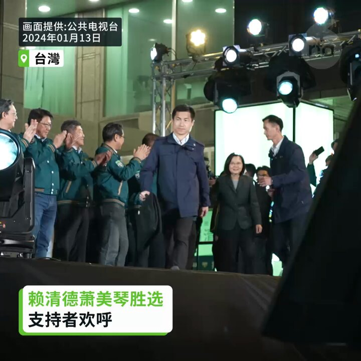

自由亚洲电台 北京时间 2024-01-14T03:01:41Z 1746246153560027314 【天安煤业十二矿发生煤与瓦斯事故】据 ＃平顶山 应急管理局，当班入井425人。事故已造成10人遇难、6人失联。
详阅：
https://t.co/HoSDJga1v5   自由亚洲电台 北京时间 2024-01-14T03:22:20Z 1746251349312860412 台湾 #立法院 选举，三党无一获多数席位，国民党获52席，成为立院第一大党，而民进党失去多年保持的多数党地位，只获得51个席位，民众党则仅获得8席。有分析指，大选以后，比起蔡英文，北京实际更不信任 #赖清德。
详阅：
https://t.co/1N779ck52u   自由亚洲电台 北京时间 2024-01-14T03:54:45Z 1746259507922022683 【美国禁止腐败官员和亲属入境】
“表忠心是存活的重要条件，这就决定了两面吃的特点：老婆、孩子和钱送到美国是安全的，给中共做渗透也是必须的，否则那边日子也不好过”。—魏京生
详阅：
https://t.co/bgpvNONoSr   自由亚洲电台 北京时间 2024-01-14T03:55:41Z 1746259743847456981 RT @RFA_Chinese: 【赖清德萧美琴胜选 支持者欢呼】
【民进党进入第3任连续执政】
赖清德和萧美琴当选总统副总统，赖清德说已接到对手恭贺的电话，也恭喜他们斩获国会席次，未来盼能一起团结合作。民进党支持者在会场兴奋欢呼。#台湾总统大选 #赖清德 #萧美琴 https…   自由亚洲电台 北京时间 2024-01-14T03:56:00Z 1746259821475627153 RT @RFA_Chinese: 【赖清德：依照中华民国的宪政体制】
【不卑不亢维持现状】… https://t.co/iP4SZ8VNhB   自由亚洲电台 北京时间 2024-01-14T04:06:38Z 1746262498083246170 【大陆九零后：你的⾃由，就是我的⾃由】
“回顾在台湾的旅途，最令⼈动容的不仅是善良的⼈与美⻝，更多的是背后沉淀并融合⼀体的多元⽂化，以及经历数⼗载政治动荡，最终⻓成的现代⺠主政治制度，⽽这个进程，时⾄今⽇，还在⾛向完善”。—　笔者
详阅：
https://t.co/4Cw96VSXqy   自由亚洲电台 北京时间 2024-01-14T00:47:40Z 1746212427744591934 【中植集团申请破产】北京法院民事裁定书称，＃中植　的流动资金严重不足，剩余货币基金仅181万元。据早前报道，暴雷涉及的债券权益投资人数15万，企业客户近5000家。
详阅：https://t.co/lsnzKVAEry   自由亚洲电台 北京时间 2024-01-14T01:00:01Z 1746215536831115399 【中俄贸易额去年创下历史新高】2023年两国的商品和服务贸易价值约2401亿美元，一年内增长了26.3%，远高于北京和莫斯科设定的年度目标。
详情：
https://t.co/jm18mHHSdR   自由亚洲电台 北京时间 2024-01-14T01:41:51Z 1746226061795328077 尽管民进党拿下558万票，超过第二高票的国民党91万多票，赖清德和四年前蔡英文的817万票相比，则差距259多万票。有党内幕僚不讳言，惊讶未达内部预测的600万大关。
详阅：https://t.co/F0gubO3UzI   自由亚洲电台 北京时间 2024-01-14T02:17:07Z 1746234939056550092 【李翘楚狱中度过生日，抑郁症病严重】
涉嫌煽动颠覆国家政权罪案被捕近三年的李翘楚，去年12月在临沂法院审而未判。尽管代理律师丁锡奎入场辩护，李国蓓律师被拒绝进入法庭。李翘楚家属多次要求保外就医屡屡遭拒。
详阅：
https://t.co/1XEgwSsK3S   自由亚洲电台 北京时间 2024-01-14T00:09:22Z 1746202788613464148 【赖清德萧美琴胜选 支持者欢呼】
【民进党进入第3任连续执政】
赖清德和萧美琴当选总统副总统，赖清德说已接到对手恭贺的电话，也恭喜他们斩获国会席次，未来盼能一起团结合作。民进党支持者在会场兴奋欢呼。#台湾总统大选 #赖清德 #萧美琴 https://t.co/kyr5PDMTSJ   