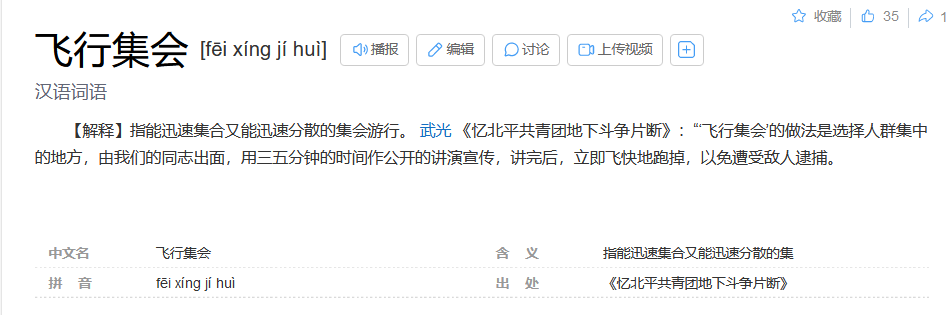
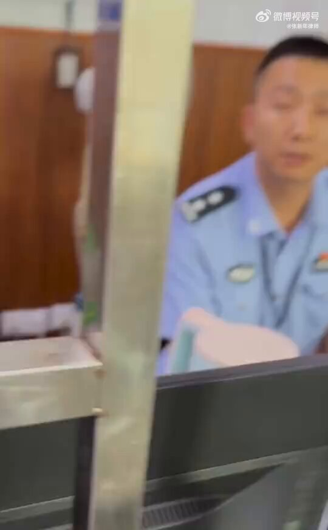

谁将十万横扫三江 北京时间 2024-01-14T16:37:32Z 1746451470076314027 为什么要打断大家跨年疏散人群呢？在一些必定有人群集中的地方，一小撮人提前准备好话题通过演讲散播政治影响力，是早期中国共产党的主要宣传手段。
现在反对政府的人很明显是少的，在人多缺少监控的地方有一两个人宣示存在，一方面对政府来说如果不能精准抓人，打击面过大，增加制度成本。另一方面根据群众觉悟的程度，提出群众可能接受的口号、要求，宣扬政治理念的同时也可打破政府的宣传霸权   谁将十万横扫三江 北京时间 2024-01-14T16:46:01Z 1746453604721152437 四川遂宁监委、遂宁中院联合侵害最高人民法院原资深法官Z某及辩护人诉讼权利录音录像纪实

遂宁中院曾两次通知我去开庭，都又临时取消，然后就不让我会见了！我基于事实和法律适用提交了十多分申请书、法律意见书，快一年了，至今没有任何回应！真没想到，最高院法官也蒙冤，而且冤得很离谱，甚至连其基本的诉讼权利都不能予以保障

背景信息：最高院原法官Z某因涉嫌受贿罪一案，由遂宁市检察院于2022年9月26日向遂宁市中级人民法院提起公诉，至今已满一年，尚未审结（遂宁中院具体立案时间不详，曾于2022年12月14日开庭审理。辩护人于2023年3月底接受委托，随即向该院提交了委托手续、复制了卷宗材料；向遂宁市看守所提交了会见手续，会见了Z某。后，依法提交相关申请，该院决定恢复庭审，中间数次确定了开庭时间，又均因各种原因临时取消）。

辩护人昨日最新了解到，本案延长审限至今，未经四川高院、最高院批准，显然被告人Z某处于超期羁押状态，故依法必须立即释放，如需审理，要依法变更强制措施。

PS：因为“司法不独立”，陪审团制度没有引入法院，不以陪审制、司法独立为基础的司法改革，都是虚伪的   谁将十万横扫三江 北京时间 2024-01-14T17:07:21Z 1746458971832201539 RT @torontobigface: 2024年是史无前例的大选年
世界一半的人将进行投票
除了台湾，还有，美国，韩国，俄罗斯，印度等国
可能有人有疑惑，为什么俄罗斯这样的国家也会有选举
其实很多人可能不知道的是，即使在一众独裁国家中，没有选票的都是少数
方脸说：中国人的政治…   谁将十万横扫三江 北京时间 2024-01-14T17:10:23Z 1746459736797819255 RT @kalsfjaksl67934: @jonathanthorlim 我是中国人，中国共产党保护我的行为，肏你妈   谁将十万横扫三江 北京时间 2024-01-14T16:09:29Z 1746444410659983421 RT @CDTChinese: 推荐理由：非新闻的延续，重要的时代记录者。2023年1月1日，非新闻创办人卢昱宇创立YOUTUBE 频道“昨天”，继续记录着在中国发生的群体抗争事件。
https://t.co/wQGKrjW81I   谁将十万横扫三江 北京时间 2024-01-14T09:58:16Z 1746350990646001761 RT @whyyoutouzhele: 1月12日，浙江宁波，海银财富600亿暴雷，“类固收”产品延期兑付，大量投资者来到海银财富宁波分公司维权。 https://t.co/KtVzUuBCUd   