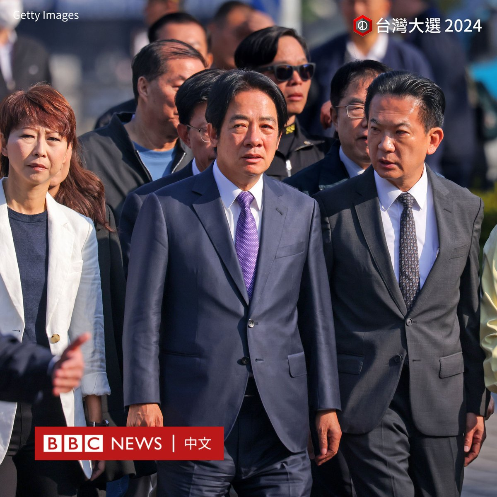
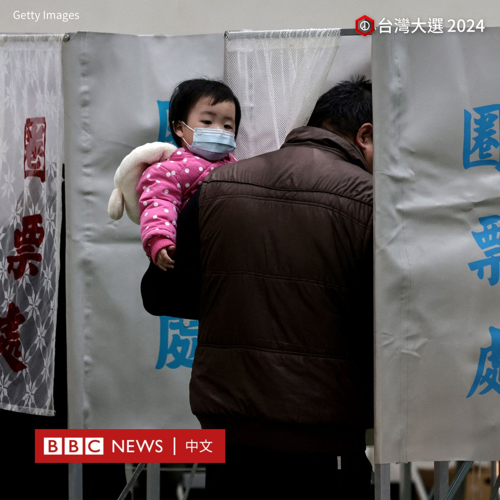

D英国广播公司BBC 北京时间 2024-01-13T09:49:45Z 1745986459902083433 民进党总统候选人、副总统赖清德现身户籍地台南市投票。

他称，今天天气“风和日丽”，是投票的好天气，呼吁民众“展现台湾的民主活力”。

他还表示，昨晚“睡得很好”，接下来还有很多忙碌的行程。

2024台湾大选持续更新：https://t.co/lPcVkln1vM https://t.co/iIuefGAJz6   D英国广播公司BBC 北京时间 2024-01-13T10:26:29Z 1745995704231731393 【图辑：台湾民众排队投票】

2024台湾大选投票正在进行。官方数据显示，此次有资格投票的选民人数逾1950万人，他们预计将前往各地设置的1.7万个投票所投票。投票时间从当地时间上午8点起至下午4点止。

周六上午，在台湾多个投票所都能看到排队投票的人潮。在台湾，投票所主要设置在学校和居民活动中心，一些宫庙也被布置为票站。

这次大选将选出总统、副总统，以及113位立法委员。据报导，选民共可投三张选票，包括总统副总统的选票、区域或原住民立委的选票、以及选出不分区及侨居国外国民立委的政党票。

根据台湾的选举规定，选民需携带身分证、印章，及投票通知单，到指定的投票所投票。

当局还表示，自投票日零时起，不得用任何方式为候选人或政党拉票，包括在社交媒体上进行助选，如有违反将处以罚款。

2024台湾大选持续更新：https://t.co/xPNsBSoGP4   D英国广播公司BBC 北京时间 2024-01-13T08:38:51Z 1745968618452512970 2024台湾总统大选及立委选举在1月13日举行，投票时间自当地时间上午8时至下午4时止。

时间刚过八点，反对党民众党总统候选人柯文哲到达台北金瓯女中投票所投票。

他在投票前接受媒体访问，称自己家住附近，步行前来投票。他还表示今天天气不错，相信民众会出来投票。

2024台湾大选持续更新：https://t.co/xPNsBSoGP4   